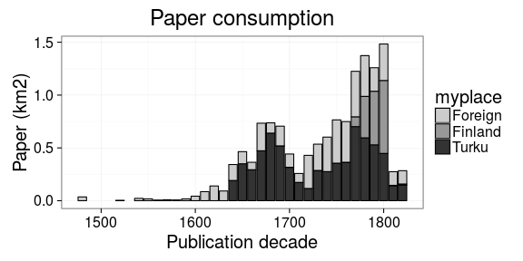
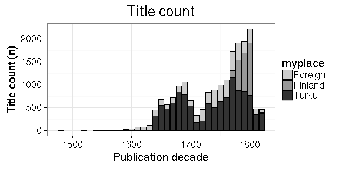
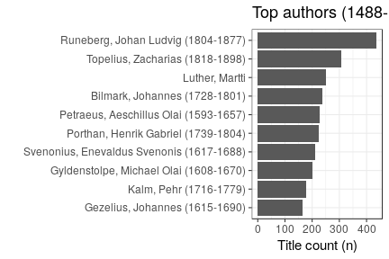
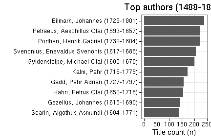
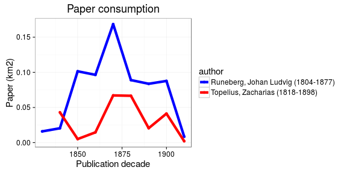
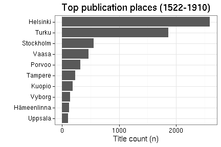
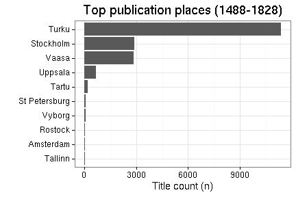
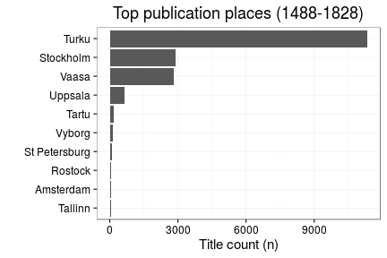
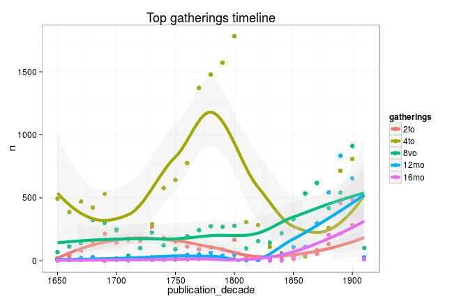

This markdown document contains presentation material for [Digital History in Finland seminar (University of Helsinki, Dec 9, 2015)](http://blogs.helsinki.fi/mstolone/2015/09/21/call-for-papers-digital-history-in-finland-wednesday-9-12-2015/). The source code to reproduce the figures is in the [Rmarkdown document](https://github.com/rOpenGov/fennica/blob/master/inst/examples/20151209-HelsinkiDH.Rmd).













```
## Error in dfs$names: $ operator is invalid for atomic vectors
```


```
## Error in dfs$names: $ operator is invalid for atomic vectors
```




