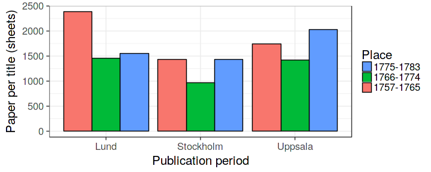
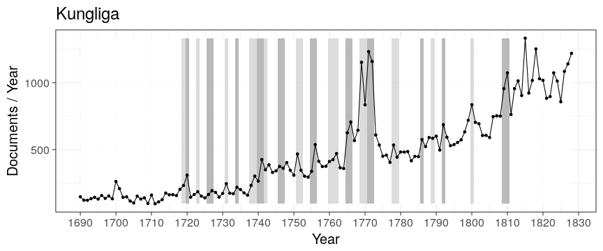
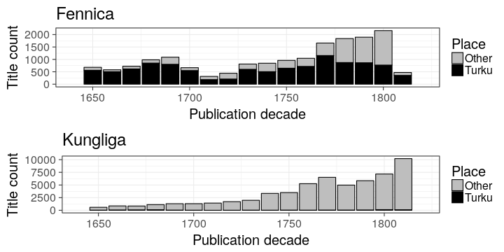

### Paper consumption per title

### Book production and Riksdag assemblies

According to Kungliga in the the long eighteenth century.

### Book production

Book production by year in Turku in Fennica and Kungliga 1640–1828 as a percentage of all books in the catalogues. 

Tämä on tavallaan pelkkä kokonaiskuva kirjatuotannosta koko ajalta, joka on jo olemassa moneen kertaan, mutta toivoisin, että siinä voisi näyttää Turun osuuden erikseen prosentteina. Tässä saadaan hyvin näytettyä se mitä Turussa tapahtuu isonvihan aikaan ja 1809 jälkeen. Fennica on tärkeämpi, mutta minusta kannattaisi katsoa myös miltä tämä näyttää Kungligan osalta.

