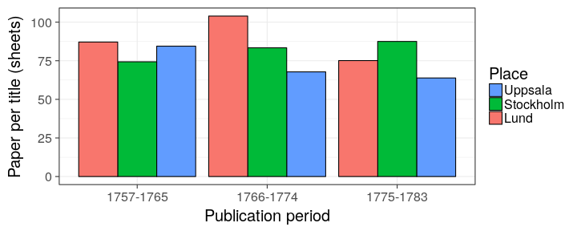

### Paper consumption per title

Paper consumption per title in 1757–1765, 1766–1774, and 1775–1783 in
Stockholm, Lund and Uppsala in Kungliga.

### Book production and Riksdag assemblies

According to Kungliga in the the long eighteenth century.

### Book production

Book production by year in Turku in Fennica and Kungliga 1640–1828 as a percentage of all books in the catalogues. 

