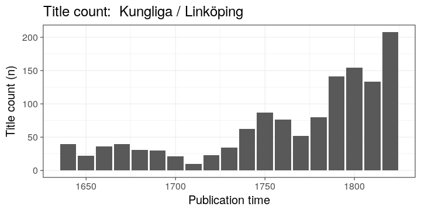
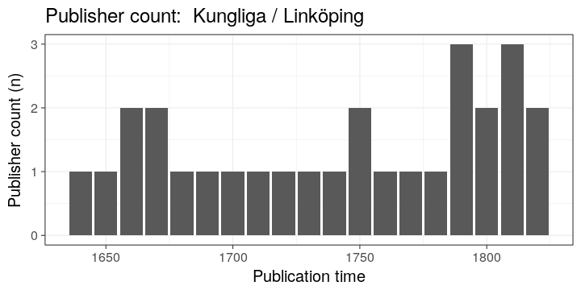
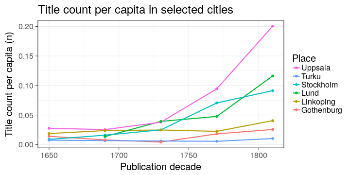

### Paper consumption per title

Paper consumption per title in 1757–1765, 1766–1774, and 1775–1783 in
Stockholm, Lund and Uppsala in Kungliga.


|period    |publication_place |    n|      paper| paper_per_title|
|:---------|:-----------------|----:|----------:|---------------:|
|1757-1765 |Lund              |   64|  152453.82|       2382.0909|
|1757-1765 |Stockholm         | 1656| 2375424.83|       1434.4353|
|1757-1765 |Uppsala           |  177|  307949.65|       1739.8285|
|1766-1774 |Lund              |   63|   92062.41|       1461.3081|
|1766-1774 |Stockholm         | 3879| 3757813.72|        968.7584|
|1766-1774 |Uppsala           |  350|  498522.87|       1424.3511|
|1775-1783 |Lund              |   77|  119119.10|       1547.0013|
|1775-1783 |Stockholm         | 1863| 2674096.92|       1435.3714|
|1775-1783 |Uppsala           |  191|  388122.22|       2032.0535|


### Book production and Riksdag assemblies

According to Kungliga in the the long eighteenth century.


### Book production

Book production by year in Turku in Fennica and Kungliga 1640–1828 as a percentage of all books in the catalogues. 


### Kungliga / Linkoping


[Document listing for Kungliga / Linköping 1640 - 1828](output.tables/Linkoping.tab)


### Title count and publisher count in Linköping



```
## Error in resolve_vars(new_groups, tbl_vars(.data)): unknown variable to group by : publication_time
```



|     | publication_year|publisher                   |
|:----|----------------:|:---------------------------|
|1    |             1756|Linköpings stifts tidningar |
|2    |             1788|NA                          |
|3    |             1792|NA                          |
|5    |             1828|NA                          |
|6    |             1816|NA                          |
|7    |             1817|NA                          |
|8    |             1820|NA                          |
|9    |             1796|NA                          |
|10   |             1700|NA                          |
|11   |             1789|NA                          |
|12   |             1790|NA                          |
|13   |             1706|NA                          |
|14   |             1821|NA                          |
|17   |             1749|NA                          |
|18   |             1751|NA                          |
|20   |             1757|NA                          |
|22   |             1767|NA                          |
|23   |             1766|NA                          |
|24   |             1800|NA                          |
|26   |             1768|NA                          |
|28   |             1791|NA                          |
|29   |             1819|NA                          |
|31   |             1823|NA                          |
|32   |             1825|NA                          |
|33   |             1826|NA                          |
|36   |             1824|NA                          |
|38   |             1822|NA                          |
|40   |             1801|NA                          |
|42   |             1806|NA                          |
|44   |             1827|NA                          |
|46   |             1802|NA                          |
|48   |             1787|NA                          |
|55   |             1797|NA                          |
|59   |             1770|NA                          |
|61   |             1744|NA                          |
|62   |             1758|NA                          |
|63   |             1772|NA                          |
|64   |             1769|NA                          |
|65   |             1755|NA                          |
|69   |             1818|NA                          |
|71   |             1786|NA                          |
|73   |             1720|NA                          |
|74   |             1717|NA                          |
|75   |             1799|NA                          |
|76   |             1809|NA                          |
|78   |             1761|NA                          |
|82   |             1793|NA                          |
|88   |             1798|NA                          |
|89   |             1810|NA                          |
|92   |             1771|NA                          |
|101  |             1811|NA                          |
|107  |             1784|NA                          |
|108  |             1723|NA                          |
|111  |             1745|NA                          |
|112  |             1754|NA                          |
|114  |             1756|NA                          |
|118  |             1759|NA                          |
|119  |             1760|NA                          |
|120  |             1815|NA                          |
|124  |             1808|NA                          |
|126  |             1773|NA                          |
|130  |             1708|NA                          |
|132  |             1795|NA                          |
|134  |             1752|NA                          |
|137  |             1742|NA                          |
|141  |             1803|NA                          |
|142  |             1743|NA                          |
|143  |             1729|NA                          |
|149  |             1794|NA                          |
|150  |             1739|NA                          |
|151  |             1722|NA                          |
|154  |             1732|NA                          |
|156  |             1712|NA                          |
|160  |             1776|NA                          |
|162  |             1731|NA                          |
|165  |             1726|NA                          |
|169  |             1740|NA                          |
|176  |             1805|NA                          |
|179  |             1804|NA                          |
|187  |             1762|NA                          |
|189  |             1813|NA                          |
|190  |             1735|NA                          |
|199  |             1748|NA                          |
|200  |             1782|NA                          |
|202  |             1750|NA                          |
|203  |             1780|NA                          |
|225  |             1814|NA                          |
|244  |             1781|NA                          |
|247  |             1778|NA                          |
|269  |             1774|NA                          |
|280  |             1736|NA                          |
|284  |             1812|NA                          |
|293  |             1738|NA                          |
|297  |             1733|NA                          |
|300  |             1737|NA                          |
|308  |             1753|NA                          |
|326  |             1725|NA                          |
|327  |             1728|NA                          |
|328  |             1827|Petre                       |
|351  |             1807|NA                          |
|368  |             1707|NA                          |
|396  |             1797|Björn                       |
|404  |             1795|Björn                       |
|407  |             1775|NA                          |
|421  |             1798|Björn                       |
|429  |             1730|NA                          |
|432  |             1764|NA                          |
|501  |             1777|NA                          |
|531  |             1765|NA                          |
|535  |             1746|NA                          |
|548  |             1718|NA                          |
|550  |             1719|NA                          |
|563  |             1763|NA                          |
|578  |             1734|NA                          |
|629  |             1779|NA                          |
|691  |             1703|NA                          |
|708  |             1785|NA                          |
|795  |             1701|NA                          |
|796  |             1704|NA                          |
|898  |             1809|Groth & Petre               |
|907  |             1783|NA                          |
|926  |             1711|NA                          |
|984  |             1793|Linköpings stiftsbibliotek  |
|989  |             1657|NA                          |
|990  |             1677|NA                          |
|991  |             1646|NA                          |
|992  |             1642|NA                          |
|993  |             1644|NA                          |
|994  |             1663|NA                          |
|995  |             1674|NA                          |
|996  |             1673|NA                          |
|997  |             1656|NA                          |
|999  |             1648|NA                          |
|1000 |             1645|NA                          |
|1001 |             1650|NA                          |
|1002 |             1653|NA                          |
|1003 |             1681|NA                          |
|1004 |             1697|NA                          |
|1005 |             1691|NA                          |
|1006 |             1679|NA                          |
|1007 |             1692|NA                          |
|1008 |             1676|NA                          |
|1009 |             1693|NA                          |
|1010 |             1683|NA                          |
|1012 |             1682|NA                          |
|1013 |             1678|NA                          |
|1014 |             1654|NA                          |
|1015 |             1662|NA                          |
|1017 |             1668|NA                          |
|1018 |             1651|NA                          |
|1019 |             1672|NA                          |
|1021 |             1664|NA                          |
|1023 |             1669|NA                          |
|1024 |             1667|NA                          |
|1027 |             1652|NA                          |
|1028 |             1640|NA                          |
|1031 |             1647|NA                          |
|1034 |             1658|NA                          |
|1036 |             1659|NA                          |
|1038 |             1666|NA                          |
|1041 |             1670|NA                          |
|1042 |             1680|NA                          |
|1044 |             1699|NA                          |
|1048 |             1690|NA                          |
|1049 |             1665|NA                          |
|1050 |             1675|Daniel Kempe                |
|1051 |             1671|NA                          |
|1054 |             1643|NA                          |
|1058 |             1695|NA                          |
|1061 |             1689|NA                          |
|1063 |             1661|NA                          |
|1077 |             1675|NA                          |
|1079 |             1688|NA                          |
|1085 |             1655|NA                          |
|1086 |             1641|NA                          |
|1089 |             1649|NA                          |
|1094 |             1684|NA                          |
|1102 |             1686|NA                          |
|1111 |             1694|NA                          |
|1116 |             1698|NA                          |
|1132 |             1687|NA                          |
|1140 |             1685|NA                          |
|1179 |             1819|Petre & rahamsson           |
|1183 |             1815|Petre & rahamsson           |
|1188 |             1810|Groth & Petre               |
|1238 |             1660|NA                          |
|1253 |             1664|Kämpe                       |


### Title count per capita

The historical population sizes used in this analysis are shown in this [table](https://github.com/rOpenGov/bibliographica/blob/master/inst/extdata/population_sizes_in_cities.csv).



