---


### Fig. 1: Number of publication places over time

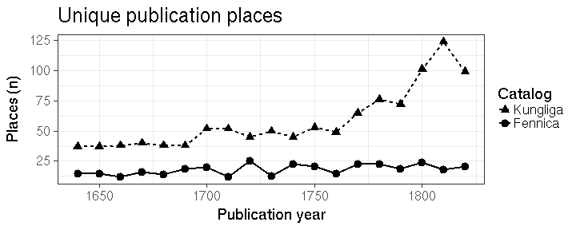

---


### Fig 2: Title count over time

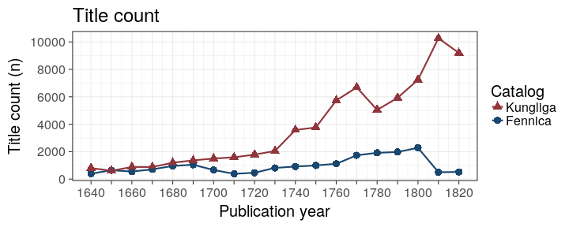

---

### Fig 3: Rise of the Octavo

Paper consumption for various document formats over time.


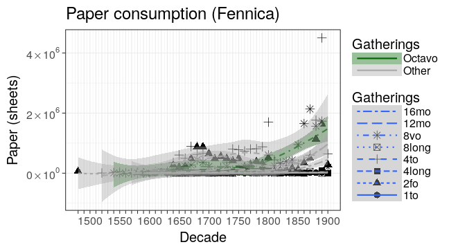

---

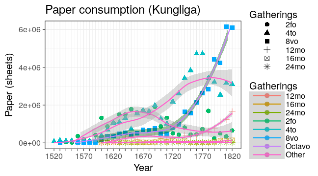

---


### Fig 4: Median title length (word count)

Loess smoothing.

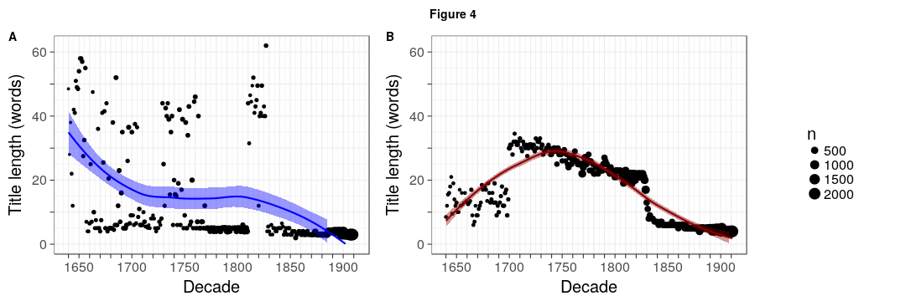

---


### Fig 5: Turku as Swedish university town

Proportions for title count and paper in Swedish University towns
 
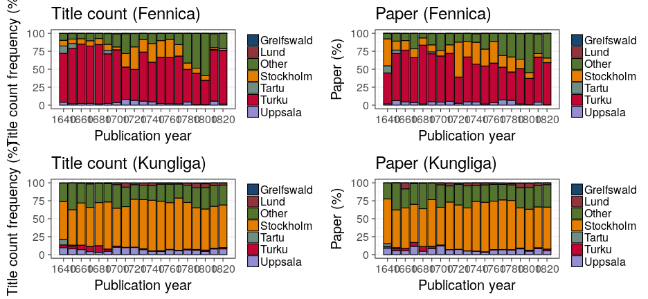

---


### Fig 6: Publishing activity over time (Kungliga)

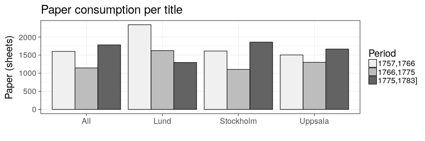

---


### Fig. 7: Publishing activity and riksdagar: Kungliga

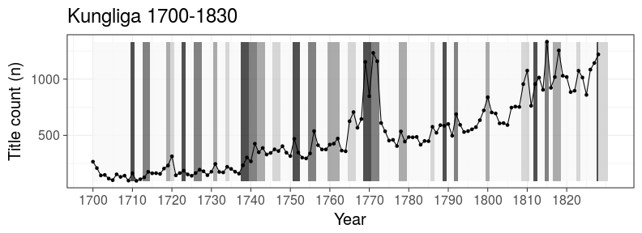

---


### Fig 8: Publishers in Swedish University towns (Fennica)

Turku, Vaasa and Vyborg from Fennica; Stockholm, Lund, Uppsala, Greifswald, Tartu from Kungliga.

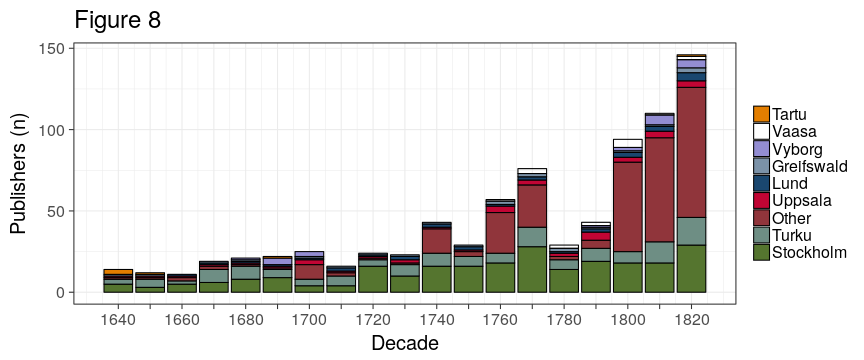

---

### Fig 9: Publishers in Swedish University towns (Kungliga)

All towns from Kungliga.

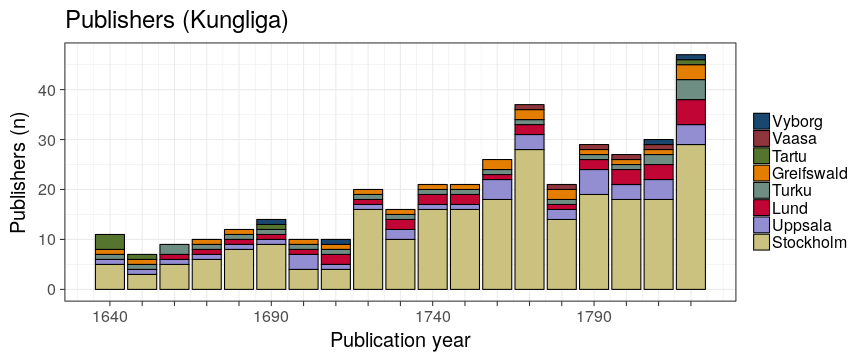

---


### Fig 10: Publications in Vaasa in Fennica, 1750-1828


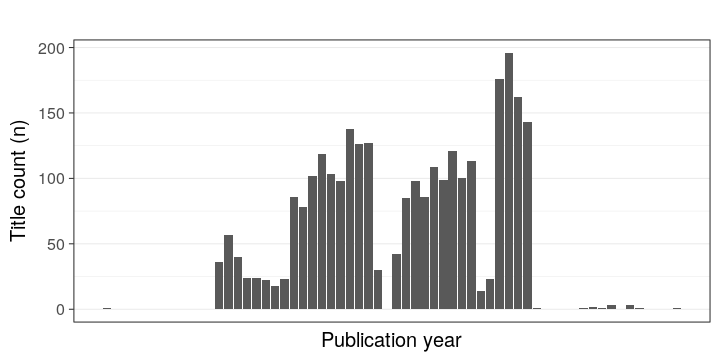

---


### Fig 11: Top publishers in Turku/Fennica

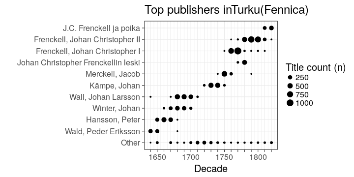

---


### Fig. 12: Title count per capita

The historical population sizes used in this analysis are shown in this [table](https://github.com/rOpenGov/bibliographica/blob/master/inst/extdata/population_sizes_in_cities.csv).

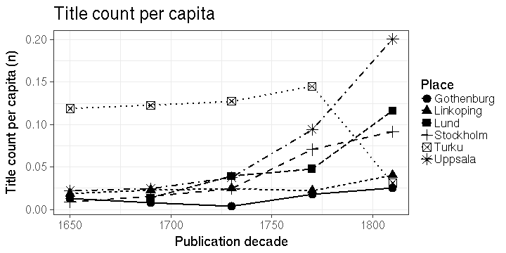

---


### Fig. 13: Title count (absolute)

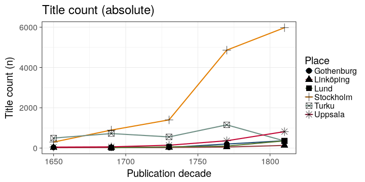

---


### Fig. 14: Octavo paper consumption

Paper consumption in octavo format books in Stockholm, Turku, Uppsala,
Lund, Göteborg and Linköping. Turku is from Fennica, other cities from
Kungliga.

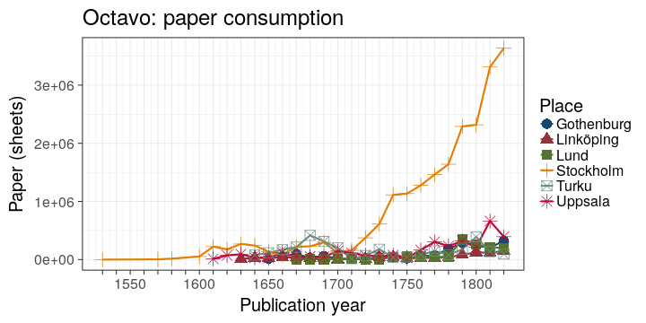


---


### Fig. 15: Octavo title length (word count)

Average title length in words in Stockholm, Turku, Uppsala, Lund,
Göteborg and Linköping. According to Kungliga, except Turku from
Fennica. 

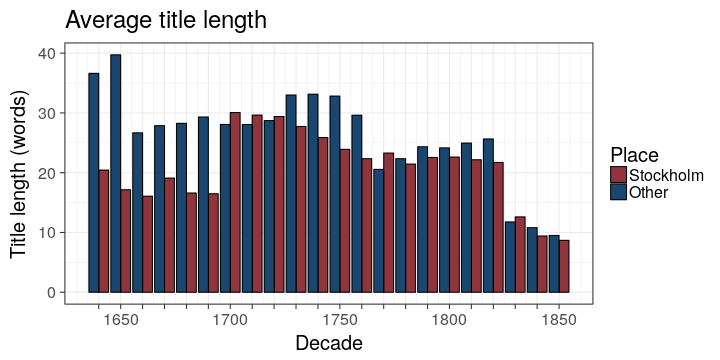

---


### Fig 16: Language use in Turku, Stockholm, Uppsala and Lund

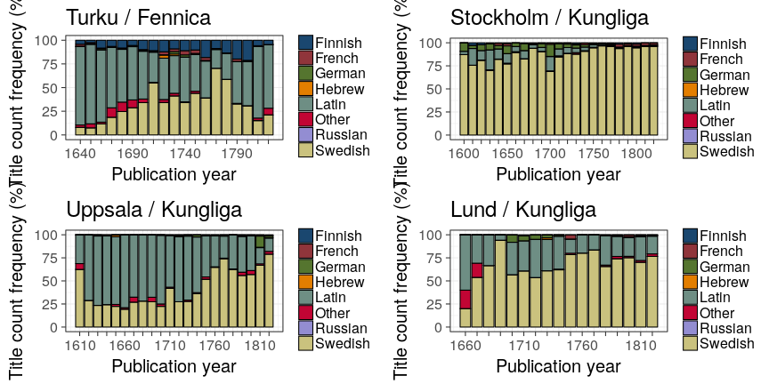

---


### Fig. 17: Topic richness per language (Fennica)

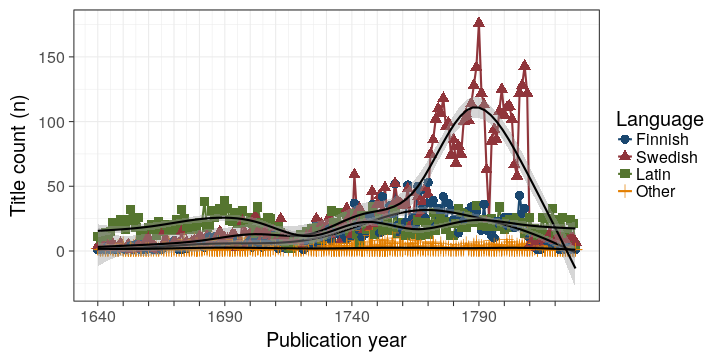

---


### Fig. 18: Temporary sermons in Latin and Swedish

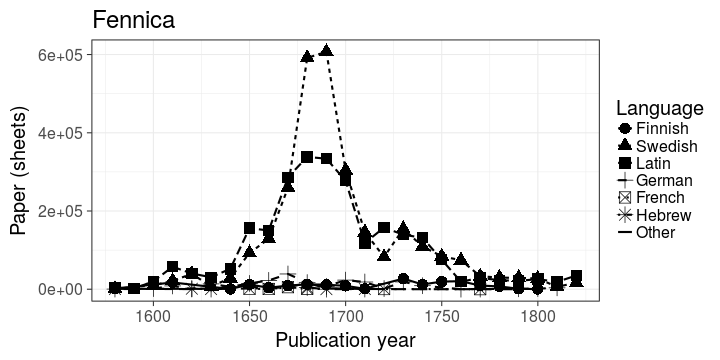

---


### Fig. 19: Devotional literature (catechisms, hymns, prayers, etc.) 

Form of literature denoting the advancement of reading in Finland in the 19th century. It has been unclear when devotional literature  shows up as a relevant category.

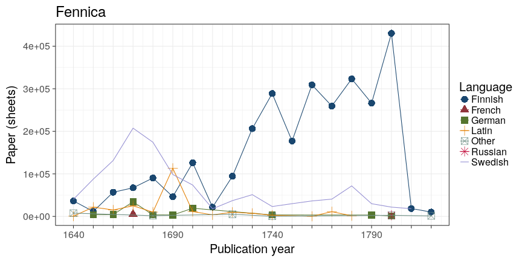

---


## Session info

This document was created with the following versions:


```
## R version 3.4.2 (2017-09-28)
## Platform: x86_64-pc-linux-gnu (64-bit)
## Running under: Ubuntu 17.04
## 
## Matrix products: default
## BLAS: /usr/lib/openblas-base/libblas.so.3
## LAPACK: /usr/lib/libopenblasp-r0.2.19.so
## 
## locale:
##  [1] LC_CTYPE=en_US.UTF-8       LC_NUMERIC=C              
##  [3] LC_TIME=en_US.UTF-8        LC_COLLATE=en_US.UTF-8    
##  [5] LC_MONETARY=en_US.UTF-8    LC_MESSAGES=en_US.UTF-8   
##  [7] LC_PAPER=en_US.UTF-8       LC_NAME=C                 
##  [9] LC_ADDRESS=C               LC_TELEPHONE=C            
## [11] LC_MEASUREMENT=en_US.UTF-8 LC_IDENTIFICATION=C       
## 
## attached base packages:
## [1] stats     graphics  grDevices utils     datasets  methods   base     
## 
## other attached packages:
##  [1] knitcitations_1.0.9   cowplot_0.8.0         scales_0.5.0         
##  [4] bibliographica_0.2.32 testthat_1.0.2        viridis_0.4.0        
##  [7] viridisLite_0.2.0     devtools_1.13.3       stringr_1.2.0        
## [10] gisfin_0.9.27         R6_2.2.2              rgdal_1.2-13         
## [13] sp_1.2-5              ggmap_2.6.1           ggthemes_3.4.0       
## [16] rmarkdown_1.6.0.9001  sorvi_0.8.13          tibble_1.3.4         
## [19] microbiome_0.99.87    phyloseq_1.21.0       bindrcpp_0.2         
## [22] knitr_1.17            gridExtra_2.3         reshape2_1.4.2       
## [25] magrittr_1.5          fennica_0.1.43        dplyr_0.7.4          
## [28] tidyr_0.7.1           ggplot2_2.2.1        
## 
## loaded via a namespace (and not attached):
##  [1] colorspace_1.3-2    rjson_0.2.15        deldir_0.1-14      
##  [4] babynames_0.3.0     rprojroot_1.2       XVector_0.17.1     
##  [7] roxygen2_6.0.1      lubridate_1.6.0     RefManageR_0.14.20 
## [10] xml2_1.1.1          codetools_0.2-15    splines_3.4.2      
## [13] ade4_1.7-8          jsonlite_1.5        Cairo_1.5-9        
## [16] cluster_2.0.6       png_0.1-7           httr_1.3.1         
## [19] mapproj_1.2-5       compiler_3.4.2      backports_1.1.1    
## [22] assertthat_0.2.0    Matrix_1.2-11       lazyeval_0.2.0     
## [25] htmltools_0.3.6     tools_3.4.2         igraph_1.1.2       
## [28] NLP_0.1-11          coda_0.19-1         gtable_0.2.0       
## [31] glue_1.1.1          maps_3.2.0          gmodels_2.16.2     
## [34] Rcpp_0.12.13        slam_0.1-40         Biobase_2.37.2     
## [37] Biostrings_2.45.4   multtest_2.33.0     spdep_0.6-15       
## [40] gdata_2.18.0        ape_4.1             nlme_3.1-131       
## [43] iterators_1.0.8     gender_0.5.1.9000   proto_1.0.0        
## [46] gtools_3.5.0        XML_3.98-1.9        stringdist_0.9.4.6 
## [49] LearnBayes_2.15     zlibbioc_1.23.0     MASS_7.3-47        
## [52] parallel_3.4.2      biomformat_1.5.0    genderdata_0.5.0   
## [55] rhdf5_2.21.6        expm_0.999-2        yaml_2.1.14        
## [58] memoise_1.1.0       geosphere_1.5-5     stringi_1.1.5      
## [61] highr_0.6           S4Vectors_0.15.11   foreach_1.4.3      
## [64] permute_0.9-4       BiocGenerics_0.23.3 bibtex_0.4.2       
## [67] boot_1.3-20         RgoogleMaps_1.4.1   rlang_0.1.2        
## [70] pkgconfig_2.0.1     commonmark_1.4      evaluate_0.10.1    
## [73] lattice_0.20-35     purrr_0.2.3         bindr_0.1          
## [76] labeling_0.3        tidyselect_0.2.0    plyr_1.8.4         
## [79] IRanges_2.11.18     withr_2.0.0         mgcv_1.8-22        
## [82] survival_2.41-3     crayon_1.3.4        jpeg_0.1-8         
## [85] grid_3.4.2          data.table_1.10.4   vegan_2.4-4        
## [88] digest_0.6.12       tm_0.7-1            stats4_3.4.2       
## [91] munsell_0.4.3       tcltk_3.4.2
```


