---


### Fig. 1: Number of publication places per decade

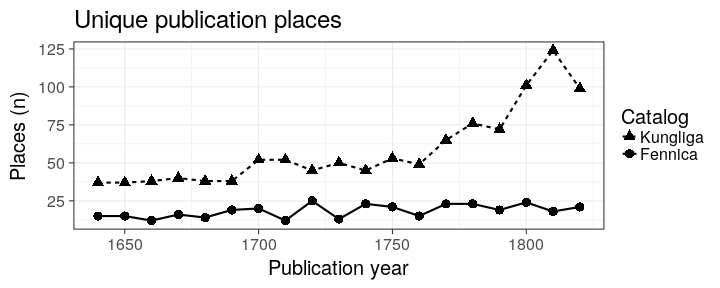

---


### Fig 2: Number of documents per decade

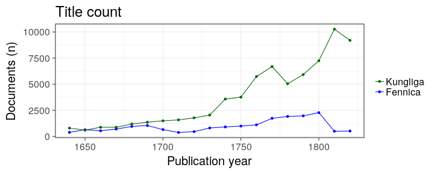

---


### Fig 3: Rise of the octavo sized book as vehicle of Enlightenment

Paper consumption: different document formats over time

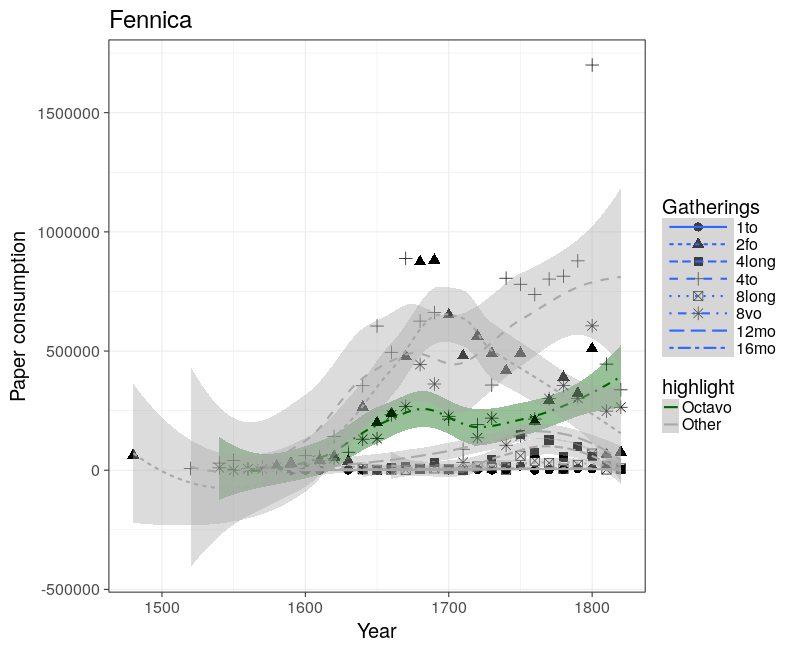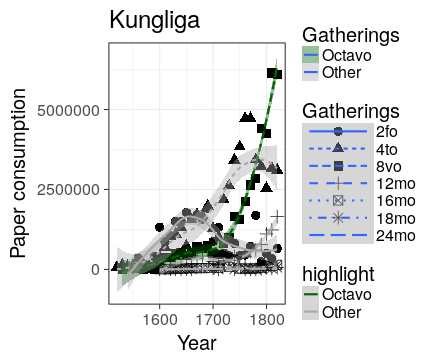

---


### Fig 4: Average title length (word count)

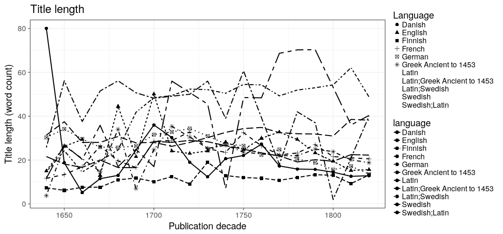

---


### Fig 5: Turku in Sweden: proportions for title count and paper in Swedish University towns
 
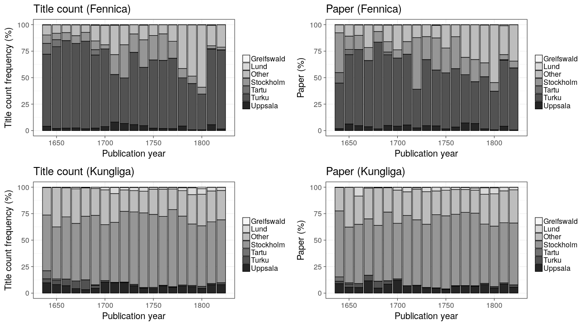

---


### Fig 6: Publishing activity over time


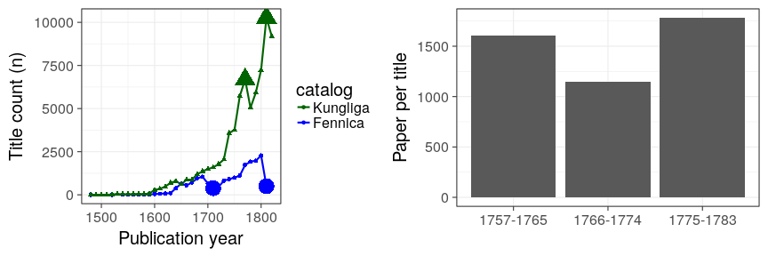

---


### Fig. 7: Riksdagar Kungliga

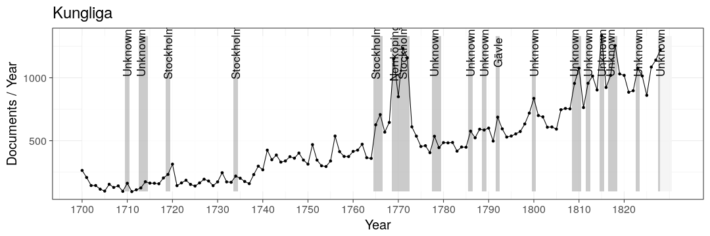

---


### Fig. 8: Riksdagar Fennica


---


### Fig 9A: Fennica - Publishers in Swedish University towns (and Finland)


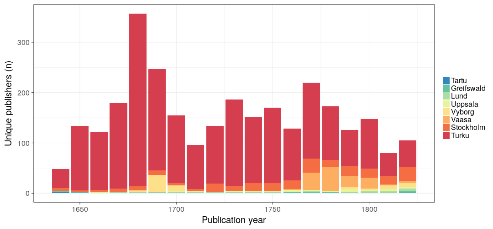


### Fig 9B: Kungliga - Publishers in Swedish University towns (and Finland)


### Fig 10: Publications in Vaasa in Fennica, 1750-1828, with percentage of all books that were not published by the printing house of the court


---


### Fig 11: Top publishers in Turku/Fennica


---


### IMAGE 12: Title count per capita

The historical population sizes used in this analysis are shown in this [table](https://github.com/rOpenGov/bibliographica/blob/master/inst/extdata/population_sizes_in_cities.csv).

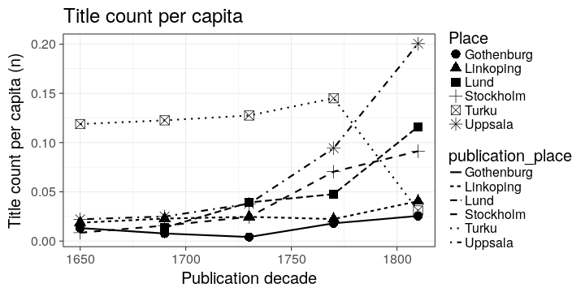

| publication_decade|publication_place | population|    n| titles_per_capita|
|------------------:|:-----------------|----------:|----:|-----------------:|
|               1650|Stockholm         |      35000|  298|         0.0085143|
|               1690|Stockholm         |      57000|  894|         0.0156842|
|               1730|Stockholm         |      57000| 1400|         0.0245614|
|               1770|Stockholm         |      69000| 4862|         0.0704638|
|               1810|Stockholm         |      65474| 5975|         0.0912576|
|               1650|Turku             |       4184|  497|         0.1187859|
|               1690|Turku             |       5882|  721|         0.1225774|
|               1730|Turku             |       4353|  555|         0.1274983|
|               1770|Turku             |       7952| 1153|         0.1449950|
|               1810|Turku             |      11387|  354|         0.0310881|
|               1650|Uppsala           |       2216|   49|         0.0221119|
|               1690|Uppsala           |       2487|   62|         0.0249296|
|               1730|Uppsala           |       3774|  143|         0.0378908|
|               1770|Uppsala           |       3859|  364|         0.0943250|
|               1810|Uppsala           |       4076|  817|         0.2004416|
|               1690|Lund              |       1251|   17|         0.0135891|
|               1730|Lund              |       1530|   60|         0.0392157|
|               1770|Lund              |       2078|   99|         0.0476420|
|               1810|Lund              |       3100|  360|         0.1161290|
|               1650|Gothenburg        |       2653|   35|         0.0131926|
|               1690|Gothenburg        |       5071|   39|         0.0076908|
|               1730|Gothenburg        |       8000|   33|         0.0041250|
|               1770|Gothenburg        |      11143|  201|         0.0180382|
|               1810|Gothenburg        |      14346|  366|         0.0255123|
|               1650|Linkoping         |       1180|   22|         0.0186441|
|               1690|Linkoping         |       1270|   29|         0.0228346|
|               1730|Linkoping         |       1383|   34|         0.0245842|
|               1770|Linkoping         |       2325|   52|         0.0223656|
|               1810|Linkoping         |       3285|  133|         0.0404871|

---


### Fig 13 Octavo paper consumption

Paper consumption in octavo format books in Stockholm, Turku, Uppsala,
Lund, Göteborg and Linköping. Turku is from Fennica, other cities from
Kungliga.

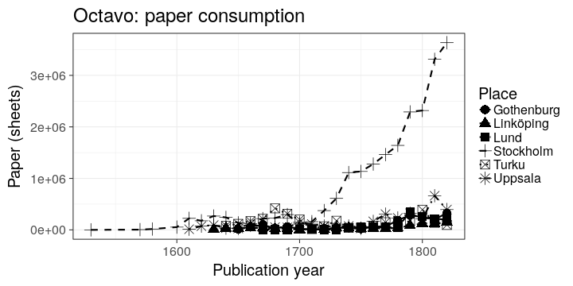


---

### Fig 14: Octavo title length

Average title length in words in Stockholm, Turku, Uppsala, Lund,
Göteborg and Linköping. According to Kungliga, except Turku from
Fennica. Only for octavo.

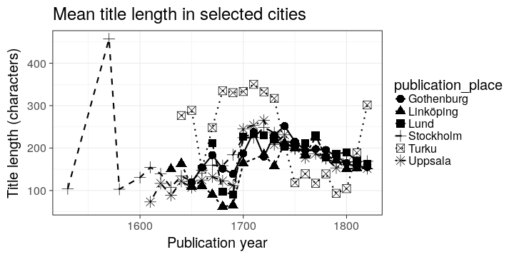

---


### Fig 15: Different languages in Turku, Stockholm, Uppsala and Lund

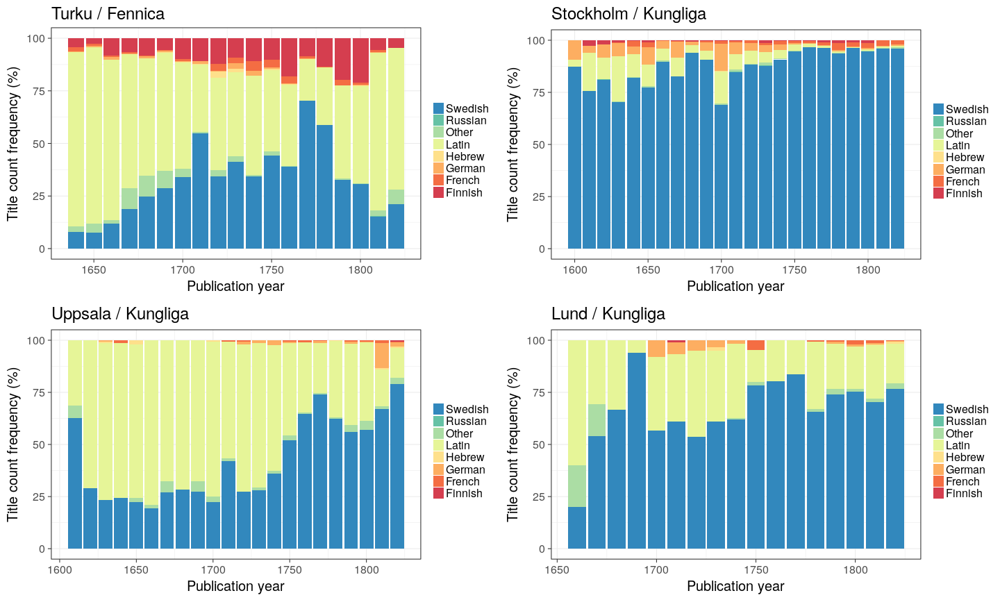

---


### Fig 16: Topic richness per language (publications in Fennica)

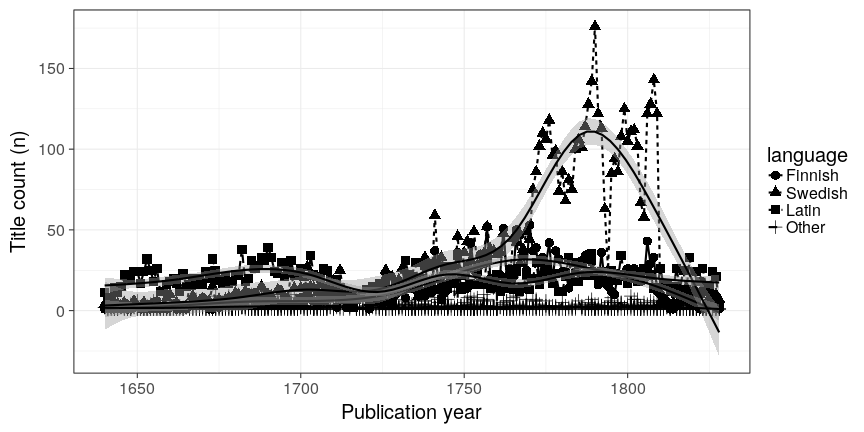

---


### Fig 17: Temporary sermons in Latin and Swedish

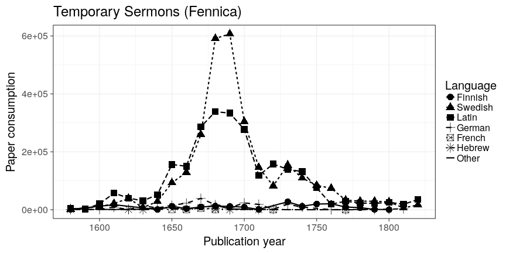

---


### Fig 18: Devotional literature (catechisms, hymns, prayers, etc.) 

Form of literature denoting the advancement of reading in Finland in the 19th century. It has been unclear when devotional literature  shows up as a relevant category.

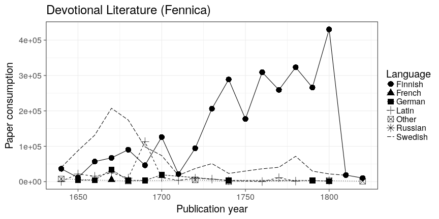

---


### Fig 19: Publisher per city over time

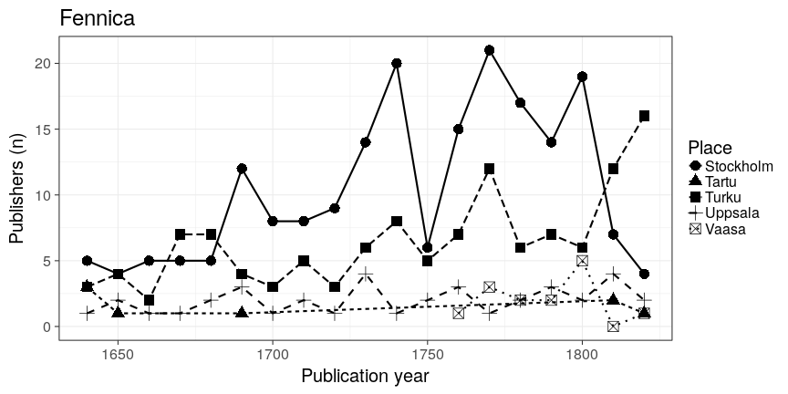


## Session info

This document was created with the following versions:


```
## R version 3.3.1 (2016-06-21)
## Platform: x86_64-pc-linux-gnu (64-bit)
## Running under: Ubuntu 16.10
## 
## locale:
##  [1] LC_CTYPE=en_US.UTF-8       LC_NUMERIC=C              
##  [3] LC_TIME=en_US.UTF-8        LC_COLLATE=en_US.UTF-8    
##  [5] LC_MONETARY=en_US.UTF-8    LC_MESSAGES=en_US.UTF-8   
##  [7] LC_PAPER=en_US.UTF-8       LC_NAME=C                 
##  [9] LC_ADDRESS=C               LC_TELEPHONE=C            
## [11] LC_MEASUREMENT=en_US.UTF-8 LC_IDENTIFICATION=C       
## 
## attached base packages:
## [1] stats     graphics  grDevices utils     datasets  methods   base     
## 
## other attached packages:
##  [1] knitcitations_1.0.7   microbiome_0.99.88    phyloseq_1.16.2      
##  [4] knitr_1.15.1          rmarkdown_1.2.9000    gridExtra_2.2.1      
##  [7] magrittr_1.5          devtools_1.12.0       sorvi_0.7.26         
## [10] fennica_0.1.43        bibliographica_0.2.31 reshape2_1.4.2       
## [13] tidyr_0.6.0           stringr_1.1.0         gisfin_0.9.27        
## [16] R6_2.2.0              rgdal_1.2-4           sp_1.2-3             
## [19] ggmap_2.6.1           ggplot2_2.2.1         dplyr_0.5.0          
## 
## loaded via a namespace (and not attached):
##   [1] colorspace_1.3-0      rjson_0.2.15          deldir_0.1-12        
##   [4] babynames_0.2.1       dynamicTreeCut_1.63-1 rprojroot_1.1        
##   [7] htmlTable_1.7         XVector_0.12.1        lubridate_1.6.0      
##  [10] AnnotationDbi_1.34.4  RefManageR_0.13.1     codetools_0.2-15     
##  [13] splines_3.3.1         doParallel_1.0.10     robustbase_0.92-6    
##  [16] impute_1.46.0         tgp_2.4-14            ade4_1.7-4           
##  [19] Formula_1.2-1         jsonlite_1.1          WGCNA_1.51           
##  [22] cluster_2.0.5         GO.db_3.3.0           png_0.1-7            
##  [25] httr_1.2.1            mapproj_1.2-4         backports_1.0.4      
##  [28] assertthat_0.1        Matrix_1.2-7.1        lazyeval_0.2.0       
##  [31] acepack_1.4.1         htmltools_0.3.5       tools_3.3.1          
##  [34] igraph_1.0.1          NLP_0.1-9             coda_0.18-1          
##  [37] gtable_0.2.0          maps_3.1.1            gmodels_2.16.2       
##  [40] Rcpp_0.12.9           slam_0.1-38           Biobase_2.32.0       
##  [43] RJSONIO_1.3-0         Biostrings_2.40.2     multtest_2.28.0      
##  [46] spdep_0.6-8           gdata_2.17.0          ape_3.5              
##  [49] preprocessCore_1.34.0 nlme_3.1-128          iterators_1.0.8      
##  [52] tensorA_0.36          fastcluster_1.1.21    gender_0.5.1         
##  [55] proto_1.0.0           gtools_3.5.0          XML_3.98-1.5         
##  [58] stringdist_0.9.4.2    DEoptimR_1.0-6        LearnBayes_2.15      
##  [61] zlibbioc_1.18.0       MASS_7.3-45           scales_0.4.1         
##  [64] parallel_3.3.1        biomformat_1.0.2      genderdata_0.5.0     
##  [67] rhdf5_2.16.0          RColorBrewer_1.1-2    yaml_2.1.14          
##  [70] memoise_1.0.0         geosphere_1.5-5       rpart_4.1-10         
##  [73] maptree_1.4-7         latticeExtra_0.6-28   stringi_1.1.3        
##  [76] RSQLite_1.0.0         highr_0.6             S4Vectors_0.10.3     
##  [79] foreach_1.4.3         energy_1.7-0          permute_0.9-4        
##  [82] BiocGenerics_0.18.0   bibtex_0.4.0          boot_1.3-18          
##  [85] bitops_1.0-6          moments_0.14          RgoogleMaps_1.4.1    
##  [88] compositions_1.40-1   matrixStats_0.51.0    evaluate_0.10        
##  [91] lattice_0.20-34       labeling_0.3          plyr_1.8.4           
##  [94] IRanges_2.6.1         Hmisc_4.0-0           DBI_0.5-1            
##  [97] foreign_0.8-67        withr_1.0.2           mgcv_1.8-16          
## [100] RCurl_1.95-4.8        survival_2.40-1       nnet_7.3-12          
## [103] tibble_1.2            bayesm_3.0-2          jpeg_0.1-8           
## [106] grid_3.3.1            data.table_1.10.0     vegan_2.4-1          
## [109] digest_0.6.12         tm_0.6-2              stats4_3.3.1         
## [112] munsell_0.4.3
```


