---


### Fig 1: Number of publication places over time

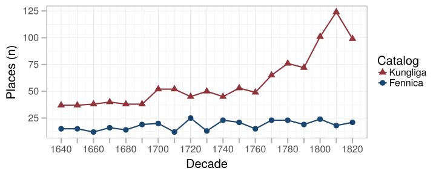

---


### Fig 2: Title count over time

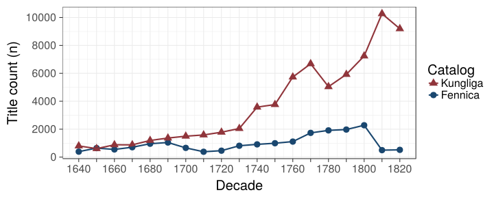

---

### Fig 3: Rise of the Octavo

Paper consumption for various document formats over time.


---


### Fig 4: Median title length (word count)

Loess smoothing.

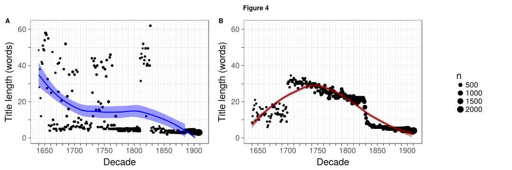

---


### Fig 5: Turku as Swedish university town

Proportions for title count and paper in Swedish University towns
 
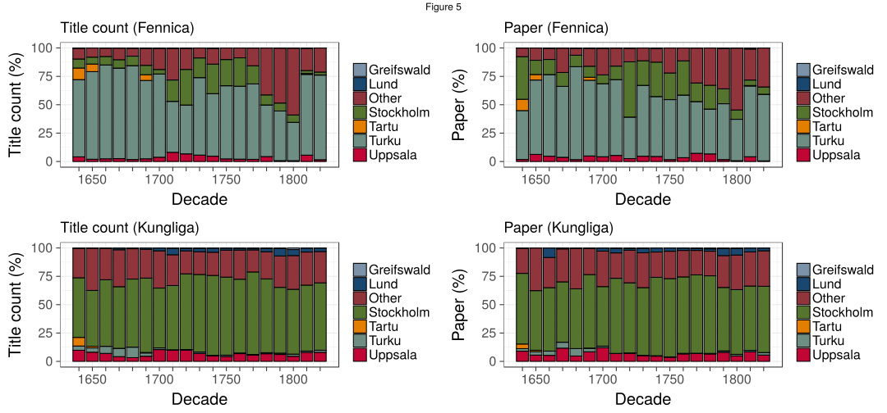

---


### Fig 6: Publishing activity over time (Kungliga)

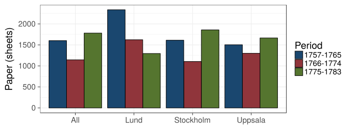

---


### Fig 7: Publishing activity and riksdagar: Kungliga

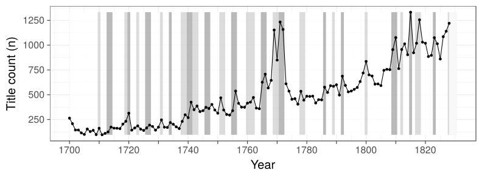

---


### Fig 8: Publishers in Swedish University towns (Fennica)

Turku, Vaasa and Vyborg from Fennica; Stockholm, Lund, Uppsala, Greifswald, Tartu from Kungliga.

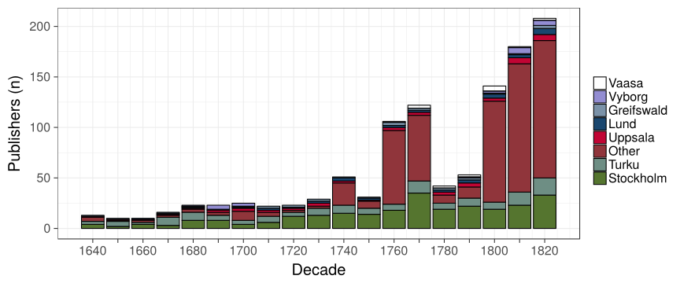

---


### Fig 9: Publications in Vaasa in Fennica, 1750-1828


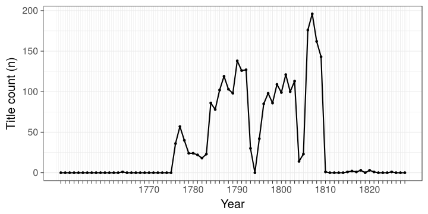


---


### Fig 10: Top publishers in Turku/Fennica

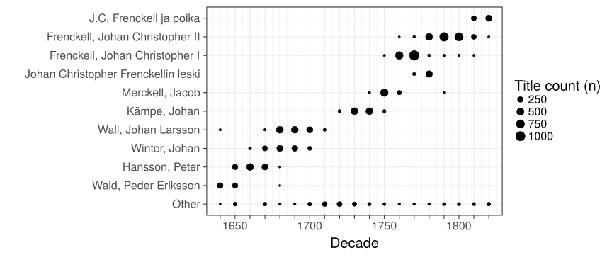

---


### Fig 11: Title count per capita

The historical population sizes used in this analysis are shown in this [table](https://github.com/COMHIS/bibliographica/blob/master/inst/extdata/population_sizes_in_cities.csv).


```
## Error in guides(shape = guide_legend(title = "Place")) + guides(color = guide_legend(title = "Place")): non-numeric argument to binary operator
```

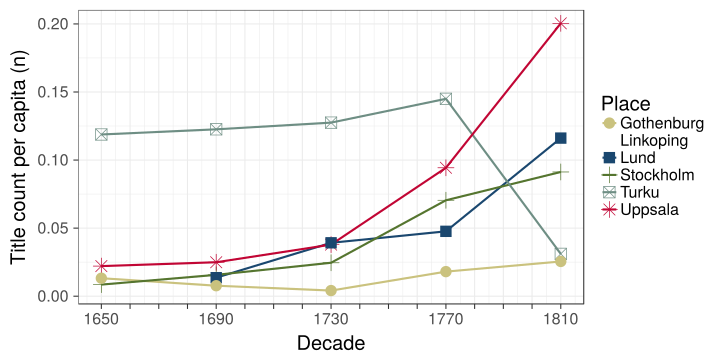

---


### Fig 12: Title count (absolute)

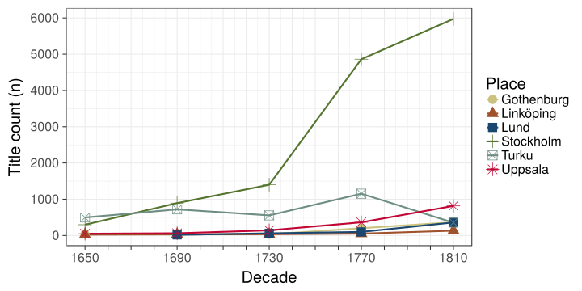

---


### Fig 13: Octavo paper consumption

Paper consumption in octavo format books in Stockholm, Turku, Uppsala,
Lund, Göteborg and Linköping. Turku is from Fennica, other cities from
Kungliga.

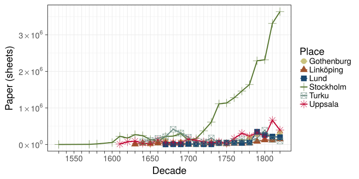


---


### Fig 14: Octavo title length (word count)

Average title length in words in Stockholm, Turku, Uppsala, Lund, Göteborg and Linköping. According to Kungliga, except Turku from Fennica. 

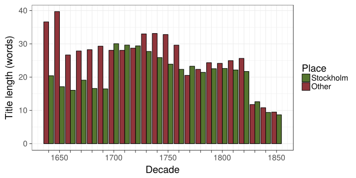

---


### Fig 15: Language use in Turku, Stockholm, Uppsala and Lund

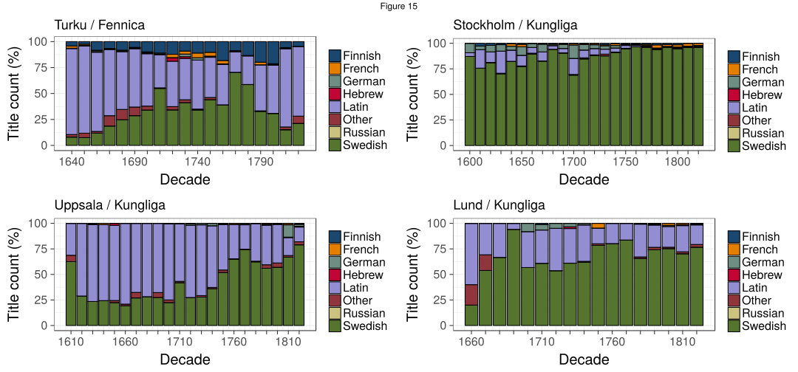

---


### Fig 16: Topic richness per language (Fennica)

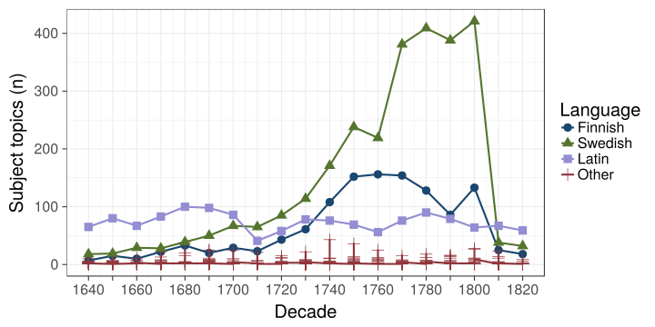

---


### Fig 17: Temporary sermons in Latin and Swedish

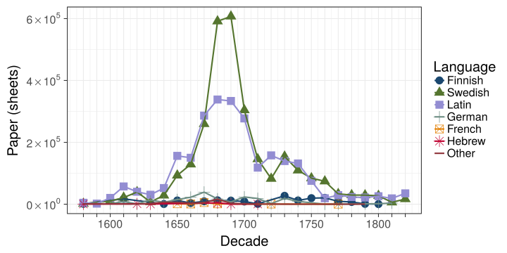

---


### Fig 18: Devotional literature (catechisms, hymns, prayers, etc.) 

Form of literature denoting the advancement of reading in Finland in the 19th century. It has been unclear when devotional literature  shows up as a relevant category.

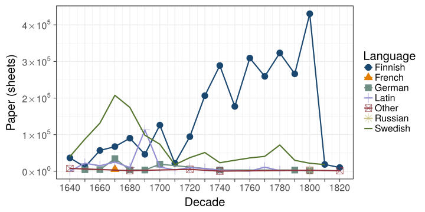

---


## Session info

This document was created with the following versions:


```
## R version 3.4.2 (2017-09-28)
## Platform: x86_64-pc-linux-gnu (64-bit)
## Running under: Ubuntu 17.04
## 
## Matrix products: default
## BLAS: /usr/lib/openblas-base/libblas.so.3
## LAPACK: /usr/lib/libopenblasp-r0.2.19.so
## 
## locale:
##  [1] LC_CTYPE=en_US.UTF-8       LC_NUMERIC=C              
##  [3] LC_TIME=en_US.UTF-8        LC_COLLATE=en_US.UTF-8    
##  [5] LC_MONETARY=en_US.UTF-8    LC_MESSAGES=en_US.UTF-8   
##  [7] LC_PAPER=en_US.UTF-8       LC_NAME=C                 
##  [9] LC_ADDRESS=C               LC_TELEPHONE=C            
## [11] LC_MEASUREMENT=en_US.UTF-8 LC_IDENTIFICATION=C       
## 
## attached base packages:
## [1] stats     graphics  grDevices utils     datasets  methods   base     
## 
## other attached packages:
##  [1] cowplot_0.8.0         scales_0.5.0          testthat_1.0.2       
##  [4] viridis_0.4.0         viridisLite_0.2.0     knitcitations_1.0.9  
##  [7] devtools_1.13.3       stringr_1.2.0         gisfin_0.9.27        
## [10] R6_2.2.2              rgdal_1.2-13          sp_1.2-5             
## [13] ggmap_2.6.1           ggthemes_3.4.0        rmarkdown_1.6.0.9001 
## [16] sorvi_0.8.13          tibble_1.3.4          microbiome_1.1.10006 
## [19] phyloseq_1.21.0       bindrcpp_0.2          knitr_1.17           
## [22] gridExtra_2.3         reshape2_1.4.2        magrittr_1.5         
## [25] fennica_0.1.44        bibliographica_0.2.37 dplyr_0.7.4          
## [28] tidyr_0.7.2           ggplot2_2.2.1        
## 
## loaded via a namespace (and not attached):
##  [1] nlme_3.1-131        lubridate_1.6.0     httr_1.3.1         
##  [4] gmodels_2.16.2      rprojroot_1.2       tools_3.4.2        
##  [7] backports_1.1.1     vegan_2.4-4         lazyeval_0.2.0     
## [10] BiocGenerics_0.23.3 mgcv_1.8-22         colorspace_1.3-2   
## [13] permute_0.9-4       ade4_1.7-8          withr_2.0.0        
## [16] tidyselect_0.2.2    compiler_3.4.2      Biobase_2.37.2     
## [19] Cairo_1.5-9         expm_0.999-2        xml2_1.1.1         
## [22] NLP_0.1-11          labeling_0.3        slam_0.1-40        
## [25] tm_0.7-1            digest_0.6.12       stringdist_0.9.4.6 
## [28] XVector_0.17.1      jpeg_0.1-8          pkgconfig_2.0.1    
## [31] htmltools_0.3.6     bibtex_0.4.2        highr_0.6          
## [34] maps_3.2.0          rlang_0.1.2         bindr_0.1          
## [37] jsonlite_1.5        gtools_3.5.0        spdep_0.6-15       
## [40] biomformat_1.5.0    geosphere_1.5-5     Matrix_1.2-11      
## [43] Rcpp_0.12.13        munsell_0.4.3       S4Vectors_0.15.11  
## [46] RefManageR_0.14.20  ape_4.1             proto_1.0.0        
## [49] stringi_1.1.5       MASS_7.3-47         zlibbioc_1.23.0    
## [52] rhdf5_2.21.6        plyr_1.8.4          grid_3.4.2         
## [55] gdata_2.18.0        parallel_3.4.2      gender_0.5.1.9000  
## [58] crayon_1.3.4        deldir_0.1-14       lattice_0.20-35    
## [61] Biostrings_2.45.4   splines_3.4.2       multtest_2.33.0    
## [64] mapproj_1.2-5       igraph_1.1.2        boot_1.3-20        
## [67] rjson_0.2.15        codetools_0.2-15    stats4_3.4.2       
## [70] LearnBayes_2.15     XML_3.98-1.9        glue_1.1.1         
## [73] babynames_0.3.0     evaluate_0.10.1     data.table_1.10.4-2
## [76] png_0.1-7           foreach_1.4.3       RgoogleMaps_1.4.1  
## [79] gtable_0.2.0        purrr_0.2.3         assertthat_0.2.0   
## [82] coda_0.19-1         survival_2.41-3     genderdata_0.5.0   
## [85] iterators_1.0.8     memoise_1.1.0       IRanges_2.11.18    
## [88] cluster_2.0.6
```


