---


## From particular data to global perspective?

**Idea**: Study early modern knowledge production, all of it (1470-1830)  

**How?** Combine library catalogues (Fennica, Kungliga, ESTC, CERL HPB database)  

**Important**: cleaning up the data (90% of the effort!) and considering how particular data collections (Finnish National Bibliography, English Short-Title Catalogue etc.) have been formed.  

**How to fail**: take worldcat or similar combination of datasets and analyse it as a whole without cleaning it up first.  

**Overcoming a national gaze** by focus on knowledge production through more complex cross-national network of cities

---

### Data: bibliographic catalogues 1640-1828  

**Fennica** Finnish National bibliography

- 18533 documents 1640-1828

**Kungliga**  Swedish National bibliography

- 68850 documents 1640-1828

**Why this project?**

- Visible roots of the diversity of "Finnishness" reflected in knowledge production, 1640-1828

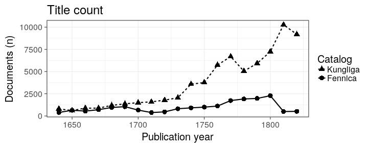

---


## Methods: Open data analytical ecosystem

**Customized** our dedicated R packages for bibliographic analysis combine flexibility with automation

**Automated** scales well with new data and unforeseen changes; a million documents cleaned up in 30 minutes

**Open source** fully transparent and reproducible data analytics: https://github.com/rOpenGov/fennica

**Research potential** greatly underestimated; world is full of metadata collections

  
\tiny{(Figure by Hadley Wickham)}


---


## Preprocess & Enrich


**Clean up messy entries**


```r
polish_physical_extent("iii-xxiv, 118, [2] p.")$pagecount
```

```
## [1] 142
```


**Enrich data** (geocoordinates, gender, ..)


```r
get_country("Porvoo")
```

```
## [1] "Finland"
```

- Parse, clean up, enrich, summarise, analyze, visualize, report..

---

\begin{center}
\Large{1. General trends and political events}
\end{center}


---

\begin{center}
\tiny{\textcolor{gray}{General trends \& political events}}
\end{center}

### Turku as a Swedish University Town among Uppsala, Tartu and Stockholm (+ Lund & Greifswald)


Map by Stamen

---

\begin{center}
\tiny{\textcolor{gray}{General trends \& political events}}
\end{center}

### Publishing activity over time

- 1700-1721 Great Northern War & Fennica drop during "the Great Wrath"
- 1760-1770 Pamphleteering plays a crucial role during abolished censorship
- 1803-1815 Napoleonic wars

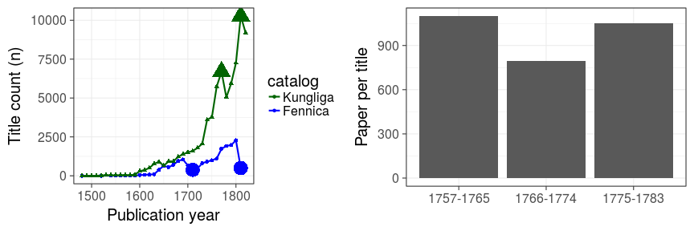

---


\begin{center}
\tiny{\textcolor{gray}{General trends \& political events}}
\end{center}

### Swedish knowledge production & cycles of representation

An example how historical events, namely **parliamentary assemblies** in the Swedish case, have an effect on knowledge production.

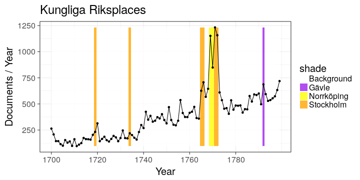

---

\begin{center}
\Large{2. Publishers in Sweden and Turku}
\end{center}

---

\begin{center}
\tiny{\textcolor{gray}{Publishers in Sweden and Turku}}
\end{center}

### Turku in Sweden: proportions for title count and paper in Swedish University towns
 
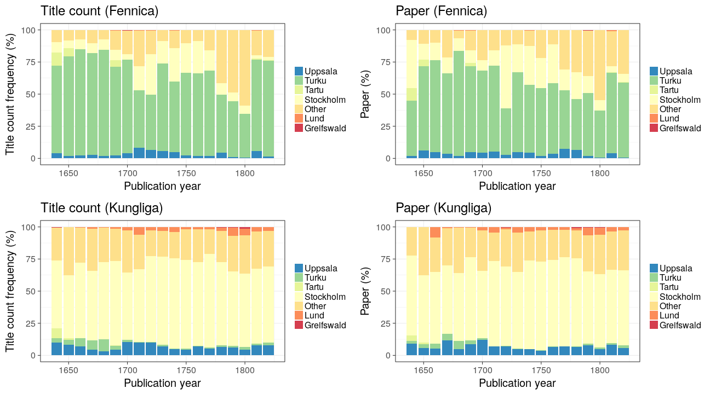

---


\begin{center}
\tiny{\textcolor{gray}{Publishers in Sweden and Turku}}
\end{center}

### Publishers in Swedish University towns (and Finland)

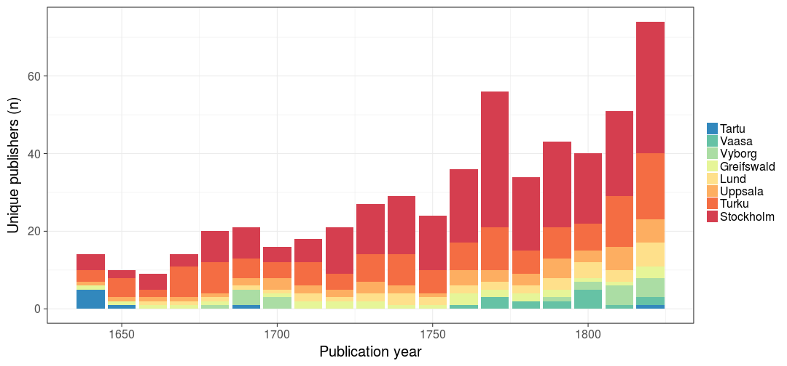


---


\begin{center}
\tiny{\textcolor{gray}{Publishers in Sweden and Turku}}
\end{center}

### Top publishers in Turku/Fennica

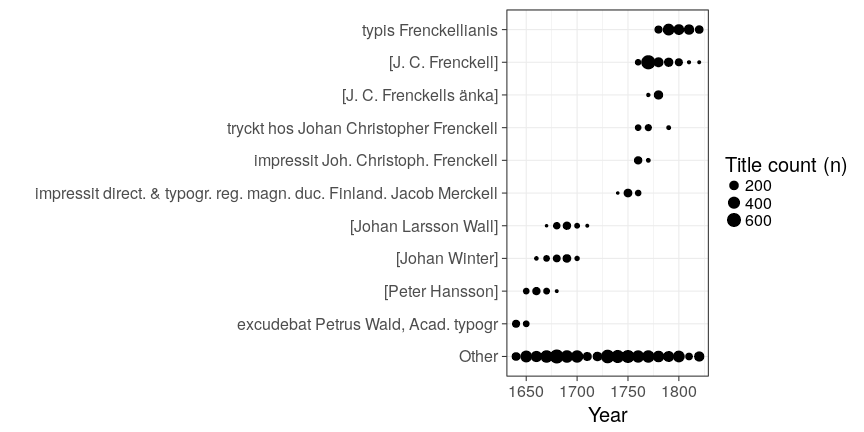

---

\begin{center}
\Large{3. Languages and religious texts in Finland}
\end{center}

---


\begin{center}
\tiny{\textcolor{gray}{Languages \& religious texts in Finland}}
\end{center}

### Different languages in Turku, Stockholm, Uppsala and Lund

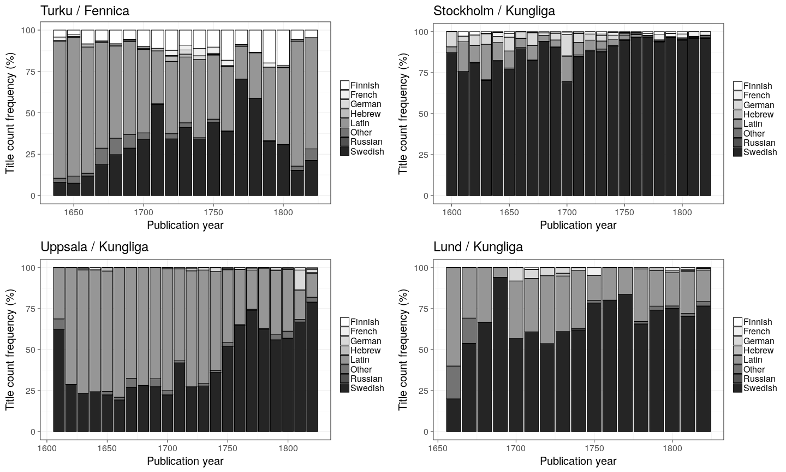

---

\begin{center}
\tiny{\textcolor{gray}{Languages \& religious texts in Finland}}
\end{center}

### Topic richness per language (publications in Fennica)


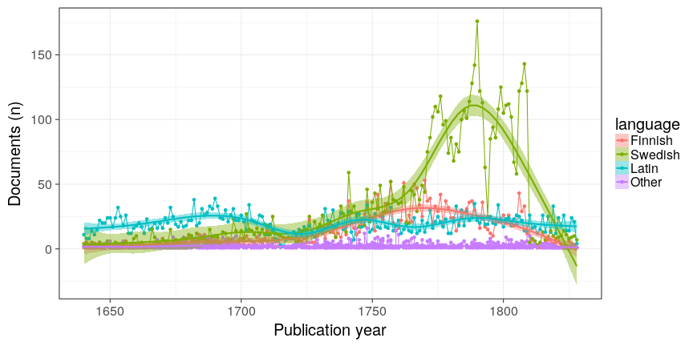

---

\begin{center}
\tiny{\textcolor{gray}{Languages \& religious texts in Finland}}
\end{center}

### Devotional literature (catechisms, hymns, prayers, etc.) 

Form of literature denoting the advancement of reading in Finland in the 19th century. It has been unclear when devotional literature  shows up as a relevant category.

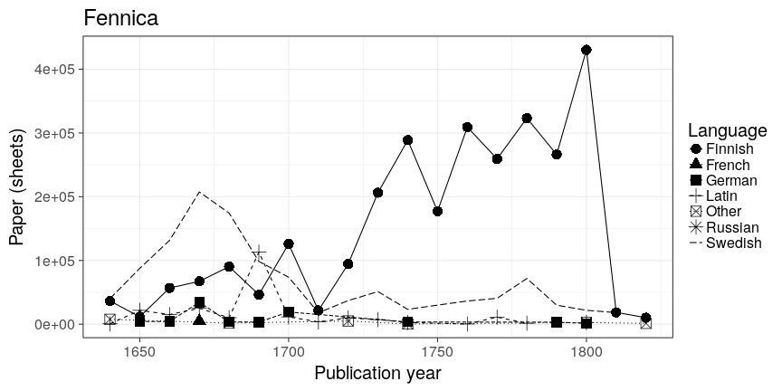

---

\begin{center}
\tiny{\textcolor{gray}{Languages \& religious texts in Finland}}
\end{center}

### Temporary sermons in Latin and Swedish

- Important role in early modern knowledge production. Language of temporary sermons in contrast to devotional literature has not been analysed in Finland (and Sweden). 

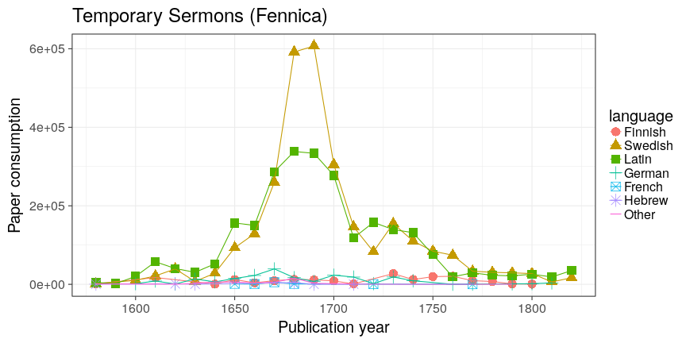

---

\begin{center}
\Large{4. University curriculum and Enlightenment in Finland}
\end{center}

---


\begin{center}
\tiny{\textcolor{gray}{University curriculum \& Enlightenment in Finland}}
\end{center}

### Dissertation languages in Turku 1640-1828

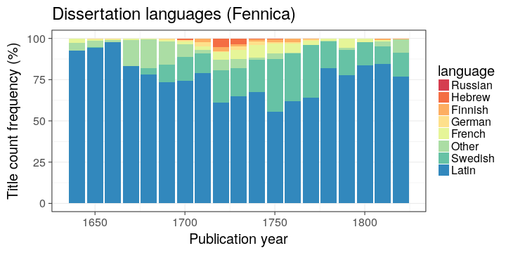

---


\begin{center}
\tiny{\textcolor{gray}{University curriculum \& Enlightenment in Finland}}
\end{center}

### Printing by topics in different languages in Turku

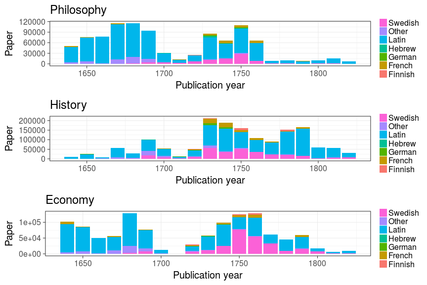


---

\begin{center}
\tiny{\textcolor{gray}{University curriculum \& Enlightenment in Finland}}
\end{center}

### Rise of the octavo sized book as vehicle of Enlightenment

Paper consumption: different document formats over time

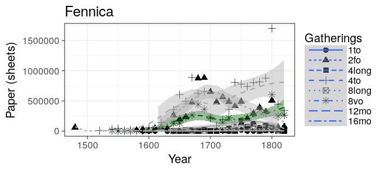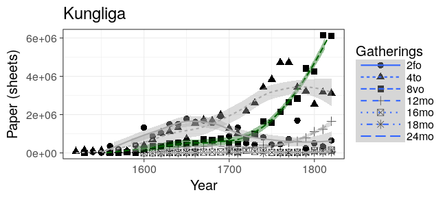

---

##Thanks !

Institutional support:

- Academy of Finland
- University of Helsinki
- Digitalia / The Regional Council of South Savo

Data providers:

- National Library of Finland
- National Library of Sweden

Code infrastructure:

- Github
- R project

For more info, see: 

- \textcolor{blue}{https://github.com/rOpenGov/fennica}

\begin{figure}
\begin{tabular}{cccccc}
\includegraphics[width=2cm,height=2cm]{aka.png}&
\includegraphics[width=1cm,height=1cm]{HY-CC.png}&
\includegraphics[width=1cm,height=1cm]{kansalliskirjasto.png}&
\includegraphics[width=1cm,height=1cm]{kungliga.png}&
\includegraphics[width=1cm,height=1cm]{github-logo.png}&
\includegraphics[width=1cm,height=1cm]{Rlogo.png}
\end{tabular}
\end{figure}

---


### Duplicate publications in Fennica/Kungliga

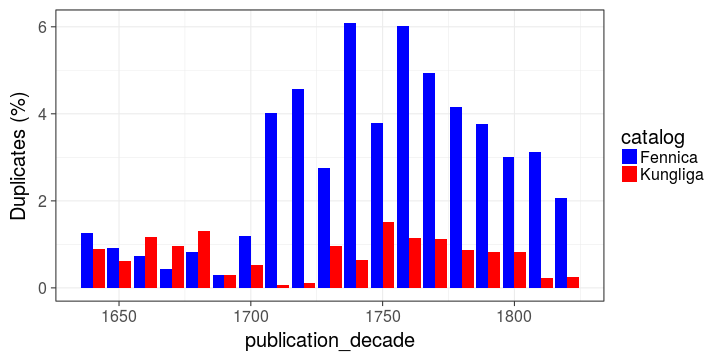


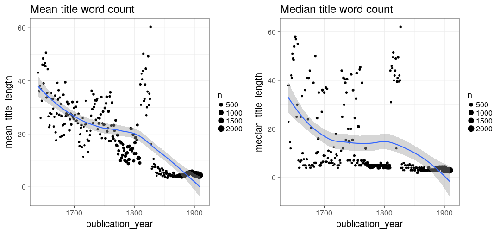


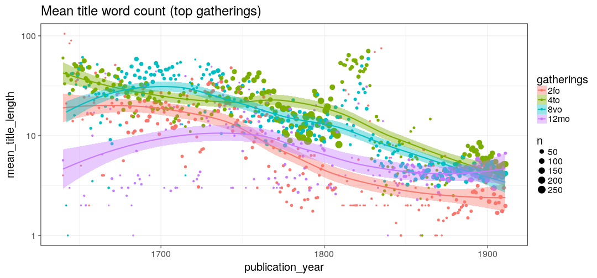


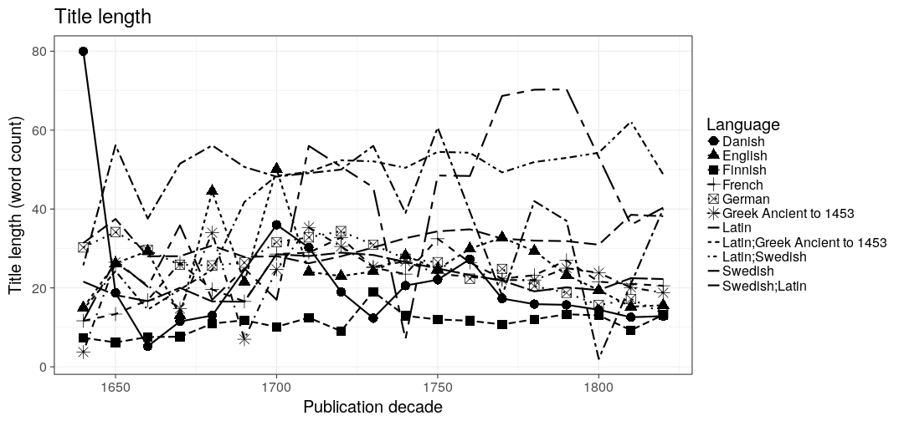


### Kungliga / Linkoping


[Document listing for Kungliga / Linköping 1640 - 1828](output.tables/Linkoping.tab)


### Title count in Linköping


### Unique publishers in Linköping by year

Never two publishers seen on the same year.


| publication_year|publisher                   |
|----------------:|:---------------------------|
|             1664|Kämpe                       |
|             1675|[Daniel Kempe]              |
|             1756|Linköpings stifts tidningar |
|             1793|Linköpings stiftsbibliotek  |
|             1797|Björn                       |
|             1809|Groth & Petré               |
|             1810|Groth & Petré               |
|             1815|Petre och Abrahamsson       |
|             1819|Petre och Abrahamsson       |


### Title count per capita

The historical population sizes used in this analysis are shown in this [table](https://github.com/rOpenGov/bibliographica/blob/master/inst/extdata/population_sizes_in_cities.csv).

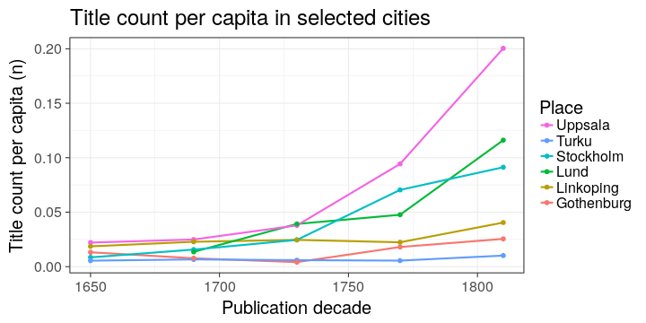

| publication_decade|publication_place | population|    n| titles_per_capita|
|------------------:|:-----------------|----------:|----:|-----------------:|
|               1650|Stockholm         |      35000|  298|         0.0085143|
|               1690|Stockholm         |      57000|  894|         0.0156842|
|               1730|Stockholm         |      57000| 1400|         0.0245614|
|               1770|Stockholm         |      69000| 4862|         0.0704638|
|               1810|Stockholm         |      65474| 5975|         0.0912576|
|               1650|Turku             |       4184|  497|         0.1187859|
|               1690|Turku             |       5882|  721|         0.1225774|
|               1730|Turku             |       4353|  555|         0.1274983|
|               1770|Turku             |       7952| 1153|         0.1449950|
|               1810|Turku             |      11387|  355|         0.0311759|
|               1650|Uppsala           |       2216|   49|         0.0221119|
|               1690|Uppsala           |       2487|   62|         0.0249296|
|               1730|Uppsala           |       3774|  143|         0.0378908|
|               1770|Uppsala           |       3859|  364|         0.0943250|
|               1810|Uppsala           |       4076|  817|         0.2004416|
|               1690|Lund              |       1251|   17|         0.0135891|
|               1730|Lund              |       1530|   60|         0.0392157|
|               1770|Lund              |       2078|   99|         0.0476420|
|               1810|Lund              |       3100|  360|         0.1161290|
|               1650|Gothenburg        |       2653|   35|         0.0131926|
|               1690|Gothenburg        |       5071|   39|         0.0076908|
|               1730|Gothenburg        |       8000|   33|         0.0041250|
|               1770|Gothenburg        |      11143|  201|         0.0180382|
|               1810|Gothenburg        |      14346|  366|         0.0255123|
|               1650|Linkoping         |       1180|   22|         0.0186441|
|               1690|Linkoping         |       1270|   29|         0.0228346|
|               1730|Linkoping         |       1383|   34|         0.0245842|
|               1770|Linkoping         |       2325|   52|         0.0223656|
|               1810|Linkoping         |       3285|  133|         0.0404871|


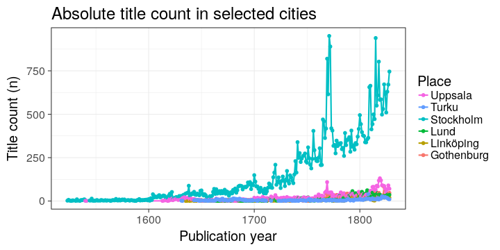


### Octavo analysis 

Paper consumption in octavo format books in Stockholm, Turku, Uppsala,
Lund, Göteborg and Linköping. Again Turku from Fennica, other cities
from Kungliga.

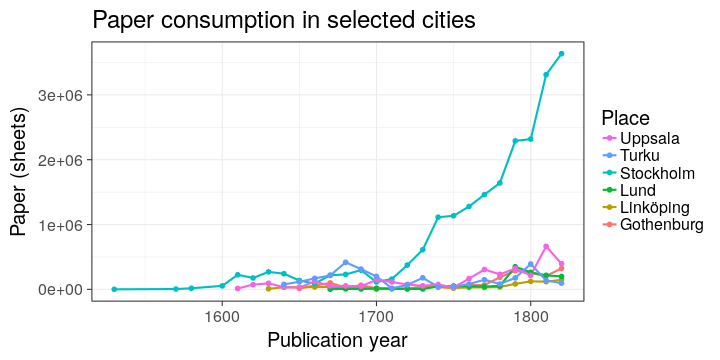


Average title length in words in Stockholm, Turku, Uppsala, Lund,
Göteborg and Linköping. According to Kungliga, except Turku from
Fennica. For octavos only,


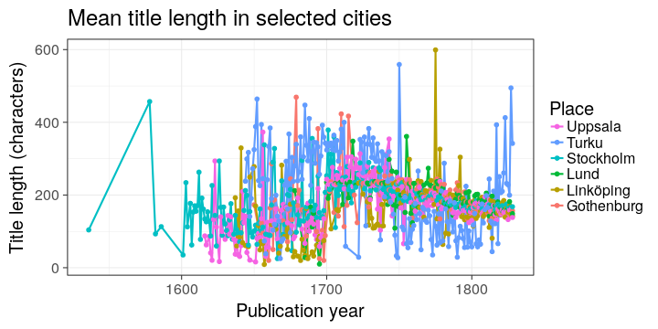


## Session info

This document was created with the following versions:


```r
sessionInfo()
```

```
## R version 3.3.1 (2016-06-21)
## Platform: x86_64-pc-linux-gnu (64-bit)
## Running under: Ubuntu 16.10
## 
## locale:
##  [1] LC_CTYPE=en_US.UTF-8       LC_NUMERIC=C              
##  [3] LC_TIME=en_US.UTF-8        LC_COLLATE=en_US.UTF-8    
##  [5] LC_MONETARY=en_US.UTF-8    LC_MESSAGES=en_US.UTF-8   
##  [7] LC_PAPER=en_US.UTF-8       LC_NAME=C                 
##  [9] LC_ADDRESS=C               LC_TELEPHONE=C            
## [11] LC_MEASUREMENT=en_US.UTF-8 LC_IDENTIFICATION=C       
## 
## attached base packages:
## [1] stats     graphics  grDevices utils     datasets  methods   base     
## 
## other attached packages:
##  [1] bibliographica_0.2.31 knitcitations_1.0.7   microbiome_0.99.88   
##  [4] phyloseq_1.16.2       devtools_1.12.0       sorvi_0.7.26         
##  [7] stringr_1.1.0         gisfin_0.9.27         R6_2.2.0             
## [10] rgdal_1.2-4           sp_1.2-3              ggmap_2.6.1          
## [13] knitr_1.15.1          gridExtra_2.2.1       reshape2_1.4.2       
## [16] magrittr_1.5          fennica_0.1.43        dplyr_0.5.0          
## [19] tidyr_0.6.0           ggplot2_2.2.0        
## 
## loaded via a namespace (and not attached):
##   [1] colorspace_1.3-0      rjson_0.2.15          deldir_0.1-12        
##   [4] babynames_0.2.1       dynamicTreeCut_1.63-1 htmlTable_1.7        
##   [7] XVector_0.12.1        roxygen2_5.0.1        lubridate_1.6.0      
##  [10] AnnotationDbi_1.34.4  RefManageR_0.13.1     codetools_0.2-15     
##  [13] splines_3.3.1         doParallel_1.0.10     impute_1.46.0        
##  [16] robustbase_0.92-6     tgp_2.4-14            ade4_1.7-4           
##  [19] Formula_1.2-1         jsonlite_1.1          WGCNA_1.51           
##  [22] cluster_2.0.5         GO.db_3.3.0           png_0.1-7            
##  [25] httr_1.2.1            mapproj_1.2-4         assertthat_0.1       
##  [28] Matrix_1.2-7.1        lazyeval_0.2.0        acepack_1.4.1        
##  [31] htmltools_0.3.5       tools_3.3.1           igraph_1.0.1         
##  [34] NLP_0.1-9             coda_0.18-1           gtable_0.2.0         
##  [37] maps_3.1.1            gmodels_2.16.2        Rcpp_0.12.8          
##  [40] slam_0.1-38           Biobase_2.32.0        RJSONIO_1.3-0        
##  [43] Biostrings_2.40.2     multtest_2.28.0       spdep_0.6-8          
##  [46] gdata_2.17.0          ape_3.5               preprocessCore_1.34.0
##  [49] nlme_3.1-128          iterators_1.0.8       tensorA_0.36         
##  [52] fastcluster_1.1.21    gender_0.5.1          proto_1.0.0          
##  [55] testthat_1.0.2        gtools_3.5.0          XML_3.98-1.5         
##  [58] stringdist_0.9.4.2    DEoptimR_1.0-6        LearnBayes_2.15      
##  [61] zlibbioc_1.18.0       MASS_7.3-45           scales_0.4.1         
##  [64] parallel_3.3.1        biomformat_1.0.2      genderdata_0.5.0     
##  [67] rhdf5_2.16.0          RColorBrewer_1.1-2    memoise_1.0.0        
##  [70] geosphere_1.5-5       rpart_4.1-10          latticeExtra_0.6-28  
##  [73] stringi_1.1.3         maptree_1.4-7         RSQLite_1.0.0        
##  [76] highr_0.6             S4Vectors_0.10.3      foreach_1.4.3        
##  [79] energy_1.7-0          permute_0.9-4         BiocGenerics_0.18.0  
##  [82] bibtex_0.4.0          boot_1.3-18           bitops_1.0-6         
##  [85] RgoogleMaps_1.4.1     compositions_1.40-1   moments_0.14         
##  [88] matrixStats_0.51.0    evaluate_0.10         lattice_0.20-34      
##  [91] labeling_0.3          plyr_1.8.4            IRanges_2.6.1        
##  [94] Hmisc_4.0-0           DBI_0.5-1             foreign_0.8-67       
##  [97] withr_1.0.2           mgcv_1.8-16           RCurl_1.95-4.8       
## [100] survival_2.40-1       nnet_7.3-12           tibble_1.2           
## [103] bayesm_3.0-2          crayon_1.3.2          jpeg_0.1-8           
## [106] grid_3.3.1            data.table_1.10.0     vegan_2.4-1          
## [109] digest_0.6.10         tm_0.6-2              stats4_3.3.1         
## [112] munsell_0.4.3
```


