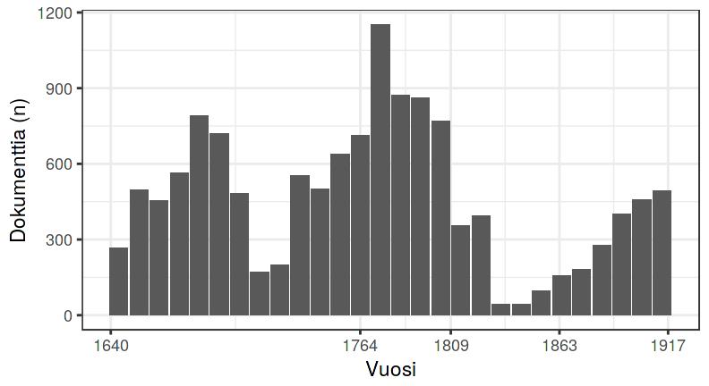

---

### Data: bibliographic catalogues 1640-1828  

**Fennica** Finnish National bibliography

- 18541 documents 1640-1828

**Kungliga**  Swedish National bibliography

- 70468 documents 1640-1828

---

### Rise of the octavo sized book as vehicle of Enlightenment

Paper consumption: document formats over time

