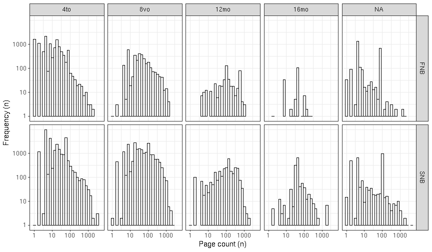
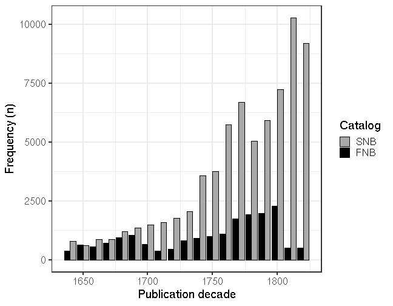

This supplementary document provides a summary of the data fields
analyzed in the main text.

### Data availability

Records in the final data set used in the analyses:

 * FNB: ``18544``
 * SNB: ``70070``

Data availability for the key fields analyzed in this work (%). 

|Field             | FNB (%)|SNB (%) |
|:-----------------|-------:|:-------|
|Publication year  |   100.0|100     |
|Title             |   100.0|100     |
|Page count        |   100.0|100     |
|Language          |    99.8|94      |
|Gatherings        |    98.0|81.1    |
|Topic             |    95.2|23.1*   |
|Publication place |    93.9|96.5    |
|Publisher         |    93.0|11.1*   |
|Author            |    51.7|51.9    |

$^*$The SNB publishers and topics are not used due to the low coverage of harmonized data entries.

### Authors

Number of unique authors and all documents with author information:

|Catalogue | Unique|   All|
|:---------|------:|-----:|
|FNB       |   2137|  9595|
|SNB       |   9387| 36399|

The most common authors in FNB:

|Author                                    | Entries (N)| Fraction (%)|
|:-----------------------------------------|-----------:|------------:|
|Bilmark, Johannes (1728-1801)             |         239|          1.3|
|Petraeus, Aeschillus Olai (1593-1657)     |         227|          1.2|
|Porthan, Henrik Gabriel (1739-1804)       |         221|          1.2|
|Svenonius, Enevaldus Svenonis (1617-1688) |         211|          1.1|
|Gyldenstolpe, Michael Olai (1608-1670)    |         198|          1.1|
|Kalm, Pehr (1716-1779)                    |         172|          0.9|
|Gezelius, Johannes (1615-1690)            |         158|          0.9|
|Hahn, Petrus Olai (1650-1718)             |         155|          0.8|
|Gadd, Pehr Adrian (1727-1797)             |         147|          0.8|
|Scarin, Algothus Asmundi (1684-1771)      |         139|          0.7|

The most common authors in SNB:

|Author                                         | Entries (N)| Fraction (%)|
|:----------------------------------------------|-----------:|------------:|
|Fant, Eric Michael (1754-1817)                 |         204|          0.3|
|Lafontaine, August Heinrich Julius (1758-1831) |         165|          0.2|
|Lagerbring, Sven (1707-1787)                   |         150|          0.2|
|Gustav,  (1746-1792)                           |         141|          0.2|
|Linné, Carl von (1707-1778)                    |         131|          0.2|
|Voltaire,  (1694-1778)                         |         115|          0.2|
|Svebilius, Olof (1624-1700)                    |         113|          0.2|
|Dalin, Olof von (1708-1763)                    |         106|          0.2|
|Bergman, Torbern (1735-1784)                   |         104|          0.1|
|Luther, Martin (1483-1546)                     |         102|          0.1|

### Languages

In FNB, we have identified ``1652`` multilingual documents in the investigated time period. In SNB, the multilingual documents have not been analyzed yet. We use the primary language of the document for summaries.

Number of identified primary languages and all documents with language information.

|Catalogue | Unique|   All|
|:---------|------:|-----:|
|FNB       |     18| 18501|
|SNB       |     32| 65891|

The most common (primary) languages in FNB:

|Language              | Entries (N)| Fraction (%)|
|:---------------------|-----------:|------------:|
|Swedish               |        8170|         44.1|
|Latin                 |        6906|         37.2|
|Finnish               |        2921|         15.8|
|German                |         240|          1.3|
|French                |          92|          0.5|
|Russian               |          48|          0.3|
|English               |          39|          0.2|
|Greek Ancient to 1453 |          28|          0.2|
|Multiple languages    |          18|          0.1|
|Dutch                 |          13|          0.1|

The most common (primary) languages in SNB:

|Language              | Entries (N)| Fraction (%)|
|:---------------------|-----------:|------------:|
|Swedish               |       56357|         80.4|
|Latin                 |        4898|          7.0|
|German                |        1739|          2.5|
|French                |        1302|          1.9|
|Finnish               |         371|          0.5|
|English               |         367|          0.5|
|Danish                |         260|          0.4|
|Greek Ancient to 1453 |         112|          0.2|
|Italian               |         103|          0.1|
|Dutch                 |         103|          0.1|

### Formats (Gatherings)

Proportion (%) of gatherings in the FNB and SNB catalogues. The gatherings with a prevalence less than 1% in both catalogues have been combined into the "Other" category.

|Gatherings         |FNB (%) |SNB (%) |
|:------------------|:-------|:-------|
|2to (2to)          |13.4    |3.6     |
|Quarto (4to)       |63.6    |41.3    |
|Octavo (8vo)       |17.1    |29.7    |
|Duodecimo (12mo)   |2.4     |4.2     |
|Sextodecimo (16mo) |0.9     |1.8     |
|Missing            |2       |18.9    |
|Other              |0.4     |0.3     |

### Pages

Page count variation per gatherings. 

### Publication places

Number of unique publication places and all documents with publication place information.

|Catalogue | Unique|   All|
|:---------|------:|-----:|
|FNB       |     81| 17410|
|SNB       |    289| 67631|

The most common publication places in FNB:

|Publication place | Entries (N)| Fraction (%)|
|:-----------------|-----------:|------------:|
|Turku             |       10954|         59.1|
|Vaasa             |        2832|         15.3|
|Stockholm         |        2213|         11.9|
|Uppsala           |         509|          2.7|
|Tartu             |         141|          0.8|
|Vyborg            |         114|          0.6|
|St Petersburg     |         101|          0.5|
|London            |          42|          0.2|
|Tallinn           |          41|          0.2|
|Amsterdam         |          35|          0.2|

The most common publication places in SNB:

|Publication place | Entries (N)| Fraction (%)|
|:-----------------|-----------:|------------:|
|Stockholm         |       43590|         62.2|
|Uppsala           |        4633|          6.6|
|Gothenburg        |        2383|          3.4|
|Lund              |        2213|          3.2|
|Linköping         |        1269|          1.8|
|Örebro            |        1082|          1.5|
|Västerås          |        1060|          1.5|
|Turku             |        1056|          1.5|
|Strängnäs         |         971|          1.4|
|Norrköping        |         881|          1.3|

### Publication years

Title count per decade for FNB and SNB.

### Publishers

In FNB, the data includes ``523`` unique publishers, and ``93``% of the documents have publisher information. We have not analyzed publishers in SNB, where the availability of harmonized publisher information is currently low (``11``%). 

The most common publishers in FNB (the total count and percentage of all documents are shown):

|Publisher                       | Entries (N)| Fraction (%)|
|:-------------------------------|-----------:|------------:|
|Frenckell, Johan Christopher II |        2204|         11.9|
|Londicer, Georg Wilhelm         |        2100|         11.3|
|Frenckell, Johan Christopher I  |        1739|          9.4|
|Wall, Johan Larsson             |        1266|          6.8|
|Kämpe, Johan                    |         986|          5.3|
|Hansson, Peter                  |         982|          5.3|
|Merckell, Jacob                 |         953|          5.1|
|Winter, Johan                   |         884|          4.8|
|J.C. Frenckell ja poika         |         502|          2.7|
|Londicer, Carl Anton            |         500|          2.7|

### Topics

We use here the term "Topic" for the "Topical term" MARC field 650a for brevity. In FNB, the data includes ``2935`` unique topics. ``95``% of the documents have topic information. We have not analyzed topics in SNB, where the availability of harmonized topics is currently low (``23``%). 

The most common topics in FNB (English translation in parentheses):

|Topic                                                       | Entries (N)| Fraction (%)|
|:-----------------------------------------------------------|-----------:|------------:|
|hautajaiset (funerals)                                      |        1328|          7.2|
|etsintäkuulutukset (warrants)                               |        1072|          5.8|
|häät (weddings)                                             |         974|          5.3|
|yliopistot;juhlamenot;Turku (universities;ceremonies;Turku) |         483|          2.6|
|arkkiveisut;virret (broadside ballads;hymns)                |         463|          2.5|
|dogmatiikka (dogmatics)                                     |         388|          2.1|
|moraali (moral philosophy)                                  |         346|          1.9|
|homiletiikka (homiletics)                                   |         333|          1.8|
|filosofia (philosophy)                                      |         310|          1.7|
|eksegetiikka (exegetics)                                    |         285|          1.5|

### MARC fields

The following table indicates the MARC fields for each data type in
our harmonized data collection. The language information was picked from the
MARC fields 008lang and 041a for SNB and FNB, respectively.

|MARC    |Description                              |SNB |FNB |
|:-------|:----------------------------------------|:---|:---|
|008lang |Language                                 |x   |    |
|041a    |Language                                 |    |x   |
|041h    |Original language                        |    |x   |
|100a    |Author                                   |x   |x   |
|100d    |Author date                              |x   |x   |
|110a    |Corporate (as author)                    |x   |    |
|240a    |Uniform title                            |x   |x   |
|245a    |Main title                               |x   |x   |
|245b    |Subtitle                                 |x   |x   |
|245c    |Title (statement of responsibility)      |x   |    |
|260a    |Publication place                        |x   |x   |
|260b    |Publisher                                |x   |x   |
|260c    |Publication year                         |x   |x   |
|260e    |Place of manufacture                     |x   |    |
|260f    |Manufacturer                             |x   |    |
|300a    |Page count                               |x   |x   |
|300b    |Physical details                         |x   |x   |
|300c    |Gatherings                               |x   |x   |
|300e    |Accompanying material                    |x   |x   |
|310a    |Publication frequency                    |x   |x   |
|362a    |Publication interval                     |x   |x   |
|440a    |Series                                   |x   |    |
|440v    |Series (volume)                          |x   |    |
|500a    |General note                             |x   |x   |
|502a    |Dissertation                             |x   |x   |
|502c    |Dissertation granter                     |x   |x   |
|502d    |Dissertation year                        |x   |x   |
|510a    |Source note                              |x   |x   |
|510c    |Source location                          |x   |x   |
|650a    |Topical term                             |x   |x   |
|650x    |Topical term (subdivision)               |x   |    |
|650y    |Topical term (chronological subdivision) |x   |    |
|650z    |Topical term (geographical subdivision)  |x   |    |
|651a    |Subject geography                        |x   |x   |
|700a    |Related person                           |x   |    |
|700d    |Related person (years)                   |x   |    |
|710a    |Related corporate                        |x   |x   |
|720a    |Related name (uncontrolled)              |x   |x   |
|740a    |Related title (uncontrolled)             |x   |    |
|772c    |Parent entry (author)                    |x   |    |
|772d    |Parent entry (publication information)   |x   |    |
|772t    |Parent entry (title)                     |x   |    |
|785t    |Succeeding entry                         |x   |x   |
|852a    |Holding location                         |x   |x   |
|852j    |Shelving control number                  |x   |    |
|852z    |Public note (holding organization)       |x   |    |
|866x    |Basic bibliographic unit                 |x   |    |
|900a    |Cross-reference (author)                 |x   |    |
|900d    |Cross-reference (author date)            |x   |    |
|900u    |Cross-reference (author affiliation)     |x   |    |
|976a    |Local use                                |x   |    |
|976b    |Local use                                |x   |    |

