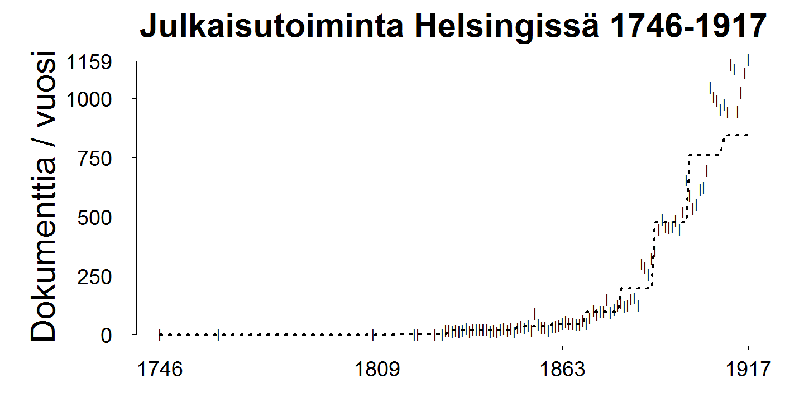

```
## Error in eval(expr, envir, enclos): object 'published_in' not found
```

```
## Error in eval(expr, envir, enclos): unknown column 'published_in'
```


```
## Warning in min(x): no non-missing arguments to min; returning Inf
```

```
## Warning in max(x): no non-missing arguments to max; returning -Inf
```

```
## Warning in min(x): no non-missing arguments to min; returning Inf
```

```
## Warning in max(x): no non-missing arguments to max; returning -Inf
```

```
## Error in plot.window(...): need finite 'xlim' values
```



```
## Error in xy.coords(x, y): 'x' and 'y' lengths differ
```


