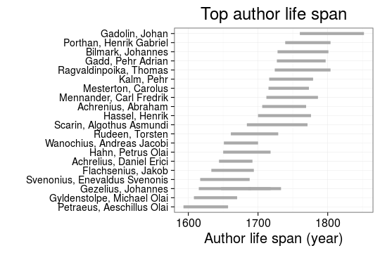
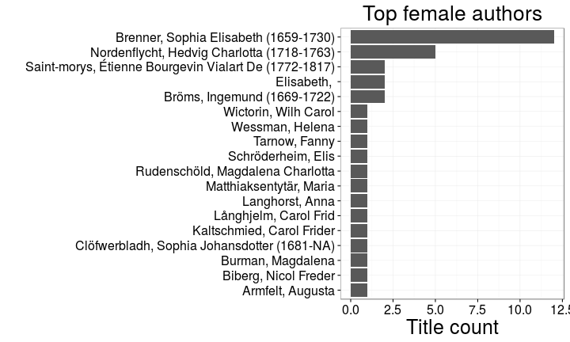
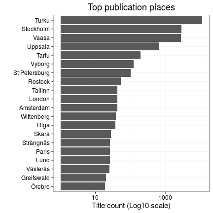
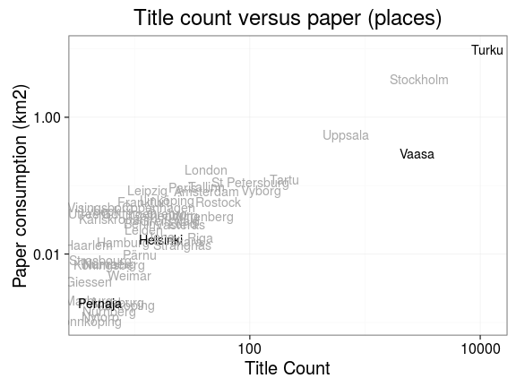
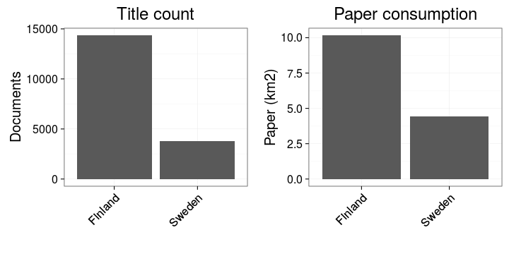
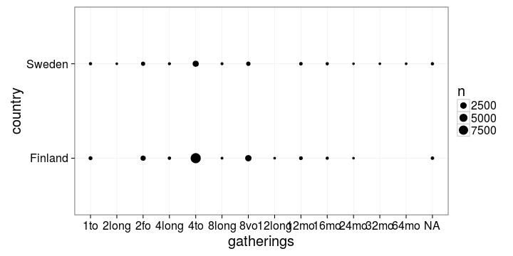
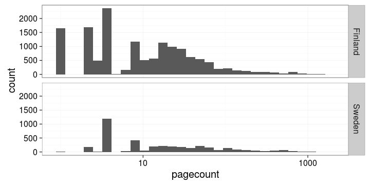
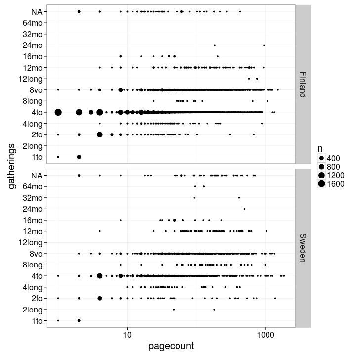
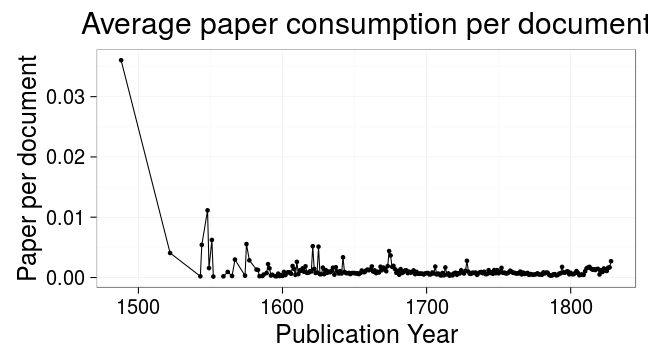
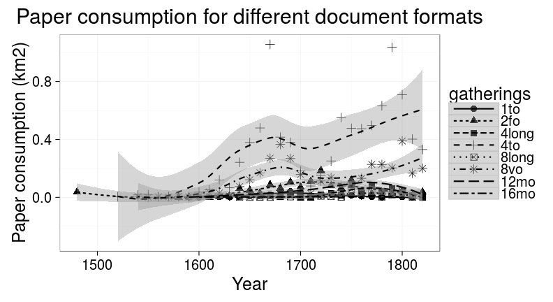

## LIBER Analyses


This document repeats the ESTC analysis from [Lahti, Ilomaki, Tolonen (2015); Liber Quarterly 25(2), pp.87–116](http://doi.org/10.18352/lq.10112) for other data sets.


## Who wrote history ?

### The life spans of the top authors based on the title count




### The most active known female authors based on the title count

The gender is inferred automatically from the first names




## Where was history published ?

### The top publication places ranked by the title count




### Title count and overall paper consumption in the top publication locations

The current country of origin is indicated. Finland is highlighted.




### Title count and paper consumption in Finland and Sweden




Estimated gatherings per country:



Estimated pagecounts per country:



Gatherings vs. pagecounts per country



## How does publishing change ?

### Average paper consumption per document 




### Paper consumption in books (balls) versus pamphlets (triangles)

Books are any documents with more than 32 pages. Pamphlets are anything less or equal than 32 pages.


### Paper consumption for different document formats over time

Each point represents a decade. Loess smoothing.




## Session info

This document was created with the following versions:


```r
sessionInfo()
```

```
## R version 3.3.0 (2016-05-03)
## Platform: x86_64-pc-linux-gnu (64-bit)
## Running under: Ubuntu 16.04 LTS
## 
## locale:
##  [1] LC_CTYPE=en_US.UTF-8       LC_NUMERIC=C              
##  [3] LC_TIME=de_BE.UTF-8        LC_COLLATE=en_US.UTF-8    
##  [5] LC_MONETARY=de_BE.UTF-8    LC_MESSAGES=en_US.UTF-8   
##  [7] LC_PAPER=de_BE.UTF-8       LC_NAME=C                 
##  [9] LC_ADDRESS=C               LC_TELEPHONE=C            
## [11] LC_MEASUREMENT=de_BE.UTF-8 LC_IDENTIFICATION=C       
## 
## attached base packages:
## [1] stats     graphics  grDevices utils     datasets  methods   base     
## 
## other attached packages:
##  [1] ggthemes_3.0.3        git2r_0.15.0          knitcitations_1.0.7  
##  [4] rmarkdown_0.9.6.14    stringr_1.0.0         microbiome_0.99.83   
##  [7] phyloseq_1.16.2       knitr_1.13            gridExtra_2.2.1      
## [10] reshape2_1.4.1        tidyr_0.4.1           fennica_0.1.42       
## [13] ggplot2_2.1.0         magrittr_1.5          sorvi_0.7.46         
## [16] tibble_1.0            dplyr_0.4.3           bibliographica_0.2.21
## [19] devtools_1.11.1      
## 
## loaded via a namespace (and not attached):
##  [1] nlme_3.1-128          bitops_1.0-6          matrixStats_0.50.2   
##  [4] lubridate_1.5.6       httr_1.1.0            doParallel_1.0.10    
##  [7] RColorBrewer_1.1-2    dynamicTreeCut_1.63-1 tools_3.3.0          
## [10] R6_2.1.2              vegan_2.3-5           rpart_4.1-10         
## [13] Hmisc_3.17-4          DBI_0.4-1             lazyeval_0.1.10      
## [16] BiocGenerics_0.18.0   mgcv_1.8-12           colorspace_1.2-6     
## [19] permute_0.9-0         ade4_1.7-4            nnet_7.3-12          
## [22] withr_1.0.1           moments_0.14          preprocessCore_1.34.0
## [25] chron_2.3-47          WGCNA_1.51            Biobase_2.32.0       
## [28] formatR_1.4           NLP_0.1-9             labeling_0.3         
## [31] slam_0.1-34           scales_0.4.0          tm_0.6-2             
## [34] tgp_2.4-14            digest_0.6.9          foreign_0.8-66       
## [37] XVector_0.12.0        htmltools_0.3.5       tau_0.0-18           
## [40] bibtex_0.4.0          highr_0.6             RSQLite_1.0.0        
## [43] impute_1.46.0         jsonlite_0.9.21       acepack_1.3-3.3      
## [46] RCurl_1.95-4.8        GO.db_3.3.0           Formula_1.2-1        
## [49] biomformat_1.0.2      Matrix_1.2-6          maptree_1.4-7        
## [52] Rcpp_0.12.5           munsell_0.4.3         S4Vectors_0.10.1     
## [55] RefManageR_0.10.13    ape_3.5               yaml_2.1.13          
## [58] stringi_1.1.1         RJSONIO_1.3-0         MASS_7.3-45          
## [61] zlibbioc_1.18.0       rhdf5_2.16.0          plyr_1.8.4           
## [64] grid_3.3.0            parallel_3.3.0        gender_0.5.1         
## [67] crayon_1.3.1          lattice_0.20-33       Biostrings_2.40.2    
## [70] splines_3.3.0         multtest_2.28.0       igraph_1.0.1         
## [73] fastcluster_1.1.20    codetools_0.2-14      stats4_3.3.0         
## [76] XML_3.98-1.4          babynames_0.2.1       evaluate_0.9         
## [79] latticeExtra_0.6-28   data.table_1.9.6      foreach_1.4.3        
## [82] testthat_1.0.2        gtable_0.2.0          assertthat_0.1       
## [85] roxygen2_5.0.1        survival_2.39-4       genderdata_0.5.0     
## [88] iterators_1.0.8       AnnotationDbi_1.34.3  memoise_1.0.0        
## [91] IRanges_2.6.0         cluster_2.0.4
```

