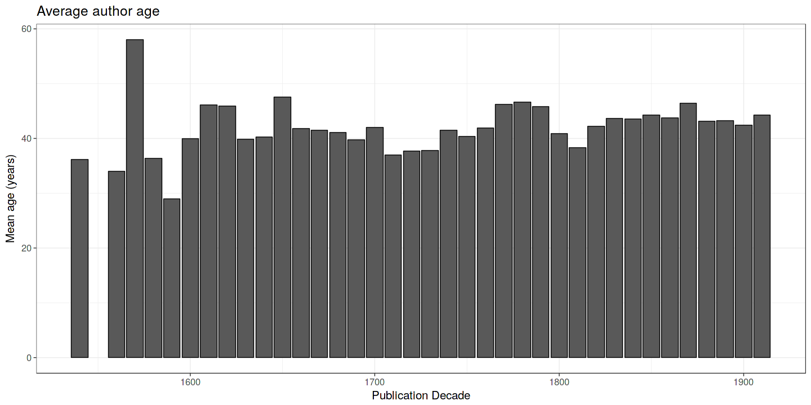
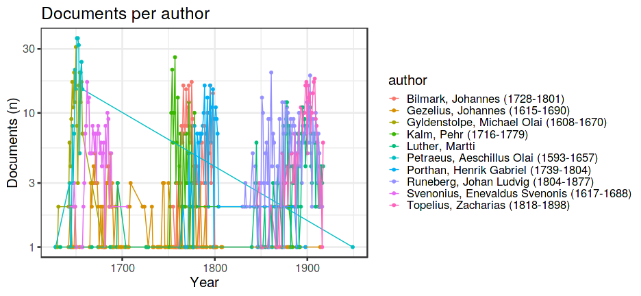

Authors
-------

-   569 [unique authors](output.tables/author_accepted.csv) These final
    names capture all name variants from the custom [author synonyme
    table](https://github.com/COMHIS/fennica/blob/master/inst/extdata/ambiguous-authors.csv),
    and exclude known pseudonymes (see below). If multiple names for the
    same author are still observed on this list, they should be added on
    the [author synonyme
    table](https://github.com/COMHIS/fennica/blob/master/inst/extdata/ambiguous-authors.csv).
-   664 documents have unambiguous author information (66%).
-   1 [unique pseudonymes](output.tables/pseudonyme_accepted.csv) are
    recognized based on [custom pseudonyme
    lists](https://github.com/COMHIS/fennica/blob/master/inst/extdata/names/pseudonymes/custom_pseudonymes.csv).
-   0 [discarded author names](output.tables/author_discarded.csv) This
    list should not include any real authors (if it does, please send a
    note to the admin). The stopword lists are considered when
    discarding names.
-   [Author name
    conversions](output.tables/author_conversion_nontrivial.csv)
    Non-trivial conversions from the original raw data to final names.

### Auxiliary files

-   [Author synonyme
    table](https://github.com/COMHIS/fennica/blob/master/inst/extdata/ambiguous-authors.csv)
-   [Stopwords for
    names](https://github.com/COMHIS/fennica/blob/master/inst/extdata/stopwords_for_names.csv)
-   [Stopwords for
    titles](https://github.com/COMHIS/fennica/blob/master/inst/extdata/stopwords_titles.csv)
-   [Custom pseudonyme
    lists](https://github.com/COMHIS/fennica/blob/master/inst/extdata/names/pseudonymes/custom_pseudonymes.csv)

Top-50 uniquely identified authors and their productivity (title count).

    ## Error in top_plot(df, "author", ntop): could not find function "top_plot"

    ## NULL

    ## Error in top_plot(dff, "author_name", ntop): could not find function "top_plot"

    ## NULL

### Ambiguous authors

Authors with ambiguous living year information - can we spot here cases
where these are clearly known identical or distinct authors? Should also
add living year information from supporting sources later.

385 [authors with missing life
years](output.tables/authors_missing_lifeyears.csv) (Life year info can
be augmented
[here](https://github.com/COMHIS/fennica/blob/master/inst/extdata/author_info.csv))

2 [authors with ambiguous life
years](output.tables/author_life_ambiguous.csv) Some of these might be
synonymous and could be added to [author synonyme
list](https://github.com/COMHIS/fennica/blob/master/inst/extdata/ambiguous-authors.csv)
(the first term will be selected for the final data)

### Life span of uniquely identified top authors

Ordered by productivity (number of documents))

### Author age

221 documents (22%) have author age at the publication year. These have
been calculated for documents where the publication year and author life
years (birth and death) are available, and the document has been printed
during the author’s life time.

### Author productivity

Title count versus paper consumption (all authors):

    ## Error in compare_title_paper(df, "author", plot.mode = "text"): could not find function "compare_title_paper"

    ## Error in compare_title_paper(df, "author", plot.mode = "point"): could not find function "compare_title_paper"

    ## Error in arrangeGrob(...): object 'res2' not found

    ## Error: Problem with `summarise()` input `paper`.
    ## ✖ object 'paper' not found
    ## ℹ Input `paper` is `sum(paper, na.rm = TRUE)`.
    ## ℹ The error occurred in group 1: publication_year = 1647, author = "Svenonius, Enevaldus Svenonis (1617-1688)".

    ## Error in ggplot(df2, aes(x = publication_year, y = paper, group = author, : object 'df2' not found

    ## Error in ggplot(df2, aes(x = publication_year, y = n, group = author, : object 'df2' not found

