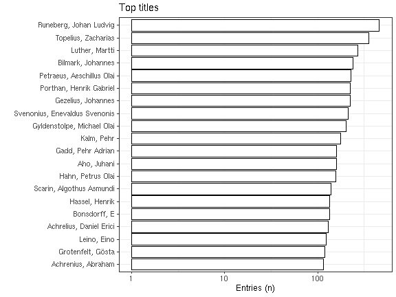
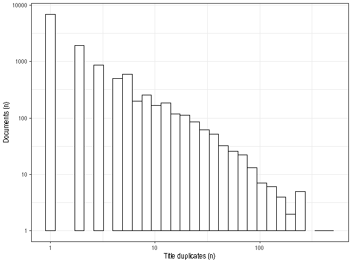

-   [Unique accepted entries](output.tables/author_name_accepted.csv):
    12017
-   [Unique discarded entries in original
    data](output.tables/author_name_discarded.csv) (excluding NA cases):
    20
-   Original documents with non-NA titles: 45812 / 71919 (63.7%)
-   Original documents with missing (NA) titles 26107 / 71919 documents
    (36.3%)

Top-20 titles and their title counts.

Frequency of unique titles:

Authors
-------

-   12017 [unique authors](output.tables/author_accepted.csv) These
    final names capture all name variants from the custom [author
    synonyme
    table](https://github.com/COMHIS/fennica/blob/master/inst/extdata/ambiguous-authors.csv),
    and exclude known pseudonymes (see below). If multiple names for the
    same author are still observed on this list, they should be added on
    the [author synonyme
    table](https://github.com/COMHIS/fennica/blob/master/inst/extdata/ambiguous-authors.csv).
-   45812 documents have unambiguous author information (64%).
-   12017 [unique pseudonymes](output.tables/pseudonyme_accepted.csv)
    are recognized based on [custom pseudonyme
    lists](https://github.com/COMHIS/fennica/blob/master/inst/extdata/names/pseudonymes/custom_pseudonymes.csv).
-   20 [discarded author names](output.tables/author_discarded.csv) This
    list should not include any real authors (if it does, please send a
    note to the admin). The stopword lists are considered when
    discarding names.
-   [Author name
    conversions](output.tables/author_conversion_nontrivial.csv)
    Non-trivial conversions from the original raw data to final names.

### Auxiliary files

-   [Author synonyme
    table](https://github.com/COMHIS/fennica/blob/master/inst/extdata/ambiguous-authors.csv)
-   [Stopwords for
    names](https://github.com/COMHIS/fennica/blob/master/inst/extdata/stopwords_for_names.csv)
-   [Stopwords for
    titles](https://github.com/COMHIS/fennica/blob/master/inst/extdata/stopwords_titles.csv)
-   [Custom pseudonyme
    lists](https://github.com/COMHIS/fennica/blob/master/inst/extdata/names/pseudonymes/custom_pseudonymes.csv)

Top-20 uniquely identified authors and their productivity (title count).

### Author productivity

Title count versus paper consumption (all authors):

