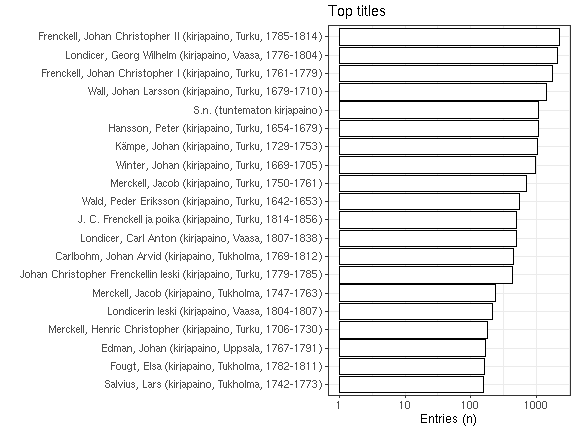
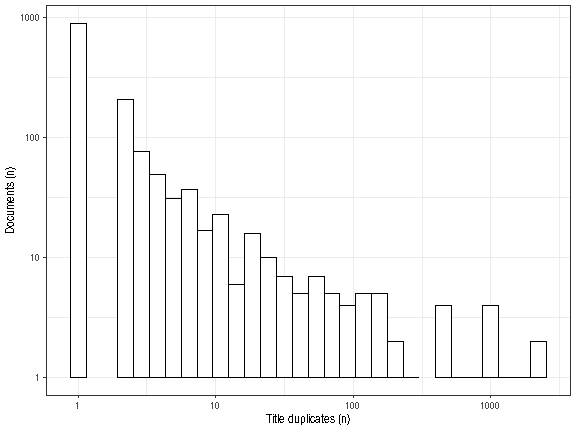

[Accepted corporate info](https://github.com/COMHIS/fennica/blob/master/inst/examples/output.tables/corporate_accepted.csv)

[Discarded corporate info](https://github.com/COMHIS/fennica/blob/master/inst/examples/output.tables/corporate_discarded.csv)

-   [Unique accepted entries](output.tables/corporate_accepted.csv):
    1415
-   [Unique discarded entries in original    data](output.tables/corporate_discarded.csv) (excluding NA cases): 0
-   Original documents with non-NA titles: 21417 / 71919 (29.8%)
-   Original documents with missing (NA) titles 50502 / 71919 documents
    (70.2%)

Top-20 titles and their title counts.

Frequency of unique titles:

