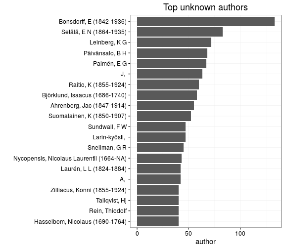
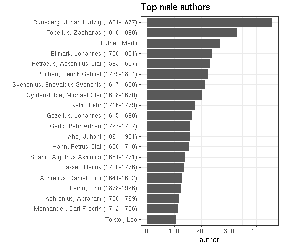
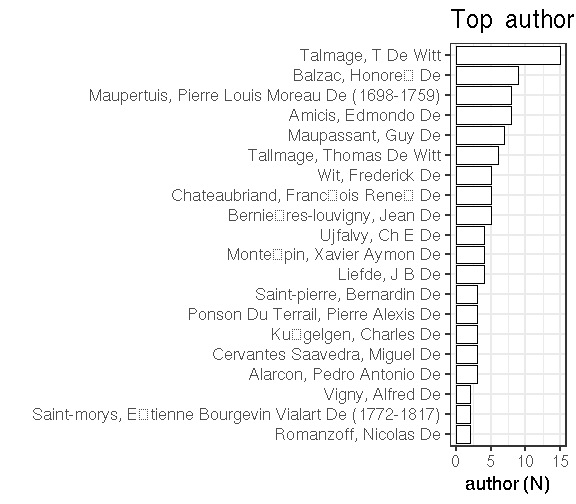
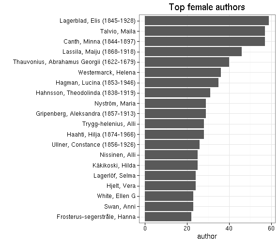
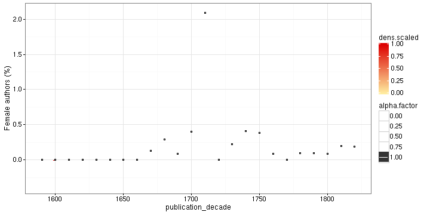

### Gender

[Female authors](output.tables/gender_female.csv)

[Male authors](output.tables/gender_male.csv)

[Authors with missing gender](output.tables/gender_unknown.csv)





Author gender distribution in the complete data:


|author_gender |  docs| fraction|
|:-------------|-----:|--------:|
|ambiguous     |   760|     1.07|
|female        |  3034|     4.26|
|male          | 31252|    43.86|
|NA            | 36202|    50.81|

Author gender distribution over time. Note that the name-gender mappings change over time. This has not been taken into account yet.


```
## Error in eval(expr, envir, enclos): could not find function "regression_plot"
```




