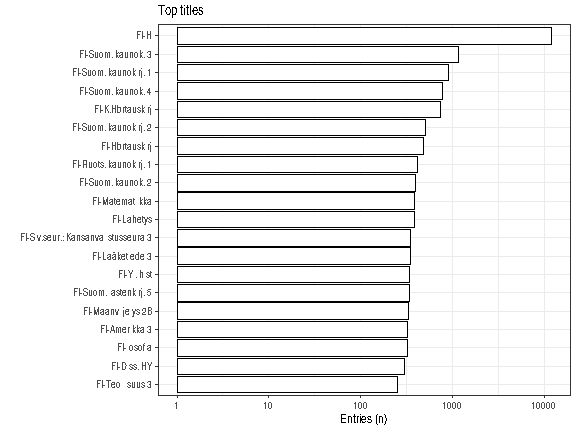
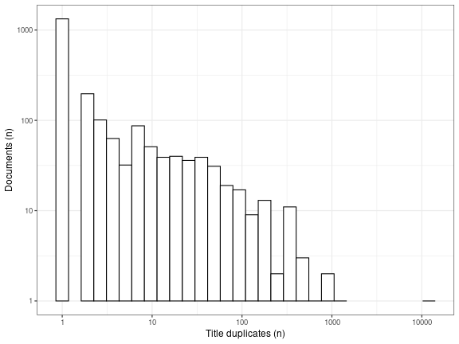

-   [Unique accepted entries](%60r%20file_accepted%60):
    `r length(unique(df[[field]]))`
-   [Unique discarded entries in original
    data](%60r%20file_discarded%60) (excluding NA cases):
    `r as.vector(countLines(file_discarded) - 1)`
-   Original documents with non-NA titles: `r sum(!is.na(df[[field]]))`
    / `r nrow(df)` (`r round(100*mean(!is.na(df[[field]])), 1)`%)
-   Original documents with missing (NA) titles
    `r sum(is.na(df[[field]]))` / `r nrow(df)` documents
    (`r round(100*mean(is.na(df[[field]])), 1)`%)

Top-20 titles and their title counts.

Frequency of unique titles:

