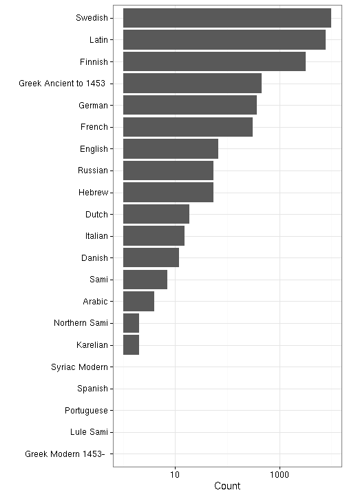

## Language

 * 39 unique languages
 * The languages may come in [combinations](output.tables/language_conversions.csv)
 * 4333 multilingual documents (6.02%)  
 * 733 docs (1.02%) with no recognized language 
 * [Discarded languages](output.tables/language_discarded.csv)

Language codes are from [MARC](http://www.loc.gov/marc/languages/language_code.html); new custom abbreviations can be added in [this table](https://github.com/rOpenGov/bibliographica/blob/master/inst/extdata/language_abbreviations.csv).

Title count per language (including multi-language documents):

### Top languages

|Language | Documents (n)| Fraction (%)|
|:--------|-------------:|------------:|
|Finnish  |         35136|         46.1|
|Swedish  |         26592|         34.9|
|Latin    |          8311|         10.9|
|German   |          2356|          3.1|
|Russian  |          1080|          1.4|
|French   |          1070|          1.4|

