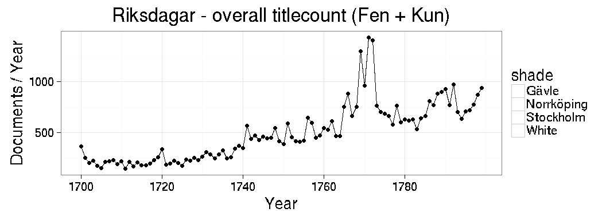
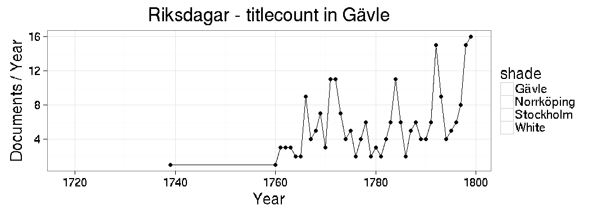
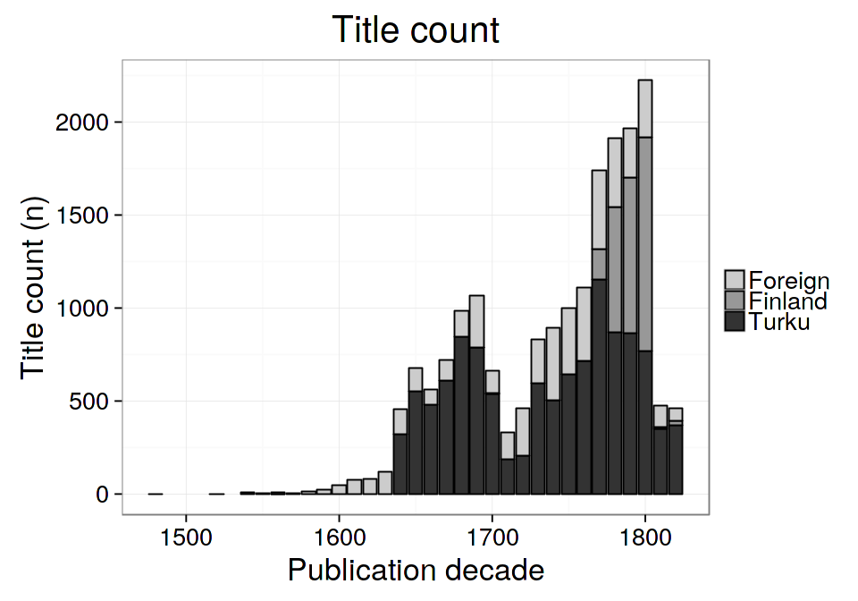

<!--
  %\VignetteEngine{knitr::rmarkdown}
  %\VignetteIndexEntry{microbiome tutorial}
  %\usepackage[utf8]{inputenc}
-->
Printing in a Periphery: a Quantitative Study of Finnish Knowledge Production, 1640-1828
========================================================================================

Introduction
------------

Matti Klinge HYn historia; Jari Niemelä, Vain hyödynkö tähden (väitöskirja) käsittelee Turun yliopiston asemaa.

Östholm, Hanna, Litteraturens uppodling : läsesällskap och litteraturkritik som politisk strategi vid sekelskiftet 1800; vertailee Turkua ja Uppsalaa lukuseurojen kautta.

Aatehistoria ja digitaalisten aineistojen mahdollisuudet (Tolonen and Lahti, 2015)

We have prepared open data analytical ecosystem for in-depth analysis of such data collections (Lahti, Ilomäki, and Tolonen, 2015b).

You can cite with the DOI (the citation info will then be collected automatically): (Lahti, Ilomäki, and Tolonen, 2015b) or alternatively add new references to the [bib file](bibliography.bib) and then cite using the key with (Lahti, Ilomäki, and Tolonen, 2015a). Such citations will be automatically numbered and collected in references section.

-   Knowledge production has been approached largely through a national perspective, here we shift focus by combining materials from Sweden and Finland and by specifically looking at cities as sites for knowledge production. Cities are to this effect seen as partly supplementing, partly competing intellectual centres.

Results
-------

### General trends: Fennica vs. Kungliga

Relevant summaries can be moved here and polished. Which figures at least ? Just let me know and I will add.

-   [Fennica overview](https://github.com/rOpenGov/fennica/blob/master/inst/examples/overview.md)
-   [Kungliga overview](https://github.com/rOpenGov/kungliga/blob/master/antagomir/overview.md)

Overall development in publishing activity:


The top publication places ranked by the title count


Comparison of printing activity in Turku, Uppsala, Lund, and Stockholm. Turussa julkaiseminen alkaa vasta 1640-luvulla, mutta ollaan kiinnostuttu ruotsalaisesta julkaisemisesta ennen sitä. Esim miten Turun yliopiston perustaminen vaikuttaa ruotsalaiseen julkaisukenttään 1600-luvun aikana. I can provide percentages instead of counts, or paper consumption estimates (not reliable yet, though), barplots, selected time spans, selected places etc.. just let me know what is needed.


**Valtiopäivät**

Riksdagar are in some cases associated with publishing peaks (see Figure ...). See "Vapauden ajan valtiopäivät" from 1719 onwards ?

Erityisesti:

Riksdag Stockholm 20 januari 1719 1 juni 1719

Riksdag Stockholm 14 maj 1734 14 december 1734

Riksdag Stockholm 21 februari 1765 21 oktober 1766

Riksdag Norrköping & Stockholm 22 april 1769 5 februari 1770

Riksdag Stockholm 19 juni 1771 12 september 1772

Riksdag Gävle 26 januari 1792 24 februari 1792

--&gt; tapahtuuko Gävlessä selvää nousua julkaisemisessa.

The publishing of historical works in .. on a timeline highlighting the eras of the riksdagar (16..-16..)..





### Book as media: development over time

Paper consumption per document in the top publication places. Note that paper consumption estimates have still problems so take this with reservations. Are there time periods with remarkable changes in paper consumption per document (meaning that small or large volumes suddenly become more frequent) ?


Overview on how over 50 page documents spread in time. Paper consumption in books (over 50 pages; balls) versus other documents (less or equal than 50 pages; triangles). TODO: voidaanko tässä nähdä paikallisia eroja ?


Average paper consumption per document over time:


The development of book formats over time. Folios (1to ja 2to) are largely missing (in contrast to ESTC). Moreover, the quarto (4to) and octavo (8vo) increase rapidly in 1700s.


Paper consumption for different document formats over time. Each point represents a decade. Loess smoothing.


Paper consumption in selected places (Fennica):



### Publisher analysis (HR)

Pystytäänkö julkaisemiseen liittyvästä Fennica-datasta erottelemaan selkeitä trendejä suomalaisesta tiedontuotannosta 1640-1828, pääfokus julkaisijat.

Miten uusia julkaisijoita tulee julkaisijakenttään Suomessa ja katoaa. Pääpaino erityisesti sillä kun julkaisijakartalle tulee uusia toimijoita! Toimijoita voisi myös yrittää luokitella suhteellisesti (“iso”, “keskikokoinen”, “pieni”) liittyen vuosittaiseen julkaisuvoluumiin jota mitataan niin julkaisujen määrän kuin myös paperinkulutusvoluumin suhteen. Vertailua suurimpien julkaisijoiden kesken.

Analyysia voisi tästä tehdä sitten näiden luokkien kehityksen mukaan. “Siinä missä Londicer 1700-luvun Vaasassa näyttää aina julkaisseen asetukset jonkinlaisena kokoomapainoksena, mutta Frenckellin kirjapainosta ne tuli yksitellen. Siten Frenckellin julkaisemien niteiden määrä saattaa näyttää suurelta verrattuna Londiceriin, mutta itse asiassa sisältömäärä on sama”. → Tämä hypoteesi voidaan todentaa/tarkistaa/korjata kun mukana on paperinkulutus!

Julkaisijoiden ilmentyminen kartalle paperinkulutusvoluumi huomioiden: julkaisutoiminnan leviäminen ja kasvu ajassa eri paikkakunnilla. Paperinkulutus voi osoittautua hyväksi työvälineeksi erityisesti kun tiedetään, että toiset isot julkaisijat julkaisivat esim. jotain asetuskokoelmia yksittäin ja toiset taas ryppäinä. Eli julkaisijoiden sisällä erottelua eri tyyppisten julkaisujen suhteen pitää tehdä.

Lisäksi kiinnostaa mitä voidaan sanoa suomalaisesta kirjatuotannosta ylipäänsä sekä löydetäänkö sieltä mitään mielenkiintoisia kehityskulkuja ylipäänsä vai pelkästään toteamus, että suomalainen tiedontuotanto oli hyvin vähäistä tarkastellulla ajanjaksolla.

Julkaisijoista tehtävä verkostoanalyysi on sitten toinen keskeinen tavoite. Löydetään keskeisimmät “nodet” siihen miten julkaisijakenttä muuttuu ajassa. Julkaisijoita voisi myös yrittää luokitella eniten käytettyjen asiasanojen mukaan. Näiden perusteella voidaan varmaankin erotella yliopistojulkaiseminen, asiakirja/asetusjulkaiseminen ja kirjajulkaiseminen. Tämän jälkeen auktorit, valtioasiakirjat, yliopistodokumentit, kirjat ja muut julkaisut kategoroina joiden ympärille verkostoanalyysi voisi syntyä (valtionasiakirjojen ja yliopisto-aineiston luokittelu voisi yhdistää myös asiasanojen ja otsikoiden analyysia).

Turku vs. muu Suomi (sillä kytköksellä että kun Kungliga aineisto tulee mukaan analyysiin, niin Turku osana ruotsalaista yliopistojärjestelmää (ml. Tarto) muuttuu tärkeäksi). Eli Turun erityistapaus analysoidaan tarkkaan, kuinka paljon yliopistoon liittyvää julkaisutoimintaa, kuinka paljon julkaisijoita, miten julkaisijoiden verkosto muodostuu Turussa; miten eri julkaisijoita Turussa voitaisiin luokitella (julkaiseeko joku paperinkulutukseltaan vain pieniä dokumentteja, julkaiseeko joku painotalo huomattavasti enemmän kuin toiset), tarkoituksena yleisten historiallisten trendien löytäminen.

Puhutaan julkaisijatoiminnan kehityksestä ikään kuin luonnollisena kehityksenä - eli yhteys luonnonilmiöiden kehitykseen säilyisi.

### University analysis (HR)

Tekee yliopistopuolta Fennica-Kungliga. Samalla voisi tehdä Fennicaa yleisesti. Eli keskittyä julkaisijoihin ja uusien julkaisijoiden analyysiin.

-   yliopistojulkaisuista mahd. pian yleiset tilastolliset näkymät ja voidaan sitten arvioida onko joku mahdollisesti pahastikin vielä pielessä esim. väitöskirjoiksi Kungligan osalta luokiteltavissa aineistoissa.

Subject topics: pientä analyysia. Ainakin yliopisto-väitöskirjoihin liittyen.

keskittyy erityisesti kaikkiin väitöskirja-kategorian alla liikkuviin yliopistotuotoksiin. Tätä kautta päästään hyvin kiinni Turku, Upsala, Lund, Tarto yms. vertailuihin. Siitä sitten kuljetaan kohti Turun suhdetta muuhun Suomeen ja katso kääntyy erityisesti julkaisijoihin (samaten toki myös noiden yliopistokaupunkien osalla, jossa myös tehdään sitten vertailua akateeminen vs. hallinnollinen vs. muu julkaisutoiminta).

analyysi mitä julkaisukentällä tapahtuu eri paikoissa kun uusia julkaisijoita tulee kartalle (meneekö esim. jossain toisessa yliopistossa tuotanto suhteessa alas kun matkan varrella tulee uusia yliopistoja vai ei) jne.

Yleinen tilasto "väitöskirjaksi" merkityistä teoksista (aikajana, julkaisupaikka) olisi hyvä Kungligan osalta. Tämä toimii lähtökohtana että nähdään sisällöstä jotain: milloin niitä väitöskirja-luokiteltuja teoksia Kungligassa on merkitty julkaistuiksi sekä missä. Tämän vertaaminen Fennican pohjalta samaan eli "väitöskirjaksi" täggättyihin on tärkeää.

Yliopistojen ilmestyminen ruotsinvaltakunnassahan on:

Uppsala: 1477

Tartu / Dorpat / Tarto (eikös paikkakunnittain synonyymit toimi jo?): 1633

Turku: 1640

Lund: 1666

Greifwald: 1456 (Ruotsin systeemissä 1600-1815)

Greifswald mukaan yliopistoanalyysiin. osana Ruotsin valtakuntaa.

Lisäksi kieli [Fennica](https://github.com/rOpenGov/fennica/blob/master/inst/examples/language.md) ja [Kungliga](https://github.com/rOpenGov/kungliga/blob/master/antagomir/language.md), milloin alkaa erityisesti tulemaan ruotsinkielellä väitöksiä eri paikoissa on mielenkiintoinen kysymys. tuleeko jostain yliopistosta erityisesti ruotsinkielistä materiaalia 1700-luvulla. Näissä pitää erityisesti analysoida niitä väitöskirjoja sekä niissä tapahtuvia muutoksia.

Turun akateemisen julkaisemisen vertautuminen muihin ruotsalaisen yliopistojärjestelmän kaupunkeihin. Lukumäärävertailut aikajanalla ja ne akateemisten julkaisujen blokkaaminenhan ei pitäisi olla kovinkaan hankalaa. Tämä saattaisi hyvin riittää siitä Kungligan käytöstä. Samalla vertailukohtia CERListä tai sitten ehkä ESTCstä pitää ottaa Fennicalle että pystytään suhteuttamaan mistä puhutaan.

Painovapaus, 1766, räjähtääkö / kasvaako julkaiseminen merkittävästi ja miten tämä näkyy Tukholma vs. muu valtakunta (ml. Turku)? Painovapaus on 1766-1772, miten tämä näkyy Kungligassa ja Fennicassa?

### Other points if the time allows

TODO HR Ja tuleeko uusia kustantajia kenttään valtiopäivien myötä ?

-   Fennica pois lukien Suomi ?
-   Kungliga pois lukien Ruotsi ?

[Topic](https://github.com/rOpenGov/kungliga/blob/master/antagomir/topic.md) saadaanko mitään irti (1470-1830 tai 1640-1830).

Further todo points. Let us move in this manuscript only those points that there is time to do.

-   [Fennica TODO](https://github.com/rOpenGov/fennica/blob/master/inst/examples/TODO.md)
-   [Kungliga TODO](https://github.com/rOpenGov/kungliga/blob/master/antagomir/TODO.md)

Conclusions
-----------

Library catalogues contain rich metadata on...

Here we have analysed Fennica & Kungliga..

Further draft text in the funding application..?

Materials and Methods
---------------------

We obtained Fennica and Kungliga library catalogues from..

The raw data contains metadata 71919 and 385771 documents in Fennica and Kungliga, respectively. We limited the present analysis in the time interval 1474-1828, yielding a subset of 20327 (28.3%) and 73176 (0%) documents for Fennica and Kungliga, respectively.

We have prepared open data analytical ecosystem for in-depth analysis of such data collections ([Lahti, Ilomaki, Tolonen (2015)](http://doi.org/10.18352/lq.10112)). In summary, the data analytical ecosystem does .. Reading, parsing, cleaning up, enriching, summarizing, analysis, visualization, figures and tables.. \[SUMMARY FIGURE OF THE PROCESS?\]. Full source code to reproduce these analyses are available via Github ([Fennica](https://github.com/rOpenGov/fennica/); [Kungliga](https://github.com/rOpenGov/kungliga/)).

A brief summary of the data processing steps:

**Author names**

**Author life years**

**Publication place**

**Publishers**

**Dissertations**

**Duplicate removal** Combining the catalogs ..

**Enriching** to add gender, country, geocoordinates ..

The package utilizes tools from a number of other R extensions, including dplyr (Wickham and Francois, 2015), ggplot2 (Wickham, 2009), stats (R Core Team, 2016), tidyr (Wickham, 2016).

### Acknowledgements

Supported by Academy of Finland (grant 293316).

References
----------

### References

\[1\] H. Wickham. *ggplot2: Elegant Graphics for Data Analysis*. Springer-Verlag New York, 2009. ISBN: 978-0-387-98140-6. &lt;URL: <http://ggplot2.org>&gt;.

\[2\] L. Lahti, N. Ilomäki and M. Tolonen. "A quantitative study of history in the English short-title catalogue (ESTC) 1470-1800". In: *LIBER Quarterly* 25.2 (Dec. 2015), pp. 87-116. ISSN: 2213-056X. &lt;URL: <http://liber.library.uu.nl/index.php/lq/article/view/10112>&gt;.

\[3\] L. Lahti, N. Ilomäki and M. Tolonen. "A Quantitative Study of History in the English Short-Title Catalogue (ESTC), 1470-1800". In: *LIBER Quarterly* 25.2 (Dec. 2015), p. 87. DOI: 10.18352/lq.10112. &lt;URL: <http://dx.doi.org/10.18352/lq.10112>&gt;.

\[4\] M. Tolonen and L. Lahti. "Aatehistoria ja digitaalisten aineistojen mahdollisuudet". In: *Ennen & Nyt 2* 2 (Aug. 2015). &lt;URL: <http://www.ennenjanyt.net/2015/08/aatehistoria-ja-digitaalisten-aineistojen-mahdollisuudet>&gt;.

\[5\] H. Wickham and R. Francois. *dplyr: A Grammar of Data Manipulation*. R package version 0.4.3. 2015. &lt;URL: <https://CRAN.R-project.org/package=dplyr>&gt;.

\[6\] R Core Team. *R: A Language and Environment for Statistical Computing*. R Foundation for Statistical Computing. Vienna, Austria, 2016. <URL: https://www.R-project.org/>.

\[7\] H. Wickham. *tidyr: Easily Tidy Data with `spread()` and `gather()` Functions*. R package version 0.4.1. 2016. &lt;URL: <https://CRAN.R-project.org/package=tidyr>&gt;.

Miscellaneous ideas to consider
-------------------------------

[ESTC-analyses](https://github.com/rOpenGov/estc) ([LIBER](https://github.com/rOpenGov/estc/blob/master/inst/examples/20151023-LIBER.md) in particular); toisto Fennica/Kungliga datoilla ? LL: lisäilin joitain analyyseja tahan mutta jos tahdotte lisaa niin pyytakaa erikseen.

The most active known female authors based on the title count:


Session info
------------

This document was created with the following versions:

``` r
sessionInfo()
```

    ## R version 3.3.0 (2016-05-03)
    ## Platform: x86_64-pc-linux-gnu (64-bit)
    ## Running under: Ubuntu 16.04 LTS
    ## 
    ## locale:
    ##  [1] LC_CTYPE=en_US.UTF-8       LC_NUMERIC=C              
    ##  [3] LC_TIME=en_US.UTF-8        LC_COLLATE=en_US.UTF-8    
    ##  [5] LC_MONETARY=en_US.UTF-8    LC_MESSAGES=en_US.UTF-8   
    ##  [7] LC_PAPER=en_US.UTF-8       LC_NAME=C                 
    ##  [9] LC_ADDRESS=C               LC_TELEPHONE=C            
    ## [11] LC_MEASUREMENT=en_US.UTF-8 LC_IDENTIFICATION=C       
    ## 
    ## attached base packages:
    ## [1] stats     graphics  grDevices utils     datasets  methods   base     
    ## 
    ## other attached packages:
    ##  [1] bibliographica_0.2.21 git2r_0.15.0          knitcitations_1.0.7  
    ##  [4] rmarkdown_0.9.6.11    stringr_1.0.0         microbiome_0.99.83   
    ##  [7] phyloseq_1.16.2       knitr_1.13            gridExtra_2.2.1      
    ## [10] reshape2_1.4.1        tidyr_0.4.1           fennica_0.1.42       
    ## [13] ggplot2_2.1.0         magrittr_1.5          sorvi_0.7.46         
    ## [16] tibble_1.0            dplyr_0.4.3           devtools_1.11.1      
    ## 
    ## loaded via a namespace (and not attached):
    ##  [1] nlme_3.1-128          bitops_1.0-6          matrixStats_0.50.2   
    ##  [4] lubridate_1.5.6       httr_1.1.0            doParallel_1.0.10    
    ##  [7] RColorBrewer_1.1-2    dynamicTreeCut_1.63-1 tools_3.3.0          
    ## [10] R6_2.1.2              vegan_2.3-5           rpart_4.1-10         
    ## [13] Hmisc_3.17-4          DBI_0.4-1             lazyeval_0.1.10      
    ## [16] BiocGenerics_0.18.0   mgcv_1.8-12           colorspace_1.2-6     
    ## [19] permute_0.9-0         ade4_1.7-4            nnet_7.3-12          
    ## [22] withr_1.0.1           moments_0.14          preprocessCore_1.34.0
    ## [25] chron_2.3-47          WGCNA_1.51            Biobase_2.32.0       
    ## [28] formatR_1.4           NLP_0.1-9             labeling_0.3         
    ## [31] slam_0.1-34           scales_0.4.0          tm_0.6-2             
    ## [34] tgp_2.4-14            digest_0.6.9          foreign_0.8-66       
    ## [37] XVector_0.12.0        htmltools_0.3.5       tau_0.0-18           
    ## [40] bibtex_0.4.0          highr_0.6             RSQLite_1.0.0        
    ## [43] impute_1.46.0         jsonlite_0.9.21       acepack_1.3-3.3      
    ## [46] RCurl_1.95-4.8        GO.db_3.3.0           Formula_1.2-1        
    ## [49] biomformat_1.0.2      Matrix_1.2-6          maptree_1.4-7        
    ## [52] Rcpp_0.12.5           munsell_0.4.3         S4Vectors_0.10.1     
    ## [55] RefManageR_0.10.13    ape_3.5               yaml_2.1.13          
    ## [58] stringi_1.1.1         RJSONIO_1.3-0         MASS_7.3-45          
    ## [61] zlibbioc_1.18.0       rhdf5_2.16.0          plyr_1.8.4           
    ## [64] grid_3.3.0            parallel_3.3.0        gender_0.5.1.9000    
    ## [67] crayon_1.3.1          lattice_0.20-33       Biostrings_2.40.1    
    ## [70] splines_3.3.0         multtest_2.28.0       igraph_1.0.1         
    ## [73] fastcluster_1.1.20    codetools_0.2-14      stats4_3.3.0         
    ## [76] XML_3.98-1.4          babynames_0.2.1.9000  evaluate_0.9         
    ## [79] latticeExtra_0.6-28   data.table_1.9.6      foreach_1.4.3        
    ## [82] testthat_1.0.2        gtable_0.2.0          assertthat_0.1       
    ## [85] roxygen2_5.0.1        survival_2.39-4       genderdata_0.5.0     
    ## [88] iterators_1.0.8       AnnotationDbi_1.34.3  memoise_1.0.0        
    ## [91] IRanges_2.6.0         cluster_2.0.4
