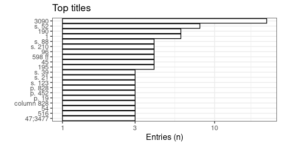
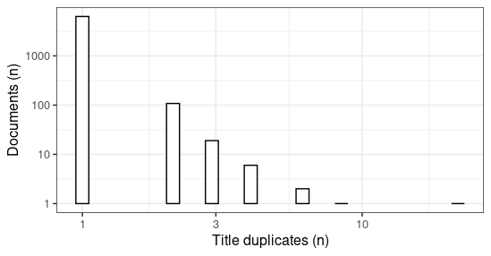

R Markdown
----------

* [Unique accepted titles](output.tables/title_accepted.csv): `r length(unique(df$note_510c)`
* [Unique discarded titles in original data](output.tables/title_discarded.csv) (excluding NA cases): `r as.vector(countLines(paste0(output.folder, "/note_510c_discarded.csv")) - 1)` 
* Original documents with non-NA titles: `r sum(!is.na(df$note_510c))` / `r nrow(df)` (`r round(100*mean(!is.na(df$note_510c)), 1)`%)
* Original documents with missing (NA) titles `r sum(is.na(df$note_510c)` / `r nrow(df)` documents (`r round(100*mean(is.na(df$note_510c)), 1)`%)

Top-20 titles and their title counts.

Frequency of unique titles:

