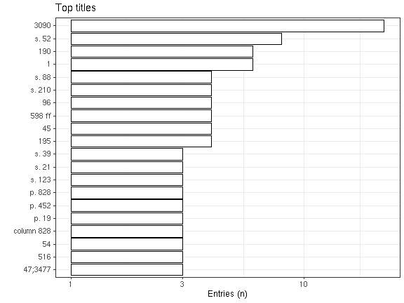
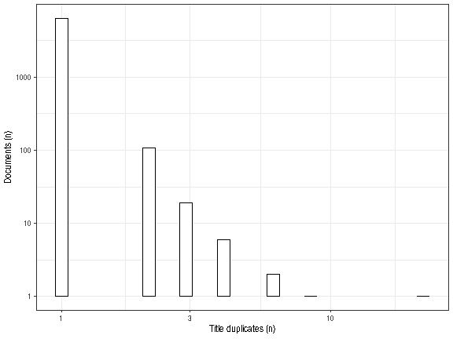

* [Unique accepted titles](output.tables/title_accepted.csv): 6451
* [Unique discarded titles in original data](output.tables/title_discarded.csv) (excluding NA cases): 0 
* Original documents with non-NA titles: 6652 / 71919 (9.2%)
* Original documents with missing (NA) titles 65267 / 71919 documents (90.8%)

 Top-20 titles and their title counts.
 

Frequency of unique titles:
  

