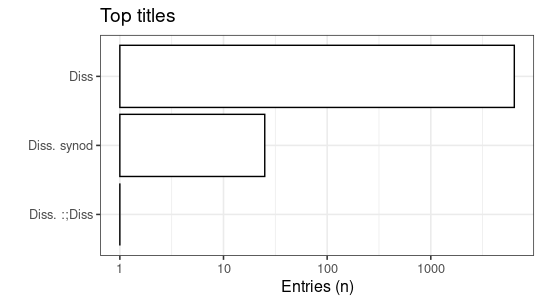
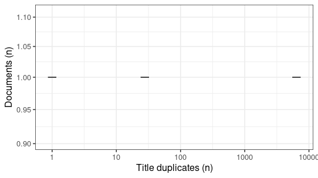

-   [Unique accepted titles](output.tables/title_accepted.csv): 4
-   [Unique discarded titles in original
    data](output.tables/title_discarded.csv) (excluding NA cases): 0
-   Original documents with non-NA titles: 6418 / 71919 (8.9%)
-   Original documents with missing (NA) titles 65501 / 71919 documents
    (91.1%)

Top-20 titles and their title counts.

Frequency of unique titles:

