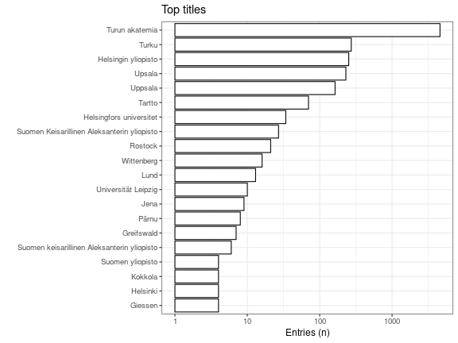

* [Unique accepted titles](output.tables/title_accepted.csv): 88
 * [Unique discarded titles in original data](output.tables/title_discarded.csv) (excluding NA cases): 0 
 * Original documents with non-NA titles: 5845 / 71919 (8.1%)
 * Original documents with missing (NA) titles 66074 / 71919 documents (91.9%) 
 
 Top-20 titles and their title counts.
 

Frequency of unique titles:
  

 
