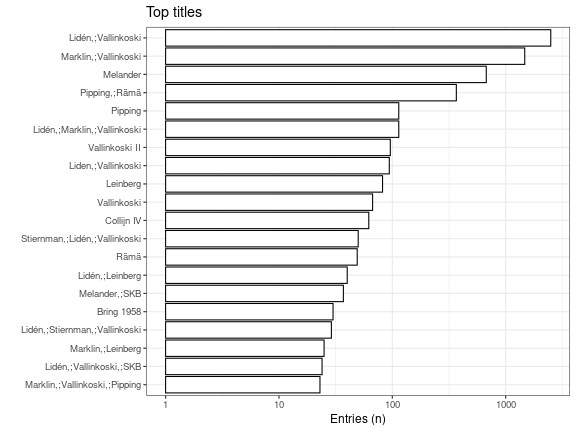
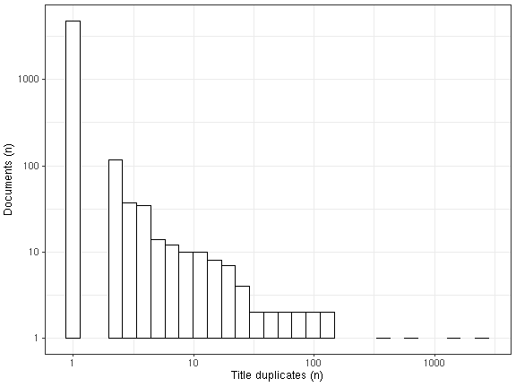

-   [Unique accepted titles](output.tables/title_accepted.csv): 5000
-   [Unique discarded titles in original
    data](output.tables/title_discarded.csv) (excluding NA cases): 0
-   Original documents with non-NA titles: 11754 / 71919 (16.3%)
-   Original documents with missing (NA) titles 60165 / 71919 documents
    (83.7%)

Top-20 titles and their title counts.

Frequency of unique titles:

