# Preprocessing summary

## Specific fields

  * [Author info](author.md)
  * [Gender info](gender.md)
  * [Publisher info](publisher.md)
  * [Publication geography](publicationplace.md)
  * [Publication year info](publicationyear.md)
  * [Titles](title.md)  
  * [Document sizes](size.md)
  * [Document topics](topic.md)
  * [Languages](language.md)

## Field conversions

This documents the conversions from raw data to the final preprocessed version (accepted, discarded, conversions). Only some of the key tables are explicitly linked below. The complete list of all summary tables is [here](output.tables/).

## Annotated documents

Fraction of documents with data:

Same in exact numbers: documents with available/missing entries, and number of unique entries for each field. Sorted by missing data:

|field name                        | missing (%)| available (%)| available (n)| unique (n)|
|:---------------------------------|-----------:|-------------:|-------------:|----------:|
|volnumber                         |       100.0|           0.0|             0|          1|
|uncontrolled                      |        99.8|           0.2|           111|         99|
|successor                         |        99.4|           0.6|           404|        396|
|publication_frequency             |        98.6|           1.4|           997|         51|
|width.original                    |        97.3|           2.7|          1952|        293|
|publication_year_till             |        93.9|           6.1|          4330|        190|
|height.original                   |        93.1|           6.9|          4949|        335|
|subject_geography                 |        91.9|           8.1|          5771|        764|
|note_granter                      |        91.8|           8.2|          5843|         98|
|note_dissertation                 |        91.0|           9.0|          6415|          5|
|note_510c                         |        90.7|           9.3|          6645|       6450|
|note_source                       |        83.6|          16.4|         11710|       4972|
|title_uniform                     |        82.9|          17.1|         12182|       8915|
|author_death                      |        75.3|          24.7|         17569|        363|
|author_date                       |        74.1|          25.9|         18432|       2508|
|author_birth                      |        74.0|          26.0|         18497|        342|
|corporate                         |        71.5|          28.5|         20281|       1406|
|subject_topic                     |        70.9|          29.1|         20766|       3513|
|pagecount.orig                    |        68.0|          32.0|         22800|        792|
|obl                               |        54.5|          45.5|         32440|          3|
|holder                            |        49.4|          50.6|         36083|       2136|
|paper.consumption.km2             |        47.6|          52.4|         37320|       2653|
|width                             |        47.6|          52.4|         37328|        296|
|height                            |        47.6|          52.4|         37328|        336|
|area                              |        47.6|          52.4|         37328|        766|
|physical_dimension                |        47.3|          52.7|         37577|       1101|
|self_published                    |        46.6|          53.4|         38080|          3|
|author_gender                     |        46.3|          53.7|         38252|          4|
|author_name                       |        36.7|          63.3|         45082|      11975|
|author                            |        36.7|          63.3|         45082|      12000|
|publisher                         |        17.5|          82.5|         58768|      10837|
|physical_extent                   |         5.7|          94.3|         67211|      15183|
|country                           |         4.1|          95.9|         68320|         33|
|publication_place                 |         4.1|          95.9|         68321|        433|
|latitude                          |         1.1|          98.9|         70471|        365|
|longitude                         |         1.1|          98.9|         70471|        365|
|language                          |         1.0|          99.0|         70519|        257|
|dissertation                      |         0.0|         100.0|         71222|          3|
|synodal                           |         0.0|         100.0|         71222|          2|
|publication_year_from             |         0.0|         100.0|         71229|        351|
|pagecount                         |         0.0|         100.0|         71240|        794|
|title                             |         0.0|         100.0|         71245|      56603|
|publication_time                  |         0.0|         100.0|         71248|       3217|
|language.Swedish                  |         0.0|         100.0|         71248|          2|
|language.Finnish                  |         0.0|         100.0|         71248|          2|
|language.Latin                    |         0.0|         100.0|         71248|          2|
|language.English                  |         0.0|         100.0|         71248|          2|
|language.French                   |         0.0|         100.0|         71248|          2|
|language.German                   |         0.0|         100.0|         71248|          2|
|language.Hebrew                   |         0.0|         100.0|         71248|          2|
|language.Greek, Ancient (to 1453) |         0.0|         100.0|         71248|          1|
|language.Arabic                   |         0.0|         100.0|         71248|          2|
|language.Italian                  |         0.0|         100.0|         71248|          2|
|language.Danish                   |         0.0|         100.0|         71248|          2|
|language.Sami                     |         0.0|         100.0|         71248|          2|
|language.Dutch                    |         0.0|         100.0|         71248|          2|
|language.Syriac, Modern           |         0.0|         100.0|         71248|          2|
|language.Spanish                  |         0.0|         100.0|         71248|          2|
|language.Lule Sami                |         0.0|         100.0|         71248|          2|
|language.Portuguese               |         0.0|         100.0|         71248|          2|
|language.Russian                  |         0.0|         100.0|         71248|          2|
|language.Northern Sami            |         0.0|         100.0|         71248|          2|
|language.Greek, Modern (1453-)    |         0.0|         100.0|         71248|          1|
|language.Estonian                 |         0.0|         100.0|         71248|          2|
|language.Esperanto                |         0.0|         100.0|         71248|          2|
|language.Norwegian                |         0.0|         100.0|         71248|          2|
|language.Polish                   |         0.0|         100.0|         71248|          2|
|language.Finno-Ugrian (Other)     |         0.0|         100.0|         71248|          1|
|language.Undetermined             |         0.0|         100.0|         71248|          2|
|language.Lithuanian               |         0.0|         100.0|         71248|          2|
|language.Hungarian                |         0.0|         100.0|         71248|          2|
|language.Tibetan                  |         0.0|         100.0|         71248|          2|
|language.Czech                    |         0.0|         100.0|         71248|          2|
|language.Afroasiatic (Other)      |         0.0|         100.0|         71248|          1|
|language.Latvian                  |         0.0|         100.0|         71248|          2|
|language.Icelandic                |         0.0|         100.0|         71248|          2|
|language.Ukrainian                |         0.0|         100.0|         71248|          2|
|language.Karelian                 |         0.0|         100.0|         71248|          2|
|language.Church Slavic            |         0.0|         100.0|         71248|          2|
|language.Erzya                    |         0.0|         100.0|         71248|          2|
|language.Yiddish                  |         0.0|         100.0|         71248|          2|
|language.Votic                    |         0.0|         100.0|         71248|          2|
|language.Germanic (Other)         |         0.0|         100.0|         71248|          1|
|language.Multiple languages       |         0.0|         100.0|         71248|          2|
|gatherings.original               |         0.0|         100.0|         71248|         18|
|obl.original                      |         0.0|         100.0|         71248|          2|
|original_row                      |         0.0|         100.0|         71248|      71248|
|publication_year                  |         0.0|         100.0|         71248|        350|
|publication_decade                |         0.0|         100.0|         71248|         40|
|author_pseudonyme                 |         0.0|         100.0|         71248|          2|
|gatherings                        |         0.0|         100.0|         71248|         18|
|volcount                          |         0.0|         100.0|         71248|          1|

## Histograms of all entries for numeric variables

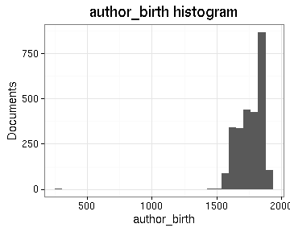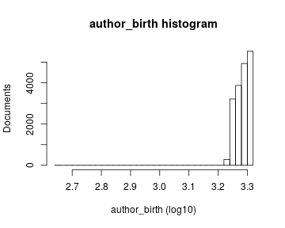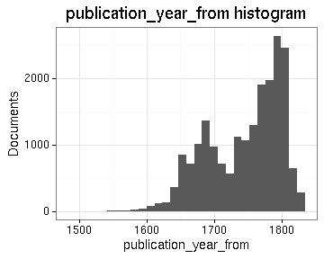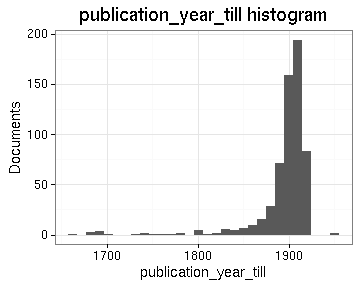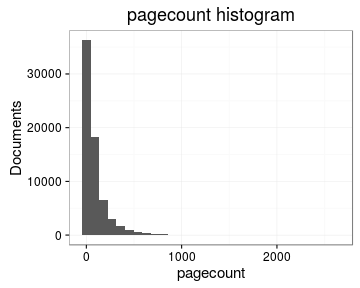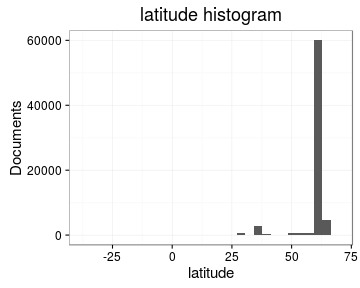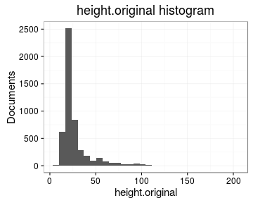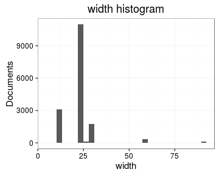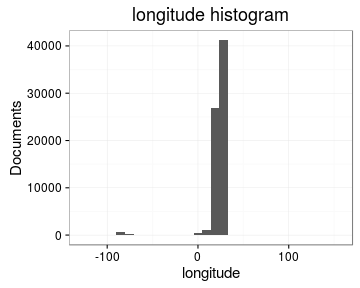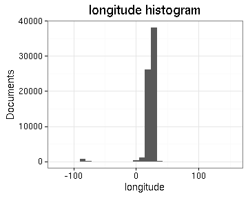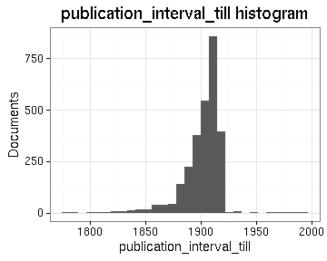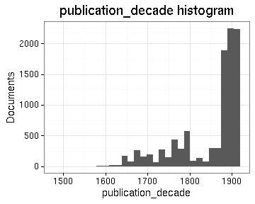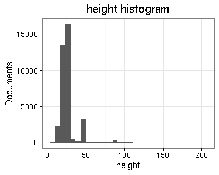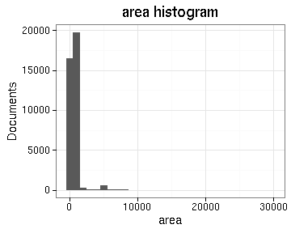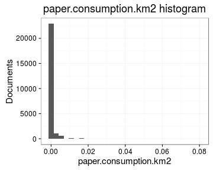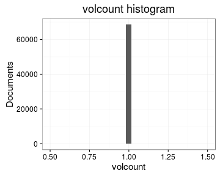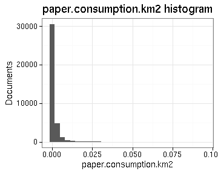

## Histograms of the top entries for factor variables

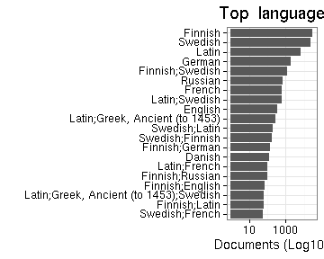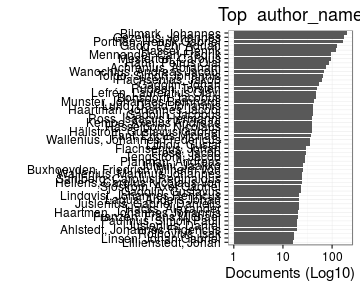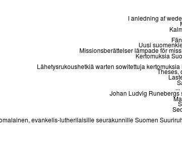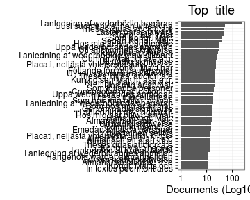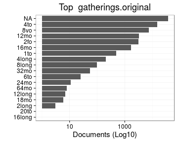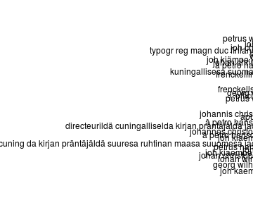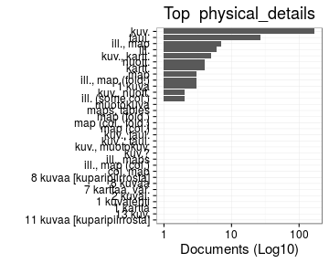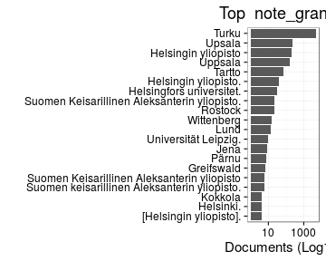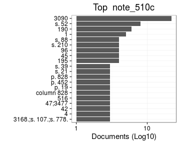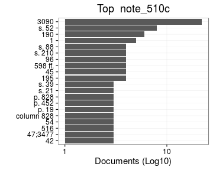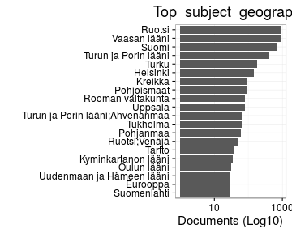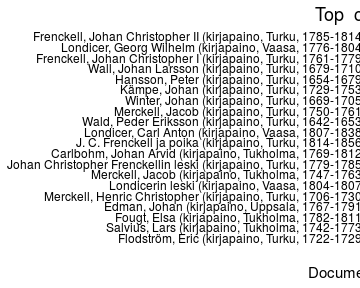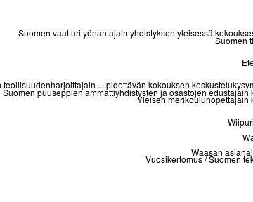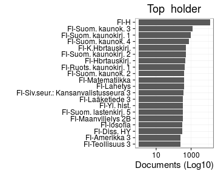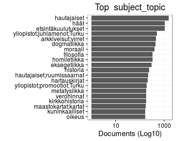

