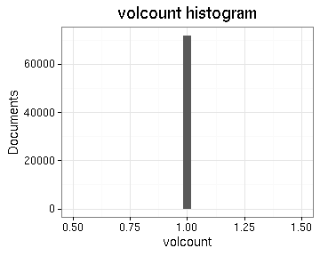
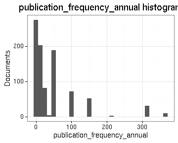
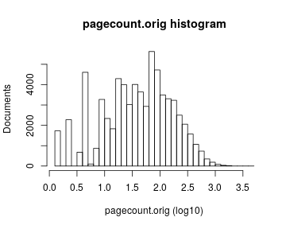
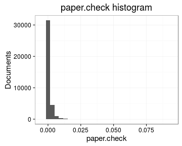
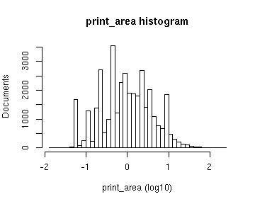
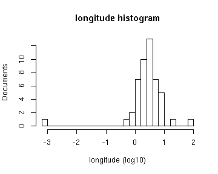
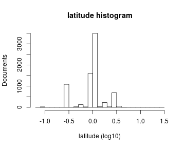
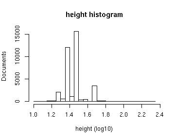
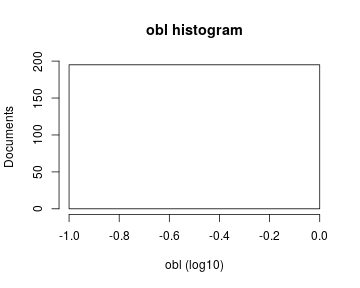
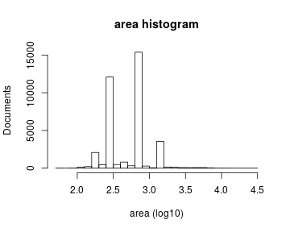

# Preprocessing summary

The data spanning years 1488-1955 has been included and contains 70451 documents (also other filter may apply depending on the data collection, see the source code for details.


## Specific fields

  * [Author info](author.md)
  * [Gender info](gender.md)
  * [Publisher info](publisher.md)
  * [Publication geography](publicationplace.md)
  * [Publication year info](publicationyear.md)
  * [Titles](title.md)  
  * [Page counts](pagecount.md)
  * [Physical dimension](dimension.md)    
  * [Document and subject topics](topic.md)
  * [Languages](language.md)


## Annotated documents

  * 71919 documents in the original raw data
  * 70451 documents in the final preprocessed data (97.96%)

Fraction of documents with data:


Same in exact numbers: documents with available/missing entries, and number of unique entries for each field. Sorted by missing data:


|field name                   | available (%)| available (n)| missing (%)| unique (n)|
|:----------------------------|-------------:|-------------:|-----------:|----------:|
|volnumber                    |           0.0|             0|       100.0|          1|
|parts                        |           0.1|            44|        99.9|          8|
|uncontrolled                 |           0.2|           111|        99.8|         99|
|successor                    |           0.6|           404|        99.4|        396|
|publication_frequency_annual |           1.6|          1149|        98.4|         82|
|publication_frequency_text   |           1.7|          1218|        98.3|         26|
|width.original               |           2.8|          1950|        97.2|        293|
|publication_interval_from    |           3.9|          2745|        96.1|        106|
|publication_interval_till    |           3.9|          2752|        96.1|        113|
|publication_year_till        |           5.3|          3724|        94.7|        191|
|height.original              |           7.0|          4950|        93.0|        335|
|note_granter                 |           8.0|          5665|        92.0|         96|
|subject_geography            |           8.1|          5692|        91.9|        758|
|note_510c                    |           9.1|          6382|        90.9|       6201|
|note_source                  |          15.8|         11136|        84.2|       4657|
|title_uniform                |          16.9|         11883|        83.1|       8674|
|author_age                   |          22.2|         15628|        77.8|         90|
|author_death                 |          25.1|         17683|        74.9|        364|
|author_birth                 |          25.3|         17850|        74.7|        340|
|first_edition                |          26.8|         18858|        73.2|          3|
|corporate                    |          27.7|         19529|        72.3|       1404|
|subject_topic                |          28.4|         20002|        71.6|       3480|
|gatherings.original          |          44.9|         31656|        55.1|         17|
|author_gender                |          46.7|         32868|        53.3|          5|
|gatherings                   |          48.4|         34092|        51.6|         17|
|holder                       |          50.6|         35616|        49.4|       2136|
|paper                        |          51.5|         36279|        48.5|       4220|
|print_area                   |          51.5|         36279|        48.5|       4220|
|width                        |          51.9|         36541|        48.1|        295|
|height                       |          51.9|         36541|        48.1|        336|
|area                         |          51.9|         36541|        48.1|        764|
|author_name                  |          63.5|         44705|        36.5|      11621|
|author                       |          63.5|         44705|        36.5|      11682|
|self_published               |          79.7|         56158|        20.3|          3|
|publisher                    |          86.3|         60779|        13.7|       8108|
|longitude                    |          95.8|         67523|         4.2|        383|
|latitude                     |          95.8|         67523|         4.2|        380|
|publication_country          |          95.9|         67535|         4.1|         34|
|publication_place            |          95.9|         67541|         4.1|        426|
|obl                          |          96.5|         67973|         3.5|          3|
|pagecount                    |          97.3|         68582|         2.7|        980|
|pagecount.orig               |          97.3|         68582|         2.7|        980|
|dissertation                 |         100.0|         70430|         0.0|          3|
|publication_year_from        |         100.0|         70433|         0.0|        357|
|title                        |         100.0|         70448|         0.0|      55862|
|pagecount.sheet              |         100.0|         70449|         0.0|        783|
|synodal                      |         100.0|         70450|         0.0|          3|
|language_count               |         100.0|         70451|         0.0|          7|
|multilingual                 |         100.0|         70451|         0.0|          2|
|languages                    |         100.0|         70451|         0.0|        253|
|language_primary             |         100.0|         70451|         0.0|         35|
|pagecount.multiplier         |         100.0|         70451|         0.0|          1|
|pagecount.squarebracket      |         100.0|         70451|         0.0|        364|
|pagecount.plate              |         100.0|         70451|         0.0|         56|
|pagecount.arabic             |         100.0|         70451|         0.0|        835|
|pagecount.roman              |         100.0|         70451|         0.0|        109|
|obl.original                 |         100.0|         70451|         0.0|          2|
|original_row                 |         100.0|         70451|         0.0|      70451|
|pagecount_from               |         100.0|         70451|         0.0|          1|
|author_pseudonyme            |         100.0|         70451|         0.0|          2|
|publication_year             |         100.0|         70451|         0.0|        356|
|publication_decade           |         100.0|         70451|         0.0|         44|
|volcount                     |         100.0|         70451|         0.0|          1|
|singlevol                    |         100.0|         70451|         0.0|          2|
|multivol                     |         100.0|         70451|         0.0|          1|
|issue                        |         100.0|         70451|         0.0|          1|

```
##            used  (Mb) gc trigger  (Mb) max used  (Mb)
## Ncells  2672425 142.8    7843334 418.9  7843334 418.9
## Vcells 22530791 171.9   43250930 330.0 43246312 330.0
```


## Field conversions

This documents the conversions from raw data to the final preprocessed version (accepted, discarded, conversions). Only some of the key tables are explicitly linked below. The complete list of all summary tables is [here](output.tables/).

Brief description of the fields:

 * [Description of the original MARC fields](https://github.com/COMHIS/bibliographica/blob/master/inst/extdata/fieldnames.csv)

 * [Description of the preprocessed fields](https://github.com/COMHIS/bibliographica/blob/master/inst/extdata/fieldname_table.csv)


## Histograms of all entries for numeric variables




## Histograms of the top entries for factor variables

Non-trivial factors with at least 2 levels are shown.


