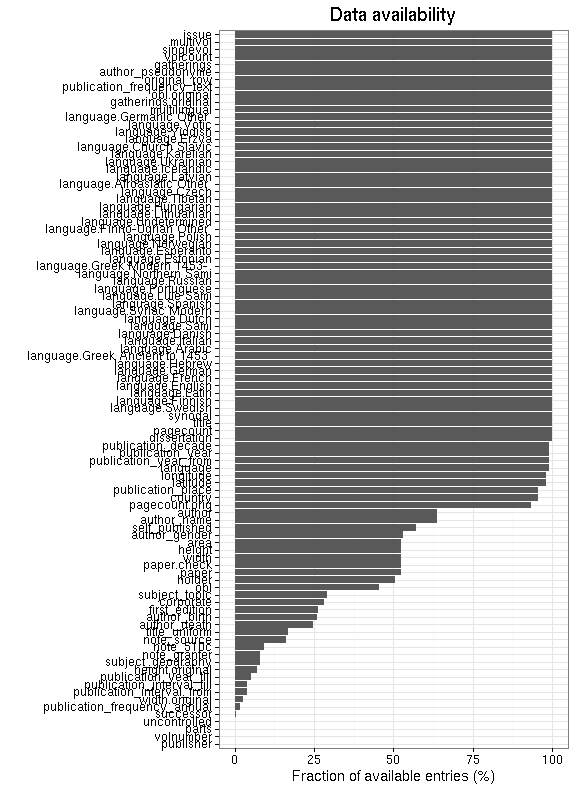

# Preprocessing summary

The data spanning years 1488-1955 has been included and contains 70451 documents (also other filter may apply depending on the data collection, see the source code for details.


## Specific fields

  * [Author info](author.md)
  * [Gender info](gender.md)
  * [Publisher info](publisher.md)
  * [Publication geography](publicationplace.md)
  * [Publication year info](publicationyear.md)
  * [Titles](title.md)  
  * [Page counts](pagecount.md)
  * [Physical dimension](dimension.md)    
  * [Document and subject topics](topic.md)
  * [Languages](language.md)


## Annotated documents

  * 71919 documents in the original raw data
  * 70451 documents in the final preprocessed data (97.96%)

Fraction of documents with data:



Same in exact numbers: documents with available/missing entries, and number of unique entries for each field. Sorted by missing data:


|field name                     | available (%)| available (n)| missing (%)| unique (n)|
|:------------------------------|-------------:|-------------:|-----------:|----------:|
|volnumber                      |           0.0|             0|       100.0|          1|
|parts                          |           0.1|            44|        99.9|          8|
|uncontrolled                   |           0.2|           111|        99.8|         99|
|successor                      |           0.6|           404|        99.4|        396|
|publication_frequency_annual   |           1.6|          1149|        98.4|         82|
|publication_frequency_text     |           1.7|          1218|        98.3|         26|
|width.original                 |           2.8|          1950|        97.2|        293|
|publication_interval_from      |           3.9|          2745|        96.1|        106|
|publication_interval_till      |           3.9|          2752|        96.1|        113|
|publication_year_till          |           5.3|          3724|        94.7|        191|
|height.original                |           7.0|          4950|        93.0|        335|
|note_granter                   |           8.0|          5665|        92.0|         96|
|subject_geography              |           8.1|          5692|        91.9|        758|
|note_510c                      |           9.1|          6382|        90.9|       6201|
|note_source                    |          15.8|         11136|        84.2|       4657|
|title_uniform                  |          16.9|         11883|        83.1|       8674|
|author_age                     |          22.2|         15629|        77.8|         90|
|author_death                   |          25.1|         17684|        74.9|        364|
|author_birth                   |          25.3|         17851|        74.7|        340|
|first_edition                  |          26.8|         18858|        73.2|          3|
|corporate                      |          27.7|         19529|        72.3|       1404|
|subject_topic                  |          28.4|         20002|        71.6|       3480|
|author_gender                  |          46.7|         32868|        53.3|          5|
|obl                            |          48.4|         34093|        51.6|          3|
|holder                         |          50.6|         35616|        49.4|       2136|
|paper                          |          51.9|         36530|        48.1|       4241|
|width                          |          51.9|         36541|        48.1|        295|
|height                         |          51.9|         36541|        48.1|        336|
|area                           |          51.9|         36541|        48.1|        764|
|author_name                    |          63.5|         44705|        36.5|      11621|
|author                         |          63.5|         44705|        36.5|      11682|
|self_published                 |          79.8|         56191|        20.2|          3|
|publisher                      |          86.3|         60833|        13.7|       8132|
|country                        |          95.9|         67539|         4.1|         34|
|publication_place              |          95.9|         67540|         4.1|        425|
|latitude                       |          98.0|         69048|         2.0|        195|
|longitude                      |          98.0|         69048|         2.0|        195|
|language                       |          99.0|         69724|         1.0|        255|
|dissertation                   |         100.0|         70430|         0.0|          3|
|publication_year_from          |         100.0|         70433|         0.0|        357|
|pagecount                      |         100.0|         70440|         0.0|        980|
|pagecount.orig                 |         100.0|         70440|         0.0|        980|
|title                          |         100.0|         70448|         0.0|      55862|
|pagecount.sheet                |         100.0|         70449|         0.0|        783|
|synodal                        |         100.0|         70450|         0.0|          3|
|language.Swedish               |         100.0|         70451|         0.0|          2|
|language.Finnish               |         100.0|         70451|         0.0|          2|
|language.Latin                 |         100.0|         70451|         0.0|          2|
|language.English               |         100.0|         70451|         0.0|          2|
|language.French                |         100.0|         70451|         0.0|          2|
|language.German                |         100.0|         70451|         0.0|          2|
|language.Hebrew                |         100.0|         70451|         0.0|          2|
|language.Greek Ancient to 1453 |         100.0|         70451|         0.0|          2|
|language.Arabic                |         100.0|         70451|         0.0|          2|
|language.Italian               |         100.0|         70451|         0.0|          2|
|language.Danish                |         100.0|         70451|         0.0|          2|
|language.Sami                  |         100.0|         70451|         0.0|          2|
|language.Dutch                 |         100.0|         70451|         0.0|          2|
|language.Syriac Modern         |         100.0|         70451|         0.0|          2|
|language.Spanish               |         100.0|         70451|         0.0|          2|
|language.Lule Sami             |         100.0|         70451|         0.0|          2|
|language.Portuguese            |         100.0|         70451|         0.0|          2|
|language.Russian               |         100.0|         70451|         0.0|          2|
|language.Northern Sami         |         100.0|         70451|         0.0|          2|
|language.Greek Modern 1453-    |         100.0|         70451|         0.0|          2|
|language.Estonian              |         100.0|         70451|         0.0|          2|
|language.Esperanto             |         100.0|         70451|         0.0|          2|
|language.Norwegian             |         100.0|         70451|         0.0|          2|
|language.Polish                |         100.0|         70451|         0.0|          2|
|language.Finno-Ugrian Other    |         100.0|         70451|         0.0|          2|
|language.Undetermined          |         100.0|         70451|         0.0|          2|
|language.Lithuanian            |         100.0|         70451|         0.0|          2|
|language.Hungarian             |         100.0|         70451|         0.0|          2|
|language.Tibetan               |         100.0|         70451|         0.0|          2|
|language.Czech                 |         100.0|         70451|         0.0|          2|
|language.Afroasiatic Other     |         100.0|         70451|         0.0|          2|
|language.Latvian               |         100.0|         70451|         0.0|          2|
|language.Icelandic             |         100.0|         70451|         0.0|          2|
|language.Ukrainian             |         100.0|         70451|         0.0|          2|
|language.Karelian              |         100.0|         70451|         0.0|          2|
|language.Church Slavic         |         100.0|         70451|         0.0|          2|
|language.Erzya                 |         100.0|         70451|         0.0|          2|
|language.Yiddish               |         100.0|         70451|         0.0|          2|
|language.Votic                 |         100.0|         70451|         0.0|          2|
|language.Germanic Other        |         100.0|         70451|         0.0|          2|
|multilingual                   |         100.0|         70451|         0.0|          2|
|pagecount.multiplier           |         100.0|         70451|         0.0|          1|
|pagecount.squarebracket        |         100.0|         70451|         0.0|        364|
|pagecount.plate                |         100.0|         70451|         0.0|         56|
|pagecount.arabic               |         100.0|         70451|         0.0|        835|
|pagecount.roman                |         100.0|         70451|         0.0|        109|
|gatherings.original            |         100.0|         70451|         0.0|         18|
|obl.original                   |         100.0|         70451|         0.0|          2|
|original_row                   |         100.0|         70451|         0.0|      70451|
|pagecount_from                 |         100.0|         70451|         0.0|          1|
|author_pseudonyme              |         100.0|         70451|         0.0|          2|
|publication_year               |         100.0|         70451|         0.0|        356|
|publication_decade             |         100.0|         70451|         0.0|         44|
|volcount                       |         100.0|         70451|         0.0|          1|
|singlevol                      |         100.0|         70451|         0.0|          2|
|multivol                       |         100.0|         70451|         0.0|          1|
|issue                          |         100.0|         70451|         0.0|          1|
|gatherings                     |         100.0|         70451|         0.0|         18|

```
<<<<<<< HEAD
##             used   (Mb) gc trigger   (Mb)  max used   (Mb)
## Ncells   3039102  162.4    4703850  251.3   4703850  251.3
## Vcells 200036317 1526.2  317733634 2424.2 300605384 2293.5
||||||| merged common ancestors
##            used  (Mb) gc trigger  (Mb) max used  (Mb)
## Ncells  1002818  53.6    1770749  94.6  1770749  94.6
## Vcells 15017181 114.6   43454662 331.6 43422118 331.3
=======
##            used  (Mb) gc trigger  (Mb) max used  (Mb)
## Ncells   983359  52.6    1770749  94.6  1770749  94.6
## Vcells 14979717 114.3   44242503 337.6 44221082 337.4
>>>>>>> 9e2c5ad18b234a320ef0f658e2027095fcf46058
```


## Field conversions

This documents the conversions from raw data to the final preprocessed version (accepted, discarded, conversions). Only some of the key tables are explicitly linked below. The complete list of all summary tables is [here](output.tables/).

Brief description of the fields:

 * [Description of the original MARC fields](https://github.com/COMHIS/bibliographica/blob/master/inst/extdata/fieldnames.csv)

 * [Description of the preprocessed fields](https://github.com/COMHIS/bibliographica/blob/master/inst/extdata/fieldnames_polished.csv)


## Histograms of all entries for numeric variables


```
## Error in freq && !equidist: invalid 'x' type in 'x && y'
```


## Histograms of the top entries for factor variables

Non-trivial factors with at least 2 levels are shown.


