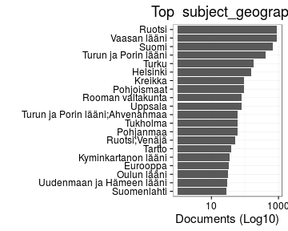
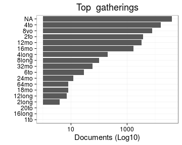
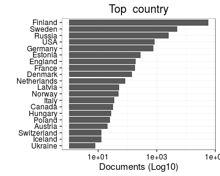

# Summary

Date:


```
## [1] "Sat Apr  2 10:03:40 2016"
```


## Specific fields

  * [Author info](author.md)
  * [Gender info](gender.md)
  * [Publisher info](publisher.md)
  * [Publication geography](publicationplace.md)
  * [Generic document info](documents.md)
  * [Document sizes](size.md)
  * [Document topics](topic.md)


## Field conversions

This documents the conversions from raw data to the final preprocessed version (accepted, discarded, conversions). Only some of the key tables are explicitly linked below. The complete list of all summary tables is [here](output.tables/).

## Annotated documents

Fraction of documents with entries:


Documents with data (number and percentage) and number of unique entries for each field:


|field_name            | missing| available|     n| unique_entries|
|:---------------------|-------:|---------:|-----:|--------------:|
|volnumber             |   100.0|       0.0|     0|              1|
|uncontrolled          |    99.8|       0.2|   111|             99|
|successor             |    99.4|       0.6|   404|            396|
|physical_accomppanied |    99.3|       0.7|   471|            171|
|publication_frequency |    98.6|       1.4|  1001|             51|
|width.original        |    97.2|       2.8|  2021|            307|
|publication_interval  |    95.3|       4.7|  3349|           2228|
|publication_year_till |    94.8|       5.2|  3709|            185|
|height.original       |    93.0|       7.0|  5058|            350|
|note_year             |    92.1|       7.9|  5661|            283|
|subject_geography     |    91.9|       8.1|  5838|            779|
|note_granter          |    91.9|       8.1|  5845|             98|
|note_510c             |    90.8|       9.2|  6652|           6457|
|physical_details      |    88.6|      11.4|  8218|            174|
|language2             |    85.2|      14.8| 10627|             59|
|note_source           |    83.7|      16.3| 11754|           5003|
|title_uniform         |    83.0|      17.0| 12209|           8937|
|author_death          |    75.4|      24.6| 17678|            364|
|author_birth          |    74.1|      25.9| 18638|            347|
|corporate             |    71.7|      28.3| 20324|           1419|
|subject_topic         |    71.0|      29.0| 20889|           3533|
|author_gender         |    66.7|      33.3| 23963|              3|
|paper.consumption.km2 |    65.4|      34.6| 24880|           1271|
|self_published        |    59.5|      40.5| 29142|              3|
|title_remainder       |    57.0|      43.0| 30915|          25258|
|obl                   |    54.6|      45.4| 32687|              3|
|author                |    51.9|      48.1| 34562|           9076|
|author_name           |    51.6|      48.4| 34825|           9175|
|note_general          |    50.6|      49.4| 35537|          21672|
|holder                |    49.5|      50.5| 36295|           2162|
|width                 |    47.6|      52.4| 37687|            310|
|height                |    47.6|      52.4| 37687|            351|
|area                  |    47.6|      52.4| 37687|            816|
|pagecount.orig        |    43.1|      56.9| 40928|            393|
|publisher             |    17.7|      82.3| 59180|          10832|
|country               |     4.3|      95.7| 68810|             34|
|publication_place     |     4.3|      95.7| 68829|            452|
|latitude              |     1.0|      99.0| 71179|            381|
|longitude             |     1.0|      99.0| 71179|            381|
|publication_year_from |     1.0|      99.0| 71227|            356|
|publication_year      |     0.9|      99.1| 71248|            356|
|publication_decade    |     0.9|      99.1| 71248|             46|
|dissertation          |     0.0|     100.0| 71893|              3|
|synodal               |     0.0|     100.0| 71893|              2|
|title                 |     0.0|     100.0| 71916|          57062|
|pagecount             |     0.0|     100.0| 71917|            394|
|language.finnish      |     0.0|     100.0| 71919|              2|
|language.swedish      |     0.0|     100.0| 71919|              2|
|language.latin        |     0.0|     100.0| 71919|              2|
|language.german       |     0.0|     100.0| 71919|              2|
|language.english      |     0.0|     100.0| 71919|              2|
|language.french       |     0.0|     100.0| 71919|              2|
|language.russian      |     0.0|     100.0| 71919|              2|
|language.greek        |     0.0|     100.0| 71919|              2|
|language.danish       |     0.0|     100.0| 71919|              2|
|language.italian      |     0.0|     100.0| 71919|              2|
|language.hebrew       |     0.0|     100.0| 71919|              2|
|language.dutch        |     0.0|     100.0| 71919|              2|
|language.spanish      |     0.0|     100.0| 71919|              2|
|language.sami         |     0.0|     100.0| 71919|              2|
|language.modern_greek |     0.0|     100.0| 71919|              2|
|language.icelandic    |     0.0|     100.0| 71919|              2|
|language.arabic       |     0.0|     100.0| 71919|              2|
|language.portuguese   |     0.0|     100.0| 71919|              2|
|language.finnougrian  |     0.0|     100.0| 71919|              2|
|language.multiple     |     0.0|     100.0| 71919|              2|
|language.undetermined |     0.0|     100.0| 71919|              2|
|volcount              |     0.0|     100.0| 71919|              1|
|gatherings.original   |     0.0|     100.0| 71919|             18|
|obl.original          |     0.0|     100.0| 71919|              2|
|original_row          |     0.0|     100.0| 71919|          71919|
|gatherings            |     0.0|     100.0| 71919|             18|
|author_pseudonyme     |     0.0|     100.0| 71919|              1|


## Histograms of all entries for numeric variables


## Histograms of the top entries for factor variables




