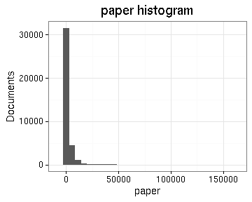

# Preprocessing summary

## Specific fields

  * [Author info](author.md)
  * [Gender info](gender.md)
  * [Publisher info](publisher.md)
  * [Publication geography](publicationplace.md)
  * [Publication year info](publicationyear.md)
  * [Titles](title.md)  
  * [Document sizes](size.md)
  * [Document and subject topics](topic.md)
  * [Languages](language.md)

## Field conversions

This documents the conversions from raw data to the final preprocessed version (accepted, discarded, conversions). Only some of the key tables are explicitly linked below. The complete list of all summary tables is [here](output.tables/).

## Annotated documents

Fraction of documents with data:

Same in exact numbers: documents with available/missing entries, and number of unique entries for each field. Sorted by missing data:

|field name                        | missing (%)| available (%)| available (n)| unique (n)|
|:---------------------------------|-----------:|-------------:|-------------:|----------:|
|publication_frequency             |       100.0|           0.0|             0|          1|
|volnumber                         |       100.0|           0.0|             0|          1|
|uncontrolled                      |       100.0|           0.0|             3|          4|
|successor                         |       100.0|           0.0|            14|         15|
|parts                             |        99.9|           0.1|            44|          8|
|publication_year_till             |        98.6|           1.4|           981|        167|
|width.original                    |        97.1|           2.9|          1950|        293|
|height.original                   |        93.4|           6.6|          4514|        335|
|subject_geography                 |        91.5|           8.5|          5770|        764|
|note_granter                      |        91.4|           8.6|          5844|         98|
|note_510c                         |        90.2|           9.8|          6642|       6447|
|note_source                       |        82.8|          17.2|         11707|       4970|
|title_uniform                     |        82.1|          17.9|         12183|       8915|
|author_death                      |        73.9|          26.1|         17723|        363|
|first_edition                     |        73.1|          26.9|         18255|          3|
|author_birth                      |        72.5|          27.5|         18651|        346|
|corporate                         |        72.1|          27.9|         18934|        645|
|subject_topic                     |        69.4|          30.6|         20756|       3509|
|obl                               |        55.4|          44.6|         30304|          3|
|width                             |        48.8|          51.2|         34757|        296|
|height                            |        48.8|          51.2|         34757|        336|
|area                              |        48.8|          51.2|         34757|        760|
|paper.consumption.km2             |        48.8|          51.2|         34757|       4287|
|holder                            |        47.4|          52.6|         35749|       2096|
|author_gender                     |        44.1|          55.9|         37970|          4|
|author_name                       |        33.0|          67.0|         45514|      11970|
|author                            |        33.0|          67.0|         45514|      12034|
|country                           |         4.1|          95.9|         65114|         33|
|publication_place                 |         4.0|          96.0|         65178|        419|
|pagecount.orig                    |         2.2|          97.8|         66381|        998|
|latitude                          |         1.1|          98.9|         67154|        342|
|longitude                         |         1.1|          98.9|         67154|        342|
|language                          |         1.1|          98.9|         67176|        254|
|dissertation                      |         0.0|         100.0|         67874|          3|
|publication_year_from             |         0.0|         100.0|         67881|        351|
|title                             |         0.0|         100.0|         67897|      53824|
|synodal                           |         0.0|         100.0|         67899|          3|
|language.Swedish                  |         0.0|         100.0|         67900|          2|
|language.Finnish                  |         0.0|         100.0|         67900|          2|
|language.Latin                    |         0.0|         100.0|         67900|          2|
|language.English                  |         0.0|         100.0|         67900|          2|
|language.French                   |         0.0|         100.0|         67900|          2|
|language.German                   |         0.0|         100.0|         67900|          2|
|language.Hebrew                   |         0.0|         100.0|         67900|          2|
|language.Greek, Ancient (to 1453) |         0.0|         100.0|         67900|          1|
|language.Arabic                   |         0.0|         100.0|         67900|          2|
|language.Italian                  |         0.0|         100.0|         67900|          2|
|language.Danish                   |         0.0|         100.0|         67900|          2|
|language.Sami                     |         0.0|         100.0|         67900|          2|
|language.Dutch                    |         0.0|         100.0|         67900|          2|
|language.Syriac, Modern           |         0.0|         100.0|         67900|          2|
|language.Spanish                  |         0.0|         100.0|         67900|          2|
|language.Lule Sami                |         0.0|         100.0|         67900|          2|
|language.Portuguese               |         0.0|         100.0|         67900|          2|
|language.Russian                  |         0.0|         100.0|         67900|          2|
|language.Northern Sami            |         0.0|         100.0|         67900|          2|
|language.Greek, Modern (1453-)    |         0.0|         100.0|         67900|          1|
|language.Estonian                 |         0.0|         100.0|         67900|          2|
|language.Esperanto                |         0.0|         100.0|         67900|          2|
|language.Norwegian                |         0.0|         100.0|         67900|          2|
|language.Polish                   |         0.0|         100.0|         67900|          2|
|language.Finno-Ugrian (Other)     |         0.0|         100.0|         67900|          1|
|language.Undetermined             |         0.0|         100.0|         67900|          2|
|language.Lithuanian               |         0.0|         100.0|         67900|          2|
|language.Hungarian                |         0.0|         100.0|         67900|          2|
|language.Tibetan                  |         0.0|         100.0|         67900|          2|
|language.Czech                    |         0.0|         100.0|         67900|          2|
|language.Afroasiatic (Other)      |         0.0|         100.0|         67900|          1|
|language.Latvian                  |         0.0|         100.0|         67900|          2|
|language.Icelandic                |         0.0|         100.0|         67900|          2|
|language.Ukrainian                |         0.0|         100.0|         67900|          2|
|language.Karelian                 |         0.0|         100.0|         67900|          2|
|language.Church Slavic            |         0.0|         100.0|         67900|          2|
|language.Erzya                    |         0.0|         100.0|         67900|          2|
|language.Yiddish                  |         0.0|         100.0|         67900|          2|
|language.Votic                    |         0.0|         100.0|         67900|          2|
|language.Germanic (Other)         |         0.0|         100.0|         67900|          1|
|language.Multiple languages       |         0.0|         100.0|         67900|          2|
|pagecount                         |         0.0|         100.0|         67900|        997|
|gatherings.original               |         0.0|         100.0|         67900|         18|
|obl.original                      |         0.0|         100.0|         67900|          2|
|original_row                      |         0.0|         100.0|         67900|      67900|
|author_pseudonyme                 |         0.0|         100.0|         67900|          2|
|publication_year                  |         0.0|         100.0|         67900|        350|
|publication_decade                |         0.0|         100.0|         67900|         41|
|gatherings                        |         0.0|         100.0|         67900|         18|
|volcount                          |         0.0|         100.0|         67900|          1|
|singlevol                         |         0.0|         100.0|         67900|          2|
|multivol                          |         0.0|         100.0|         67900|          1|
|issue                             |         0.0|         100.0|         67900|          1|

## Histograms of all entries for numeric variables

## Histograms of the top entries for factor variables

Non-trivial factors with at least 2 levels are shown.

