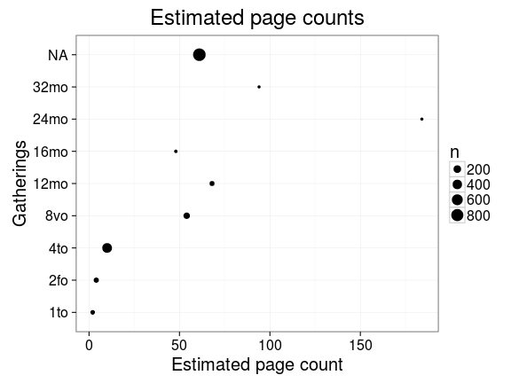

## Page counts

  * Page count missing and estimated for 4892 documents (6.8%).

  * Page count missing and could not be estimated for 0 documents

  * Page count updated for 0 documents.
  
  * [Conversions from raw data to final page count estimates](output.tables/pagecount_conversion_nontrivial.csv)

<!--[Page conversions from raw data to final page count estimates with volume info](output.tables/page_conversion_table_full.csv)-->

  * [Discarded pagecount info](output.tables/pagecount_discarded.csv) For these cases the missing/discarded page count was estimated based on average page count estimates for [single volume](mean_pagecounts_singlevol.csv), [multi-volume](mean_pagecounts_multivol.csv) and [issues](mean_pagecounts_issue.csv), calculated from those documents where original pagecount info is available.

  * [Automated tests for page count conversions](https://github.com/rOpenGov/bibliographica/blob/master/inst/extdata/tests_polish_physical_extent.csv)

Left: Gatherings vs. overall pagecounts (original + estimated). Right: Only the estimated page counts (shown only for the 4892 documents that have missing pagecount info in the original data):

<!--

## Average page counts (only works in CERL now)

Multi-volume documents average page counts are given per volume.

|doc.dimension | mean.pages.singlevol| median.pages.singlevol| n.singlevol|mean.pages.multivol |median.pages.multivol | n.multivol| mean.pages.issue| median.pages.issue| n.issue|
|:-------------|--------------------:|----------------------:|-----------:|:-------------------|:---------------------|----------:|----------------:|------------------:|-------:|
|2fo           |                12.38|                      4|        3194|NA                  |NA                    |         NA|             4.00|                  4|     601|
|4long         |                69.50|                     28|         206|NA                  |NA                    |         NA|               NA|                 NA|      NA|
|4to           |                35.88|                     10|       15773|NA                  |NA                    |         NA|            10.00|                 10|     428|
|6to           |                99.97|                     64|          29|NA                  |NA                    |         NA|               NA|                 NA|      NA|
|8long         |               210.27|                    112|          99|NA                  |NA                    |         NA|               NA|                 NA|      NA|
|8vo           |               105.18|                     54|        7817|NA                  |NA                    |         NA|            54.00|                 54|    1073|
|12long        |               388.14|                    244|           7|NA                  |NA                    |         NA|               NA|                 NA|      NA|
|12mo          |               111.51|                     68|        3285|NA                  |NA                    |         NA|            68.00|                 68|      21|
|16long        |               159.00|                    159|           1|NA                  |NA                    |         NA|               NA|                 NA|      NA|
|16mo          |               105.49|                     48|        1688|NA                  |NA                    |         NA|            48.00|                 48|      13|
|18mo          |               244.88|                    199|           8|NA                  |NA                    |         NA|               NA|                 NA|      NA|
|20to          |               209.00|                    209|           1|NA                  |NA                    |         NA|               NA|                 NA|      NA|
|24mo          |               302.00|                    184|          12|NA                  |NA                    |         NA|               NA|                 NA|      NA|
|32mo          |               224.79|                     94|          58|NA                  |NA                    |         NA|            94.00|                 94|       1|
|64mo          |                91.50|                    112|           8|NA                  |NA                    |         NA|               NA|                 NA|      NA|
|NA            |               108.72|                     61|       39232|NA                  |NA                    |         NA|            52.56|                 61|    1221|

-->
