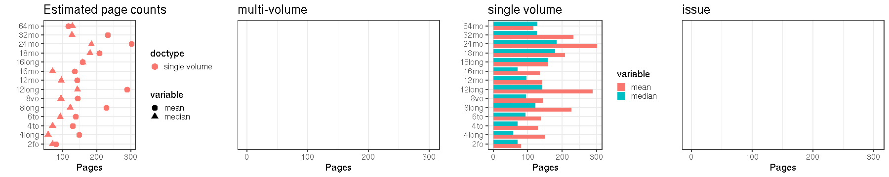

## Page counts

  * Page count missing and estimated for 642 documents (3.2%).

  * Page count missing and could not be estimated for 22 documents (0.1%).

  * Page count updated for 0 documents.
  
  * [Conversions from raw data to final page count estimates](output.tables/pagecount_conversion_nontrivial.csv)

<!--[Page conversions from raw data to final page count estimates with volume info](output.tables/page_conversion_table_full.csv)-->

  * [Discarded pagecount info](output.tables/pagecount_discarded.csv) For these cases the missing/discarded page count was estimated based on average page count estimates for [single volume](mean_pagecounts_singlevol.csv), [multi-volume](mean_pagecounts_multivol.csv) and [issues](mean_pagecounts_issue.csv), calculated from those documents where original pagecount info is available.

  * [Automated tests for page count conversions](https://github.com/rOpenGov/bibliographica/blob/master/inst/extdata/tests_polish_physical_extent.csv)

Left: Gatherings vs. overall pagecounts (original + estimated). Right: Only the estimated page counts (shown only for the 642 documents that have missing pagecount info in the original data):

<!--

## Average page counts (only works in CERL now)

Multi-volume documents average page counts are given per volume.

|doc.dimension | mean.pages.singlevol| median.pages.singlevol| n.singlevol|mean.pages.multivol |median.pages.multivol | n.multivol| mean.pages.issue| median.pages.issue| n.issue|
|:-------------|--------------------:|----------------------:|-----------:|:-------------------|:---------------------|----------:|----------------:|------------------:|-------:|
|2fo           |                 8.59|                    4.0|        2223|NA                  |NA                    |         NA|                4|                  4|      11|
|4long         |                51.87|                   24.0|         181|NA                  |NA                    |         NA|               NA|                 NA|      NA|
|4to           |                17.71|                    8.0|       12660|NA                  |NA                    |         NA|               NA|                 NA|      NA|
|8long         |               225.51|                  122.0|          71|NA                  |NA                    |         NA|               NA|                 NA|      NA|
|8vo           |                71.59|                   32.0|        3438|NA                  |NA                    |         NA|               50|                 50|       1|
|12long        |               583.25|                  666.5|           4|NA                  |NA                    |         NA|               NA|                 NA|      NA|
|12mo          |               199.98|                  100.0|         499|NA                  |NA                    |         NA|               NA|                 NA|      NA|
|16mo          |                47.16|                   48.0|         183|NA                  |NA                    |         NA|               NA|                 NA|      NA|
|24mo          |               453.50|                  340.5|           4|NA                  |NA                    |         NA|               NA|                 NA|      NA|
|32mo          |               254.50|                  254.5|           2|NA                  |NA                    |         NA|               NA|                 NA|      NA|
|64mo          |               117.33|                  128.0|           6|NA                  |NA                    |         NA|               NA|                 NA|      NA|
|NA            |                48.32|                    8.0|         558|NA                  |NA                    |         NA|               60|                 60|      10|

-->
