## Page counts

  * Page count available for 927 documents in total (93.6%), including both readily available and estimated page counts.

  * Page count readily available for 0 documents (0%). 

  * Page count estimated for 927 documents (93.6%).

  * Page count missing and could not be estimated for 0 documents (0%).

  * Page count updated for 0 documents in the validation phase.
  
  * [Conversions from raw data to final page count estimates](output.tables/pagecount_conversions.csv)

  * [Augmented pagecounts](output.tables/pagecount_discarded.csv) For these cases the page count is missing (or discarded) in the original data, and estimated based on median page counts for [single volume](mean_pagecounts_singlevol.csv), [multi-volume](mean_pagecounts_multivol.csv) and [issues](mean_pagecounts_issue.csv), calculated from those documents where page count info was available.

  * [Automated unit tests for page count conversions](https://github.com/COMHIS/bibliographica/blob/master/inst/extdata/tests_polish_physical_extent.csv) - these are used to control that the page count conversions remain correct when changes are made to the cleanup routines


## Average page counts

Mean and median page counts calculated based on the documents where
the page count information was readily available. Also see the
correponding numerical tables with page count estimates:

 * [Single volume](mean_pagecounts_singlevol.csv)
 * [Multi-volume](mean_pagecounts_multivol.csv)
 * [Issue](mean_pagecounts_issue.csv)

These estimates are used to fill in page count info for the remaining
documents where page count info is missing.

The multi-volume documents average page counts are given per volume.

The page count estimates are calculated without plates. Plate
information is added separately for each document on top of the page
count estimate.


```
## Error in get_mean_pagecounts(df, exclude.plates = TRUE): could not find function "get_mean_pagecounts"
```


```
## Error in eval(expr, envir, enclos): object 'mean.pagecounts' not found
```

```
## Error in `colnames<-`(`*tmp*`, value = character(0)): attempt to set 'colnames' on an object with less than two dimensions
```

```
## Error in UseMethod("droplevels"): no applicable method for 'droplevels' applied to an object of class "NULL"
```

```
## Error in pics[[2]]: subscript out of bounds
```


### Document size distribution


```
## Error: Problem with `filter()` input `..1`.
## ✖ object 'volcount' not found
## ℹ Input `..1` is `volcount == 1 & is.na(volnumber)`.
```

```
## Error: Must group by variables found in `.data`.
## * Column `gatherings` is not found.
## * Column `pagecount` is not found.
```

```
## Error: Must group by variables found in `.data`.
## * Column `gatherings` is not found.
```

```
## Error in ggplot(dff2, aes(y = gatherings, x = pagecount)): object 'dff2' not found
```

```
## Error in fortify(data): object 'dff3' not found
```

```
## Error in fortify(data): object 'dff3' not found
```

```
## Error: Problem with `filter()` input `..1`.
## ✖ object 'volcount' not found
## ℹ Input `..1` is `(volcount > 1 | (!is.na(volnumber)))`.
```

```
## Error: Must group by variables found in `.data`.
## * Column `gatherings` is not found.
## * Column `pagecount` is not found.
```

```
## Error: Must group by variables found in `.data`.
## * Column `gatherings` is not found.
```

```
## Error in ggplot(dff2, aes(y = gatherings, x = pagecount)): object 'dff2' not found
```

```
## Error in fortify(data): object 'dff3' not found
```

```
## Error in fortify(data): object 'dff3' not found
```

```
## Error in FUN(X[[i]], ...): object 'doctype' not found
```

Left: Gatherings vs. overall pagecounts (original + estimated). Right: Only the estimated page counts (for the 927 documents that have missing pagecount info in the original data):


```
## Error in eval(e, x, parent.frame()): object 'pagecount.orig' not found
```

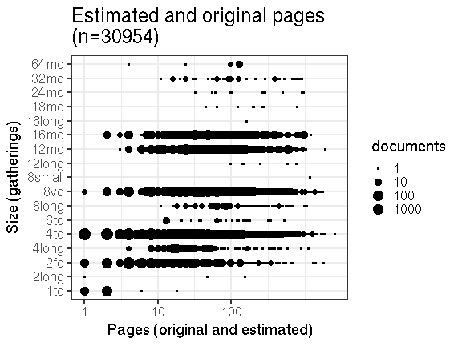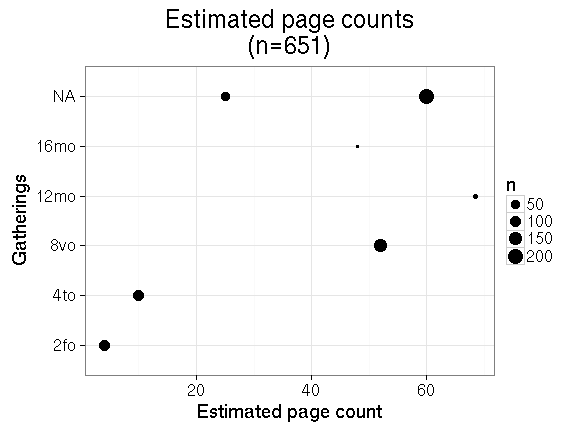


## Documents with missing pages over years 


```
## Error: Problem with `summarise()` input `na`.
## ✖ object 'pagecount.orig' not found
## ℹ Input `na` is `sum(is.na(pagecount.orig) | (!pagecount.orig == pagecount))`.
## ℹ The error occurred in group 1: publication_decade = 1570, gatherings = "4to".
```

```
## Error in `$<-.data.frame`(`*tmp*`, na, value = logical(0)): replacement has 0 rows, data has 64
```

```
## Error in FUN(X[[i]], ...): object 'gatherings' not found
```

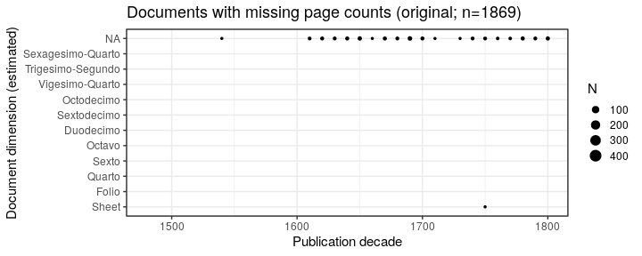


## Estimated paper consumption

Note: there are 0 documents that have some dimension info but sheet area information could not be calculated. 


```
## Error: Problem with `summarise()` input `paper`.
## ✖ object 'paper' not found
## ℹ Input `paper` is `sum(paper, na.rm = TRUE)`.
## ℹ The error occurred in group 1: publication_year = 1575.
```

```
## Error: Can't subset columns that don't exist.
## ✖ Column `publication_year` doesn't exist.
```

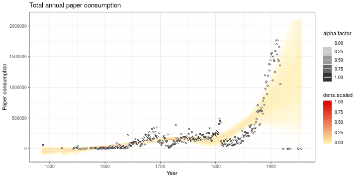

```
## Error: Can't subset columns that don't exist.
## ✖ Column `publication_year` doesn't exist.
```

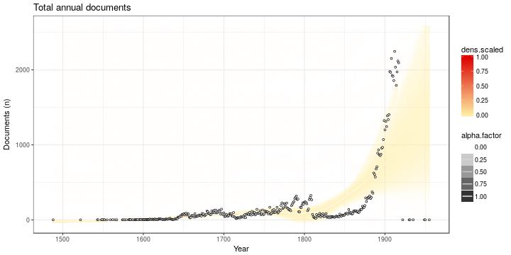


```
## Error: Problem with `summarise()` input `paper`.
## ✖ object 'paper' not found
## ℹ Input `paper` is `sum(paper, na.rm = TRUE)`.
## ℹ The error occurred in group 1: publication_year = 1575, gatherings = "4to".
```

```
## Error: Problem with `filter()` input `..1`.
## ✖ object 'gatherings' not found
## ℹ Input `..1` is `gatherings %in% names(which(table(df2$gatherings) >= 50))`.
```

```
## Error in FUN(X[[i]], ...): object 'publication_year' not found
```

```
## Error in FUN(X[[i]], ...): object 'publication_year' not found
```

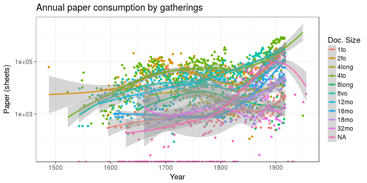


```
## Error: Problem with `summarise()` input `paper`.
## ✖ object 'paper' not found
## ℹ Input `paper` is `sum(paper, na.rm = TRUE)`.
## ℹ The error occurred in group 1: publication_decade = 1570, gatherings = "4to".
```

```
## Error: Problem with `filter()` input `..1`.
## ✖ object 'gatherings' not found
## ℹ Input `..1` is `gatherings %in% top`.
```

```
## Error in ggplot(df3, aes(x = publication_decade, y = paper, fill = gatherings)): object 'df3' not found
```

```
## Error in FUN(X[[i]], ...): object 'publication_year' not found
```

```
## Error in FUN(X[[i]], ...): object 'gatherings' not found
```

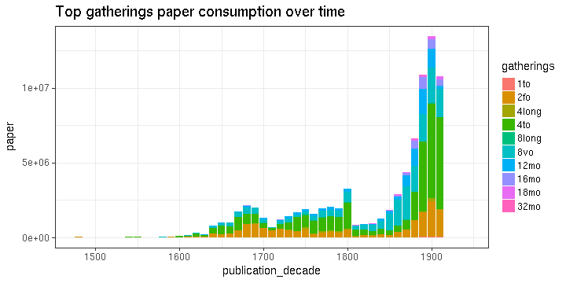


```
## Error: Problem with `summarise()` input `paper`.
## ✖ object 'paper' not found
## ℹ Input `paper` is `sum(paper, na.rm = TRUE)`.
## ℹ The error occurred in group 1: publication_decade = 1570.
```

```
## Error in FUN(X[[i]], ...): object 'paper' not found
```

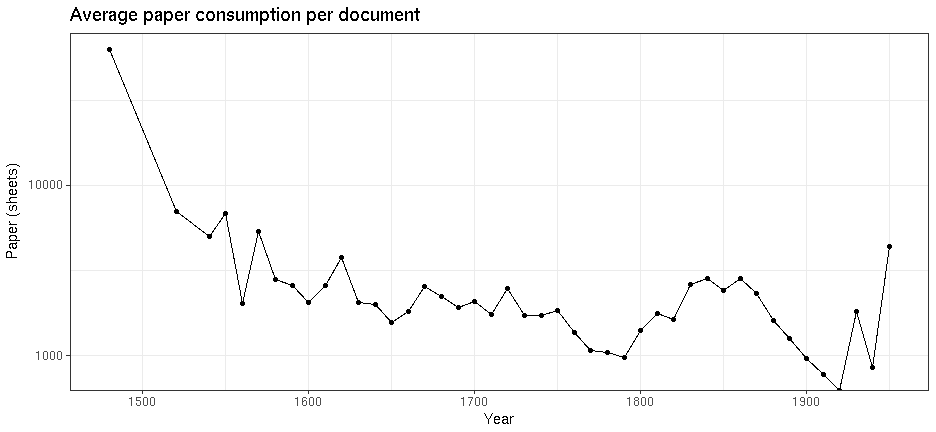


## Pamphlets vs. Books


```
## Error: Problem with `summarise()` input `paper`.
## ✖ object 'paper' not found
## ℹ Input `paper` is `sum(paper, na.rm = TRUE)`.
## ℹ The error occurred in group 1: publication_year = 1575, type = "book".
```

```
## Error in FUN(X[[i]], ...): object 'publication_year' not found
```

```
## Error in FUN(X[[i]], ...): object 'publication_year' not found
```

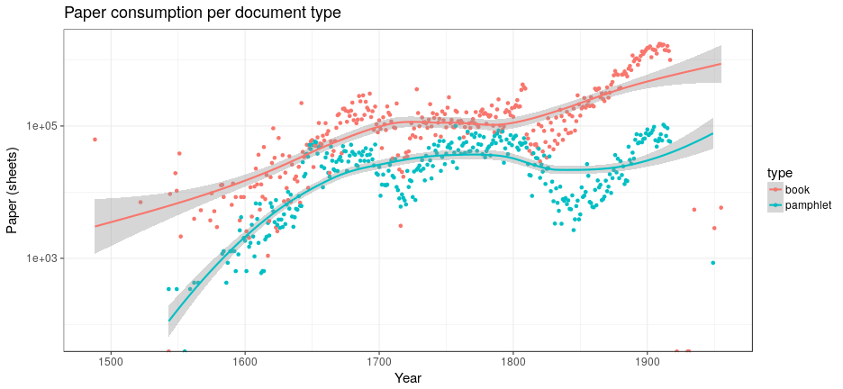


```
## Error: Problem with `summarise()` input `paper`.
## ✖ object 'paper' not found
## ℹ Input `paper` is `sum(paper, na.rm = TRUE)`.
## ℹ The error occurred in group 1: publication_decade = 1570, length = "(148,250]".
```

```
## Error in FUN(X[[i]], ...): object 'paper' not found
```

```
## Error: Aesthetics must be valid data columns. Problematic aesthetic(s): group = length, colour = length. 
## Did you mistype the name of a data column or forget to add after_stat()?
```

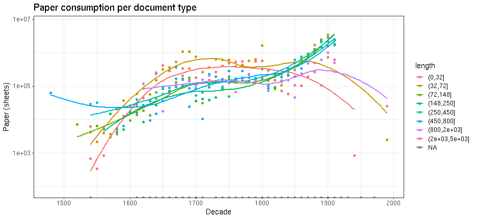


## Nature of the documents over time

Estimated paper consumption by document size


```
## Error: Problem with `summarise()` input `paper`.
## ✖ object 'paper' not found
## ℹ Input `paper` is `sum(paper, na.rm = TRUE)`.
## ℹ The error occurred in group 1: publication_year = 1575, gatherings = "4to".
```

```
## Error: Problem with `filter()` input `..1`.
## ✖ object 'gatherings' not found
## ℹ Input `..1` is `gatherings %in% names(which(table(df2$gatherings) >= 50))`.
```

```
## Error in FUN(X[[i]], ...): object 'publication_year' not found
```


Gatherings height: does it change over time? How increased printing activity is related to book size trends? Alternatively, we could use area (height x width), or median over time. Note that only original (not augmented) dimension info is being used here.

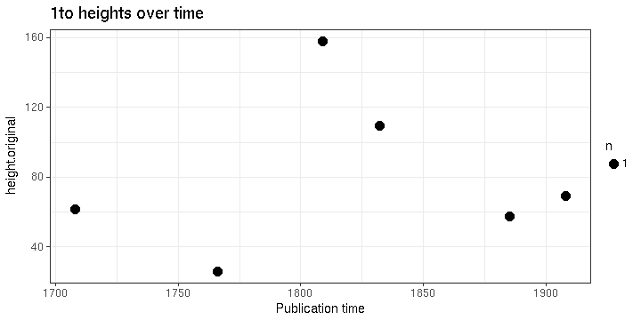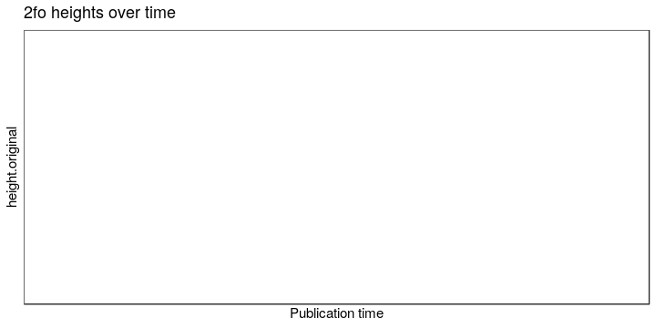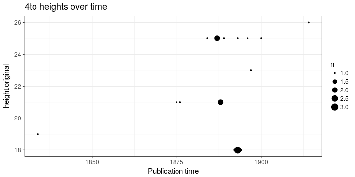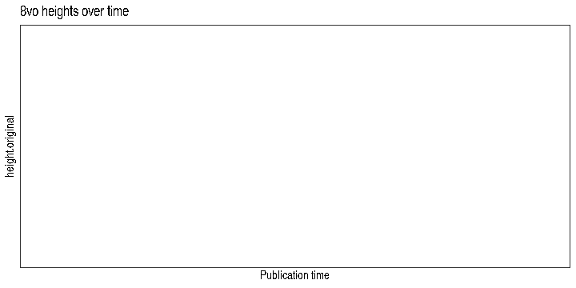


Page counts: does it change over time? Also suggested we could calculate some kind of factor for each time period based on this ? In principle, we could calculate this separately for any given publication place as well but leẗ́s discuss this later. Would help to specify some specific places of interest.


```
## Error: Problem with `filter()` input `..1`.
## ✖ object 'pagecount.orig' not found
## ℹ Input `..1` is `&...`.
```


Same for documents that have a sufficient number of pages:


```
## Error: Problem with `filter()` input `..1`.
## ✖ object 'pagecount.orig' not found
## ℹ Input `..1` is `&...`.
```

