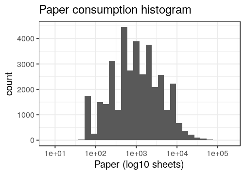
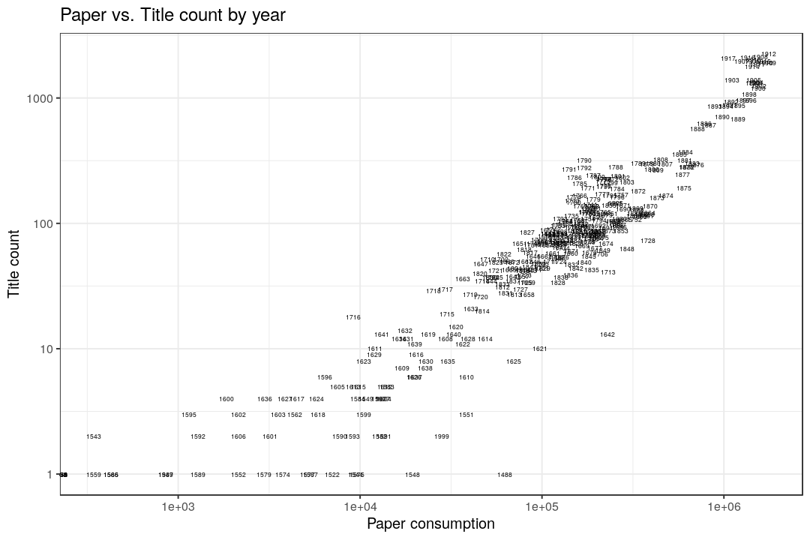

## Page counts

  * Page count available for 0 documents in total (0%), including both readily available and estimated page counts.

  * Page count readily available for 0 documents (0%). 

  * Page count estimated for 0 documents (0%).

  * Page count missing and could not be estimated for 1869 documents (2.7%).

  * Page count updated for 0 documents in the validation phase.
  
  * [Conversions from raw data to final page count estimates](output.tables/pagecount_conversions.csv)

  * [Augmented pagecounts](output.tables/pagecount_discarded.csv) For these cases the page count is missing (or discarded) in the original data, and estimated based on median page counts for [single volume](mean_pagecounts_singlevol.csv), [multi-volume](mean_pagecounts_multivol.csv) and [issues](mean_pagecounts_issue.csv), calculated from those documents where page count info was available.

  * [Automated unit tests for page count conversions](https://github.com/COMHIS/bibliographica/blob/master/inst/extdata/tests_polish_physical_extent.csv) - these are used to control that the page count conversions remain correct when changes are made to the cleanup routines


## Average page counts

Mean and median page counts calculated based on the documents where
the page count information was readily available. Also see the
correponding numerical tables with page count estimates:

 * [Single volume](mean_pagecounts_singlevol.csv)
 * [Multi-volume](mean_pagecounts_multivol.csv)
 * [Issue](mean_pagecounts_issue.csv)

These estimates are used to fill in page count info for the remaining
documents where page count info is missing.

The multi-volume documents average page counts are given per volume.

The page count estimates are calculated without plates. Plate
information is added separately for each document on top of the page
count estimate.


```
## Error in get_mean_pagecounts(df.combined, exclude.plates = TRUE): object 'df.combined' not found
```


```
## Error in eval(expr, envir, enclos): object 'mean.pagecounts' not found
```

```
## Error in `colnames<-`(`*tmp*`, value = character(0)): attempt to set 'colnames' on an object with less than two dimensions
```

```
## Error in UseMethod("droplevels"): no applicable method for 'droplevels' applied to an object of class "NULL"
```

```
## Error in pics[[2]]: subscript out of bounds
```
### Document size distribution


```
## Error in filter(df.combined, volcount == 1 & is.na(volnumber)): object 'df.combined' not found
```

```
## Error: Must group by variables found in `.data`.
## * Column `gatherings` is not found.
## * Column `pagecount` is not found.
```

```
## Error: Must group by variables found in `.data`.
## * Column `gatherings` is not found.
```

```
## Error in ggplot(dff2, aes(y = gatherings, x = pagecount)): object 'dff2' not found
```

```
## Error in fortify(data): object 'dff3' not found
```

```
## Error in fortify(data): object 'dff3' not found
```

```
## Error in filter(df.combined, (volcount > 1 | (!is.na(volnumber)))): object 'df.combined' not found
```

```
## Error: Must group by variables found in `.data`.
## * Column `gatherings` is not found.
## * Column `pagecount` is not found.
```

```
## Error: Must group by variables found in `.data`.
## * Column `gatherings` is not found.
```

```
## Error in ggplot(dff2, aes(y = gatherings, x = pagecount)): object 'dff2' not found
```

```
## Error in fortify(data): object 'dff3' not found
```

```
## Error in fortify(data): object 'dff3' not found
```

```
## Error in FUN(X[[i]], ...): object 'doctype' not found
```

Left: Gatherings vs. overall pagecounts (original + estimated). Right: Only the estimated page counts (for the 0 documents that have missing pagecount info in the original data):


```
## Error in eval(expr, envir, enclos): object 'df.combined' not found
```

```
## Error: Can't subset columns that don't exist.
## ✖ Column `pagecount` doesn't exist.
```

```
## Error in UseMethod("filter_"): no applicable method for 'filter_' applied to an object of class "list"
```

```
## Error in UseMethod("group_by_"): no applicable method for 'group_by_' applied to an object of class "list"
```

```
## Error in names(dfg) <- c("pagecount", "gatherings", "documents"): object 'dfg' not found
```

```
## Error in factor(dfg$gatherings, levels = levels(df$gatherings)): object 'dfg' not found
```

```
## Error in eval(expr, envir, enclos): object 'dfg' not found
```

```
## Error in ggplot(dfg, aes(x = gatherings, y = pagecount)): object 'dfg' not found
```

```
## Error in table(dfg$pagecount): object 'dfg' not found
```

```
## Error in limits(c(...), "y"): object 'ylims' not found
```

```
## Error in 0:n: NA/NaN argument
```

```
## Error in paste("Estimated and original pagecount\n(n=", sum(dfg$documents), : object 'dfg' not found
```

```
## Error in FUN(X[[i]], ...): object 'doctype' not found
```

```
## Error in eval(e, x, parent.frame()): object 'pagecount.orig' not found
```

```
## Error: `data` must be a data frame, or other object coercible by `fortify()`, not a list
```

```
## Error in FUN(X[[i]], ...): object 'doctype' not found
```

```
## Error: Problem with `filter()` input `..1`.
## ✖ object 'paper' not found
## ℹ Input `..1` is `!is.na(paper) & !is.na(gatherings)`.
```

```
## Error in dfs[, c("gatherings", "paper")]: incorrect number of dimensions
```


Paper consumption histogram;


```
## Error in FUN(X[[i]], ...): object 'paper' not found
```



<!--

### Title count versus paper consumption


```
## Error in eval(lhs, parent, parent): object 'df.combined' not found
```

```
## Error in ggplot(d, aes(y = n, x = p)): object 'd' not found
```

```
## Error in FUN(X[[i]], ...): object 'paper' not found
```




## Documents with missing pages over years 


```
## Error: Must group by variables found in `.data`.
## * Column `gatherings` is not found.
```

```
## Error in `$<-.data.frame`(`*tmp*`, na, value = logical(0)): replacement has 0 rows, data has 88
```

```
## Error in UseMethod("droplevels"): no applicable method for 'droplevels' applied to an object of class "NULL"
```

```
## Error in FUN(X[[i]], ...): object 'na' not found
```

```
## Error in top(df$gatherings, n = 4): object 's' not found
```

```
## Error: Problem with `filter()` input `..1`.
## ✖ object 'gatherings' not found
## ℹ Input `..1` is `gatherings %in% topg`.
```

```
## Error in UseMethod("droplevels"): no applicable method for 'droplevels' applied to an object of class "character"
```

```
## Error in FUN(X[[i]], ...): object 'na' not found
```

```
## PNG 
##   2
```

```
## Error: Must group by variables found in `.data`.
## * Column `gatherings` is not found.
```

```
## Error in df2b$na[df2b$na == 0] <- NA: object 'df2b' not found
```

```
## Error in ggplot(df2b, aes(x = publication_decade, y = gatherings, size = na)): object 'df2b' not found
```

```
## Error in na.omit(df2b$na): object 'df2b' not found
```

```
## Error in FUN(X[[i]], ...): object 'na' not found
```


## Estimated paper consumption

Note: there are 0 documents that have some dimension info but sheet area information could not be calculated. 


```
## Error in eval(expr, envir, enclos): object 'df.combined' not found
```

```
## Error: Must group by variables found in `.data`.
## * Column `publication_year` is not found.
```

```
## Error: Can't subset columns that don't exist.
## ✖ Column `publication_year` doesn't exist.
```

```
## Error in FUN(X[[i]], ...): object 'na' not found
```

```
## Error: Can't subset columns that don't exist.
## ✖ Column `publication_year` doesn't exist.
```

```
## Error in FUN(X[[i]], ...): object 'na' not found
```


```
## Error in eval(expr, envir, enclos): object 'df.combined' not found
```

```
## Error: Must group by variables found in `.data`.
## * Column `publication_year` is not found.
## * Column `gatherings` is not found.
```

```
## Error in FUN(X[[i]], ...): object 'publication_year' not found
```

```
## Error in FUN(X[[i]], ...): object 'publication_year' not found
```


```
## Error in eval(lhs, parent, parent): object 'df.combined' not found
```

```
## Error in FUN(X[[i]], ...): object 'paper' not found
```

```
## Error: Aesthetics must be valid data columns. Problematic aesthetic(s): y = n. 
## Did you mistype the name of a data column or forget to add after_stat()?
```


```
## Error in eval(lhs, parent, parent): object 'df.combined' not found
```

```
## Error in FUN(X[[i]], ...): object 'paper' not found
```


## Pamphlets vs. Books


```
## Error in eval(expr, envir, enclos): object 'df.combined' not found
```

```
## Error: Must group by variables found in `.data`.
## * Column `publication_year` is not found.
```

```
## Error in FUN(X[[i]], ...): object 'publication_year' not found
```

```
## Error in FUN(X[[i]], ...): object 'publication_year' not found
```


```
## Error in eval(expr, envir, enclos): object 'df.combined' not found
```

```
## Error: Problem with `mutate()` input `length`.
## ✖ object 'pagecount' not found
## ℹ Input `length` is `cut(pagecount, c(0, 32, 72, 148, 250, 450, 800, 2000, 5000, Inf))`.
```

```
## Error: Must group by variables found in `.data`.
## * Column `length` is not found.
```

```
## Error in FUN(X[[i]], ...): object 'paper' not found
```

```
## Error: Aesthetics must be valid data columns. Problematic aesthetic(s): y = n, group = length, colour = length. 
## Did you mistype the name of a data column or forget to add after_stat()?
```


## Nature of the documents over time

Estimated paper consumption by document size


```
## Error in eval(expr, envir, enclos): object 'df.combined' not found
```

```
## Error: Must group by variables found in `.data`.
## * Column `publication_year` is not found.
## * Column `gatherings` is not found.
```

```
## Error in FUN(X[[i]], ...): object 'publication_year' not found
```


Gatherings height: does it change over time? How increased printing activity is related to book size trends? Alternatively, we could use area (height x width), or median over time. Note that only original (not augmented) dimension info is being used here.


```
## Error in eval(expr, envir, enclos): object 'df.combined' not found
```

```
## Error: Problem with `filter()` input `..1`.
## ✖ object 'gatherings.original' not found
## ℹ Input `..1` is `&...`.
```


Page counts: does it change over time? Also suggested we could calculate some kind of factor for each time period based on this ? In principle, we could calculate this separately for any given publication place as well but leẗ́s discuss this later. Would help to specify some specific places of interest.


```
## Error in eval(expr, envir, enclos): object 'df.combined' not found
```

```
## Error: Problem with `filter()` input `..1`.
## ✖ object 'gatherings.original' not found
## ℹ Input `..1` is `&...`.
```


Same for documents that have a sufficient number of pages:


```
## Error in eval(expr, envir, enclos): object 'df.combined' not found
```

```
## Error: Problem with `filter()` input `..1`.
## ✖ object 'pagecount' not found
## ℹ Input `..1` is `&...`.
```


-->

