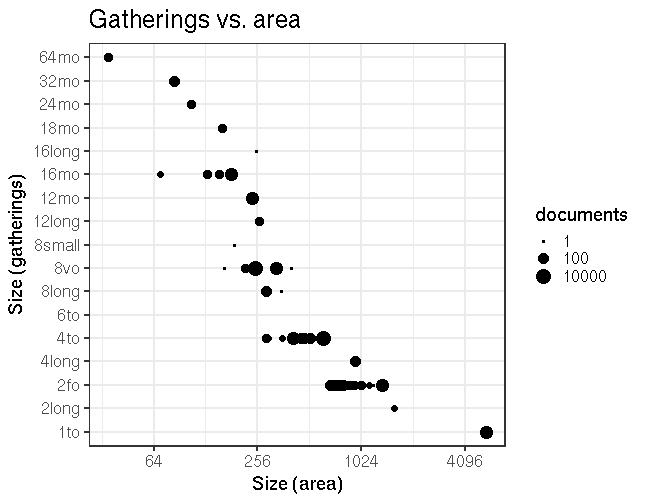
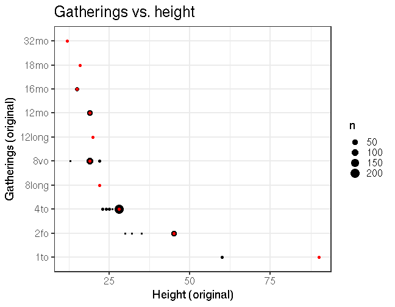
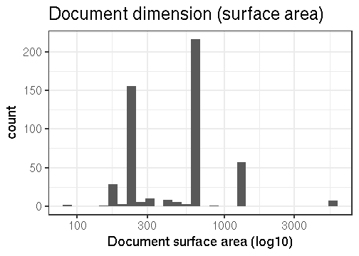
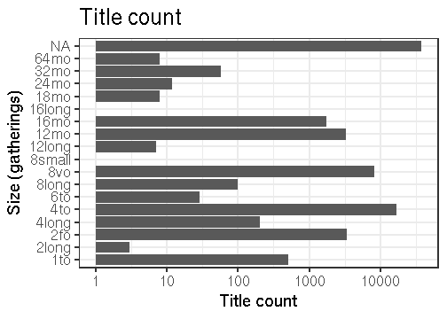
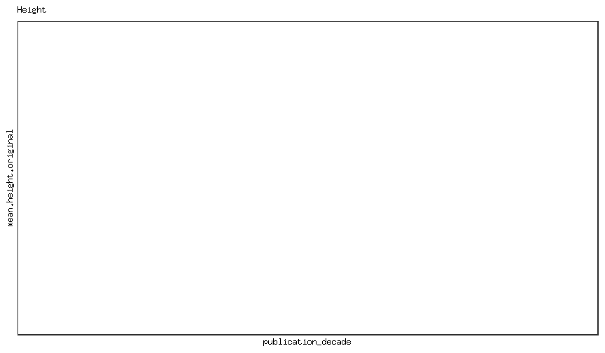

## Document size comparisons

  * Some dimension info is provided in the original raw data for altogether 517 documents (51.7%) but could not be interpreted for 259 documents (ie. dimension info was successfully estimated for 49.9 % of the documents where this field was not empty).

  * Document size (area) info was obtained in the final preprocessed data for altogether 479 documents (48%). For the remaining documents, critical dimension information was not available or could not be interpreted: [List of entries where document surface could not be estimated](physical_dimension_incomplete.csv)

  * Document gatherings info is originally available for 440 documents (44%), and further estimated up to 456 documents (46%) in the final preprocessed data.

  * Document height info is originally available for 39 documents (4%), and further estimated up to 479 documents (48%) in the final preprocessed data.

  * Document width info is originally available for 0 documents (0%), and further estimated up to 479 documents (48%) in the final preprocessed data.


These tables can be used to verify the accuracy of the conversions from the raw data to final estimates:

  * [Dimension conversions from raw data to final estimates](conversions_physical_dimension.csv)

  * [Automated tests for dimension conversions](https://github.com/COMHIS/fennica/blob/master/inst/extdata/tests_dimension_polish.csv)


The estimated dimensions are based on the following auxiliary information sheets:

  * [Document dimension abbreviations](https://github.com/COMHIS/fennica/blob/master/inst/extdata/document_size_abbreviations.csv)

  * [Standard sheet size estimates](https://github.com/COMHIS/fennica/blob/master/inst/extdata/sheetsizes.csv)

  * [Document dimension estimates](https://github.com/COMHIS/fennica/blob/master/inst/extdata/documentdimensions.csv) (used when information is partially missing)


<!--[Discarded dimension info](dimensions_discarded.csv)-->

Left: final gatherings vs. final document dimension (width x height). Right: original gatherings versus original heights where both are available. The point size indicates the number of documents for each case. The red dots indicate the estimated height that is used when only gathering information is available. 




Left: Document dimension histogram (surface area);
Right: title count per gatherings.




<!--

### Gatherings timelines


Popularity of different document sizes over time. Left: absolute title
counts. Right: relative title counts. Gatherings with less than `r
nmin` documents at every decade are excluded:


```
## Error in timeline(dfs, group = "gatherings", nmin = nmin, mode = "absolute"): could not find function "timeline"
```

```
## Error in print(res$plot): object 'res' not found
```

```
## Error in timeline(dfs, group = "gatherings", nmin = nmin, mode = "percentage"): could not find function "timeline"
```

```
## Error in print(res$plot): object 'res' not found
```


## Average document dimensions 

Here we use the original data only:




Only the most frequently occurring gatherings are listed here:


Table: Average document dimensions

|gatherings.original | mean.width| median.width| mean.height| median.height|  n|
|:-------------------|----------:|------------:|-----------:|-------------:|--:|

-->
