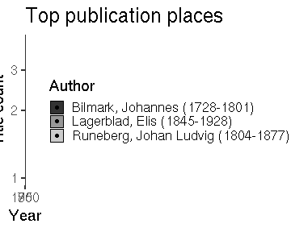

### Publication places

 * 425 [unique publication places](output.tables/publication_place_accepted.csv); available for 67540 documents (96%).
 * 0 [ambiguous publication places](output.tables/publication_place_ambiguous.csv); some of these can be possibly resolved by checking that the the [synonyme list](https://github.com/COMHIS/bibliographica/blob/master/inst/extdata/PublicationPlaceSynonymes.csv) does not contain multiple versions of the final name (case sensitive). 
 * 0 [unknown place names](output.tables/publication_place_todo.csv) These terms do not map to any known place on the [synonyme list](https://github.com/COMHIS/bibliographica/blob/master/inst/extdata/PublicationPlaceSynonymes.csv); either because they require further cleaning or have not yet been encountered in the analyses. Terms that are clearly not place names can be added to [stopwords](inst/extdata/stopwords_for_place.csv); borderline cases that are not accepted as place names can be added as NA on the [synonyme list](https://github.com/COMHIS/bibliographica/blob/master/inst/extdata/PublicationPlaceSynonymes.csv).
 * 32 [discarded place names](output.tables/publication_place_discarded.csv) These terms are potential place names but with a closer check have been explicitly rejected on the [synonyme list](https://github.com/COMHIS/bibliographica/blob/master/inst/extdata/PublicationPlaceSynonymes.csv)
 * [Conversions from the original to the accepted place names](output.tables/publication_place_conversion_nontrivial.csv) 
 * [Unit tests for place names](https://github.com/COMHIS/bibliographica/blob/master/inst/extdata/tests_place.csv) are automatically checked during package build

Top-20 publication places are shown together with the number of documents.

