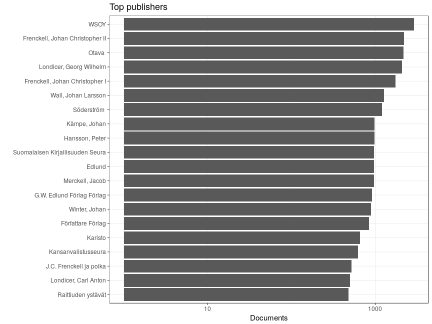
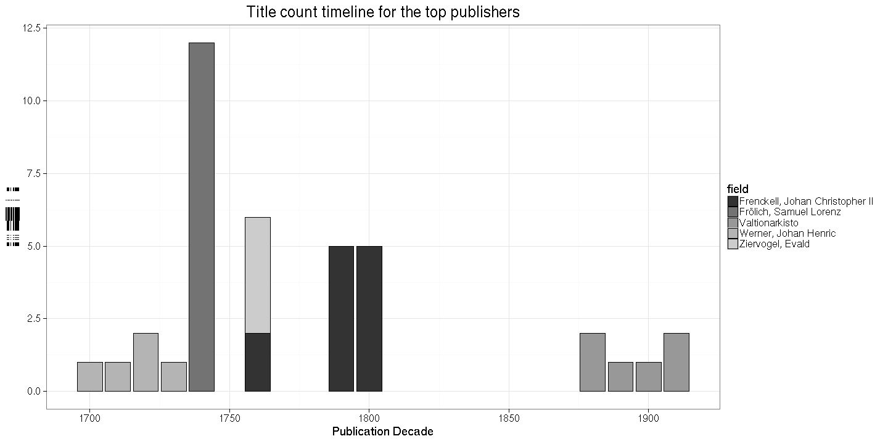
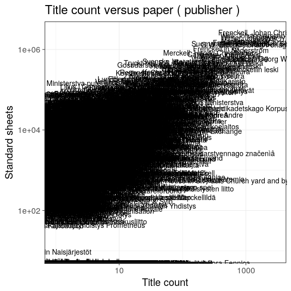
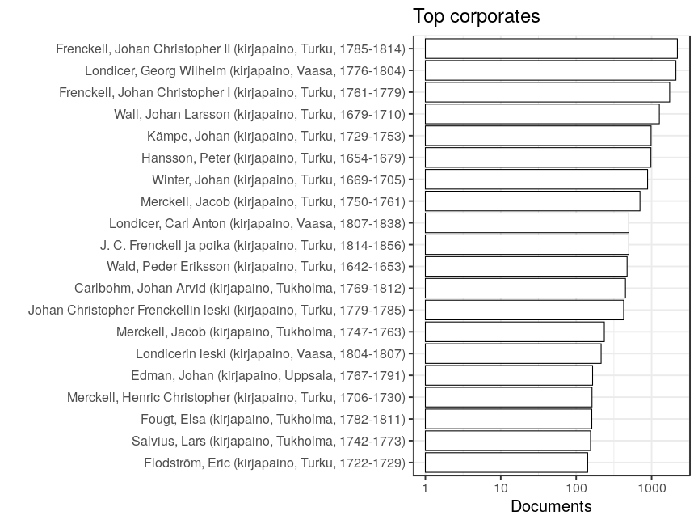

### Publishers

 * 7974 [unique publishers](output.tables/publisher_accepted.csv)

 * 60824 documents have unambiguous publisher information (86.3%). This includes documents identified as self-published; the author name is used as the publisher in those cases (if known).

 * 1864 documents are identified as self-published (2.6%). 

 * [Discarded publisher entries](output.tables/publisher_discarded.csv)

 * [Conversions from original to final names](output.tables/publisher_conversion_nontrivial.csv) (only non-trivial conversions shown)

The 20 most common publishers are shown with the number of documents. 

### Publication timeline for top publishers

Title count

Title count versus paper consumption (top publishers):

|publisher                        | titles|     paper|
|:--------------------------------|------:|---------:|
|Frenckell, Johan Christopher I   |   1740| 1460952.5|
|Frenckell, Johan Christopher II  |   2205| 2622613.1|
|Hansson, Peter                   |    982| 1612252.9|
|Kämpe, Johan                     |    986| 1556110.9|
|Londicer, Georg Wilhelm          |   2100|  590734.4|
|Otava                            |   2188| 2017674.9|
|Söderström                       |   1203|  943434.8|
|Suomalaisen Kirjallisuuden Seura |    973| 1390833.1|
|Wall, Johan Larsson              |   1266| 2210292.0|
|WSOY                             |   2882| 1862844.8|

### Corporates

Summaries of the corporate field.

 * 1404 [unique corporates](output.tables/corporate_accepted.csv)

 * 19529 documents have unambiguous corporate information (27.7%). 

 * [Discarded corporate entries](output.tables/corporate_discarded.csv)

 * [Conversions from original to final names](output.tables/corporate_conversion_nontrivial.csv) (only non-trivial conversions shown)

The 20 most common corporates are shown with the number of documents. 

