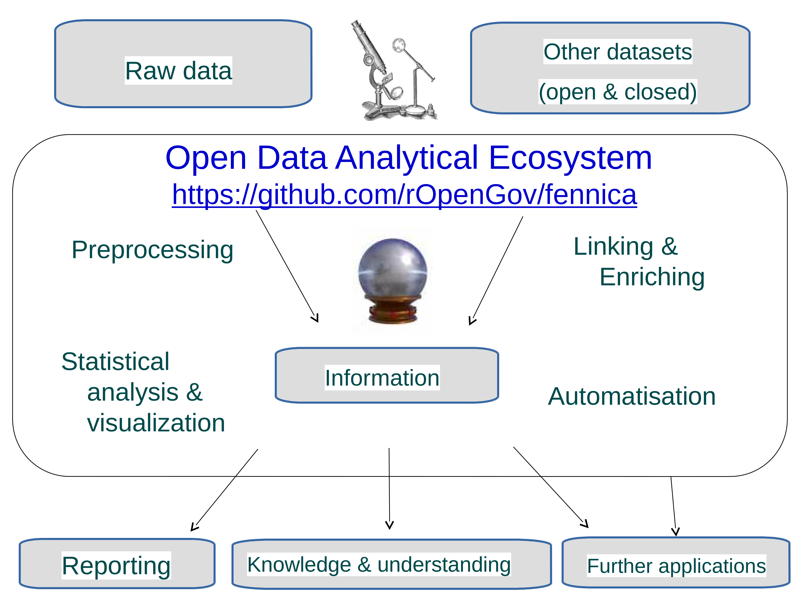

### Data processing is a major effort and should not be underestimated

We have built custom tools to automate all analyses from raw data to final summary documents (these slides, for instance).

\begin{columns}
\begin{column}{0.5\textwidth}
     \includegraphics[width=1\textwidth]{parsing.png}
\end{column}
\begin{column}{0.5\textwidth}  %%<--- here
    \begin{center}
     \includegraphics[width=1\textwidth]{iceberg.png}
     \end{center}
\end{column}
\end{columns}


---




---

### Data: bibliographic catalogues 1640-1828  


**Fennica** Finnish National bibliography

- 900,000+ books and monographies (printed and electronic; 1488-)
- 70,000+ continuous publications (journals or series; 1771-)
- Series, maps, audiovisual, electronic material
- `r nrow(subset(df0, catalog == "Fennica" & publication_year >= 1640 & publication_year < 1828))` documents 1640-1828

**Kungliga**  Swedish National bibliography

- `r nrow(subset(df0, catalog == "Kungliga" & publication_year >= 1640 & publication_year < 1828))` documents 1640-1828
- Altogether > 18 million entries

```{r, message=FALSE, warning=FALSE, fig.width=10, fig.height=3, echo=FALSE}
library(dplyr)
library(ggplot2)
theme_set(theme_bw(20))
df <- df0 %>% filter(publication_year >=1640 & publication_year <=1828) %>% group_by(catalog, publication_decade) %>% tally()
p <- ggplot(df, aes(x = publication_decade, y = n, color = catalog)) + 
       geom_point() + 
       geom_line() + 
       ylab("Documents (n)") + xlab("Publication year") +
       scale_color_manual(values = c("blue", "darkgreen"))
print(p)
```

---

## Analyse & Visualize

**Fast time line analysis**

```{r, fig.width=15, fig.height=5, message=FALSE, warning=FALSE}
#
timeline(subset(df0, catalog == "Fennica"), 
          group = "publisher", nmin = 500, mode = "absolute")$plot
```

---


### Comparing publishing activity in Stockholm and Turku

```{r publishingactivitycomparisons, echo=FALSE, message=FALSE, cache=TRUE, fig.width=10, fig.height=9, fig.show="hold", out.width="160px"}
v <- seq(1500, 1800, 100)
selected.places = c("Turku", "Stockholm")
df2 <- df0 %>% group_by(publication_decade, publication_place, catalog) %>%
               summarise(n = n()) %>%
	       filter(publication_place %in% selected.places) 
df2$catalog = factor(df2$catalog, levels = rev(c("Fennica", "Kungliga")))
df2$publication_place = droplevels(factor(df2$publication_place))
df3 = as.data.frame(spread(df2, publication_decade, n, fill = 0))
df2 = melt(df3)
colnames(df2) = c("publication_place", "catalog", "publication_decade", "n")
df2$publication_decade = as.numeric(as.character(df2$publication_decade))
df2$n = as.numeric(as.character(df2$n))
for (catal in unique(df2$catalog)) {
  p <- ggplot(subset(df2, catalog == catal), aes(x = publication_decade, y = n)) +
     geom_line(aes(linetype = publication_place)) +
     geom_point(aes(shape = publication_place), size = 3) +
     ylab("Title count (n)") + xlab("Publication year") +  
     ggtitle(catal) +
     scale_x_continuous(breaks = v, labels = v) + 
     theme(axis.text.x = element_text(angle = 0))
  print(p)

}
```

---

### Language comparison between catalogues (percentage)

```{r languageperc, echo=FALSE, message=FALSE, warning=FALSE, fig.width=15, fig.height=10}
pics <- list()
for (catalogue in c("Fennica", "Kungliga")) {

  if (catalogue == "Fennica") {
    df <- df.full # full time span
  } else if (catalogue == "Kungliga") {
    df <- df.full # full time span
  }
  langs <- c("Finnish", "Swedish", "Latin", "German", "Russian", "French", "Other")
  df <- df %>% filter(catalog == catalogue)%>%
        filter(publication_year >= 1600 & publication_year <= 1900)

library(dplyr)
library(tidyr)
library(magrittr)
library(reshape2)
  
lang <- paste("language.", langs, sep = "")
otherlang <- setdiff(names(df)[grep("lang.", names(df))], lang)
df$language.Other <- rowSums(df[, otherlang] == TRUE, na.rm = T) > 0

dfl <- NULL
for (lan in lang) {

  # Classify a document to the specifed language
  # If document is assigned with languages, each case is considered
  # so one doc may have multiple entries corresponding to different languages
  # mean(rowSums(df[, lang]) == 1) # 93% Fennica docs have just 1 language
  # Combine data frames for specified languages
  dflsub <- filter(df, df[[lan]])
  if (nrow(dflsub)>0) {
    dflsub$language <- gsub("language.", "", lan)
    dfl <- bind_rows(dfl, dflsub)
  }
}

df <- dfl %>% group_by(publication_decade, language) %>%
     	     summarise(n = n())

# Calculate percentages
dff <- spread(df, language, n, fill = 0)
dff[, -1] <- 100 * t(apply(dff[, -1], 1, function (x) {x/sum(x)}))
dff <- melt(dff, "publication_decade");
colnames(dff) <- c("publication_decade", "language", "f")

theme_set(theme_bw(20))
p <- ggplot(dff, aes(x = publication_decade, y = f)) +
     geom_bar(position = "stack", stat = "identity", aes(fill = language)) + 
     xlab("Publication year") +
     ylab("Title count frequency (%)") +
     #ggtitle(paste("Languages (", catalogue, ")", sep = "")) +
     ggtitle(catalogue) +
     guides(fill = guide_legend(reverse = TRUE, title = "")) +
     scale_fill_brewer(palette="Paired")
pics[[catalogue]] <- p
library(dplyr)
library(magrittr)
}
library(gridExtra)
grid.arrange(pics[[1]], pics[[2]], nrow = 2)
```

---


[University curriculum & Enlightenment in Finland]

### Printing of philosophy in different languages in Turku

```{r topics-103, echo=FALSE, message=FALSE, warning=FALSE, fig.width=12, fig.height=6}
sel = c("filosofia","luonnonfilosofia","metafysiikka","logiikka")
# Selected catalogue with selected topics
df = dfl
df$hit <- apply((sapply(sel, function (x) {grepl(x, tolower(df$subject_topic))})), 1, any)  
df <- df %>% filter(hit)
df <- df %>% group_by(publication_decade, language) %>%
             summarise(n = n(),
                 paper = sum(paper, na.rm = TRUE))

# PAPER CONSUMPTION
theme_set(theme_bw(20))
p <- ggplot(df, aes(x = publication_decade, y = paper, group = language)) +
       geom_bar(aes(fill = language), position = "stack", stat = "identity") +                     
       xlab("Publication year") +
       ylab("Paper consumption") +
       guides(fill = guide_legend(reverse = TRUE, title = "")) 
       #ggtitle(paste("Paper (", paste(sel, collapse = ";"), ")", sep = ""))
print(p)

```


---

[University curriculum & Enlightenment in Finland]

### Printing of history in different languages in Turku

```{r topics-102, echo=FALSE, message=FALSE, warning=FALSE, fig.width=12, fig.height=6}
sel = c("oppihistoria","antiikki","historia")
# Selected catalogue with selected topics
df = dfl
df$hit <- apply((sapply(sel, function (x) {grepl(x, tolower(df$subject_topic))})), 1, any)  
df <- df %>% filter(hit)
df <- df %>% group_by(publication_decade, language) %>%
             summarise(n = n(),
	               paper = sum(paper, na.rm = TRUE))

# PAPER CONSUMPTION
theme_set(theme_bw(20))
p <- ggplot(df, aes(x = publication_decade, y = paper, group = language)) +
       geom_bar(aes(fill = language), position = "stack", stat = "identity") +             
       xlab("Publication year") +
       ylab("Paper consumption") +
       guides(fill = guide_legend(reverse = TRUE, title = "")) 
       #ggtitle(paste("Paper (", paste(sel, collapse = ";"), ")", sep = ""))
print(p)

```

---

[University curriculum & Enlightenment in Finland]

### Printing of economy and social science in different languages in Turku


```{r topics-105, echo=FALSE, message=FALSE, warning=FALSE, fig.width=12, fig.height=6}
sel =   c("psykologia","yhteiskuntafilosofia","valtiofilosofia","talous","raha","moraali","velvollisuudet","kasvatus","maanviljely","maatalous","kalastus")

# Selected catalogue with selected topics
df = dfl
df$hit <- apply((sapply(sel, function (x) {grepl(x, tolower(df$subject_topic))})), 1, any)  
df <- df %>% filter(hit)
df <- df %>% group_by(publication_decade, language) %>%
             summarise(n = n(),
	               paper = sum(paper, na.rm = TRUE))

# PAPER CONSUMPTION
theme_set(theme_bw(20))
p <- ggplot(df, aes(x = publication_decade, y = paper, group = language)) +
       geom_bar(aes(fill = language), position = "stack", stat = "identity") +              
       xlab("Publication year") +
       ylab("Paper consumption") +
       guides(fill = guide_legend(reverse = TRUE, title = "")) 
       #ggtitle(paste("Paper (", paste(sel, collapse = ";"), ")", sep = ""))
print(p)

```

---

[University curriculum & Enlightenment in Finland]

### Enlightenment literature read in Finland

```{r authors22, echo=FALSE, message=FALSE, warning=FALSE, fig.width=12, fig.height=10, out.width="160px", fig.show="hold"}
theme_set(theme_bw(20))
for (catalogue in c("Fennica", "Kungliga")) {
  df <- filter(df0, catalog == catalogue) %>%
        filter(publication_year >= 1640 & publication_year <= 1828)
  top.authors <- names(comhis::top(df, field = "author", n = 10))
  dfs <- df %>% filter(author %in% top.authors) %>%
         group_by(author, publication_decade) %>%
         tally() %>%
         arrange(publication_decade)
  p <- ggplot(dfs, aes(x = publication_decade, y = n, fill = author)) +
       geom_bar(stat = "identity", position = "stack", color = "black") +
       xlab("Publication Decade") +
       ylab("Title Count") +
       scale_fill_grey() +
       guides(fill = guide_legend("Author")) +
       ggtitle(paste("Title count top authors\n", catalogue)) +
       xlim(c(1640, 1828))
  print(p)
}
```


[General trends & political events]

### Publishing activity over time

- 1700-1721 Fennica drop
- 1760-1770 Kungliga peak 
- 1803-1815 Napoleonic wars

```{r publishingovertime, echo=FALSE, message=FALSE, warning=FALSE, fig.width=6, fig.height=4, out.width="200px"}
library(magrittr)
library(ggplot2)
library(dplyr)
df2 <- df0 %>% group_by(publication_decade, catalog) %>%
               summarise(n = n())
df2$highlight <- rep(FALSE, nrow(df2))
df2$highlight[df2$catalog == "Kungliga" &
	      df2$publication_decade %in% c(1770, 1810)] <- TRUE
df2$highlight[df2$catalog == "Fennica" &
	      df2$publication_decade %in% c(1710, 1810)] <- TRUE
v <- seq(1500, 1800, 100)
theme_set(theme_bw(20))
p <- ggplot(df2, aes(x = publication_decade, y = n)) +
     geom_line(aes(color = catalog), size = 1) +
     geom_point(aes(shape = catalog, color = catalog, size = highlight)) +
     ylab("Title count (n)") + xlab("Publication year") +
     #theme(legend.position = "none") +
     scale_x_continuous(breaks = v, labels = v) +
     scale_color_manual(values = c("blue", "darkgreen")) + 
  	 scale_size_discrete(range = c(2, 8)) +
     guides(color = guide_legend(reverse = TRUE), size = "none", shape = "none") 
print(p)
```


---

[General trends & political events]

### Swedish 1760-1770 publishing peak

Pamphleteering plays a crucial role during abolished censorship

```{r pamflets1, echo=FALSE, message=FALSE, warning=FALSE, fig.width=8, fig.height=4, out.width="280px", fig.show="hold"}
df <- df0 %>% filter(catalog == "Kungliga")

# Add indicator of the publication period
df$period <- cut(df$publication_year,
           breaks = c(1757, 1766, 1775, 1783),
		 include.lowest = TRUE,
		 right = FALSE
		 )

# Remove entries outside the investigated publication periods
df <- df %>% filter(!is.na(period)) %>%
	     group_by(period) %>%
	     summarise(n = n(),
		  paper = sum(paper, na.rm = TRUE)) %>%
        mutate(paper.per.title = paper/n)		 

p <- ggplot(df,
       aes(x = period, y = paper.per.title)) + 
       geom_bar(stat = "identity") +
       scale_x_discrete(labels = c("1757-1765", "1766-1774", "1775-1783")) +
       ylab("Paper per title") + xlab("") 
print(p)
```

---
