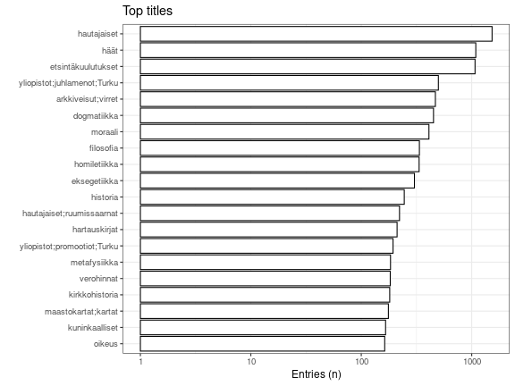
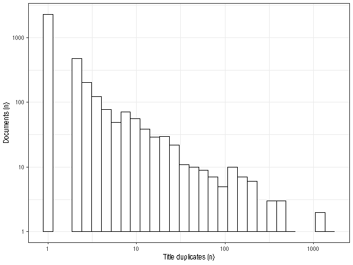

* [Unique accepted entries](output.tables/subject_topic_accepted.csv): 3533
* [Unique discarded entries in original data](output.tables/subject_topic_discarded.csv) (excluding NA cases): 0
* Original documents with non-NA titles: 20889 / 71919 (29%)
* Original documents with missing (NA) titles 51030 / 71919 documents (71%)

 Top-20 titles and their title counts.
 

Frequency of unique titles:
  

