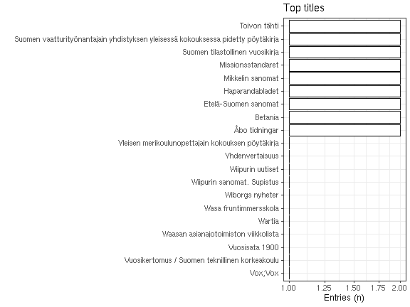
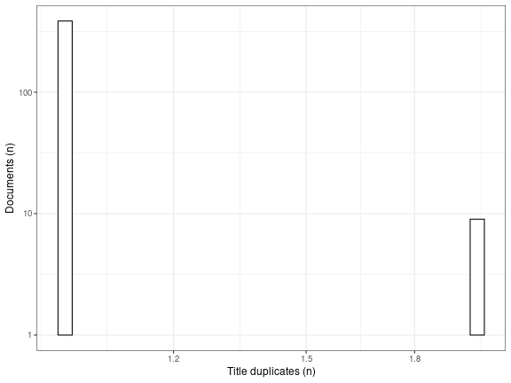

-   [Unique accepted entries](output.tables/successor_accepted.csv): 396
-   [Unique discarded entries in original    data](output.tables/successor_discarded.csv) (excluding NA cases): 0
-   Original documents with non-NA titles: 404 / 71919 (0.6%)
-   Original documents with missing (NA) titles 71515 / 71919 documents
    (99.4%)

Top-20 titles and their title counts.

Frequency of unique titles:

