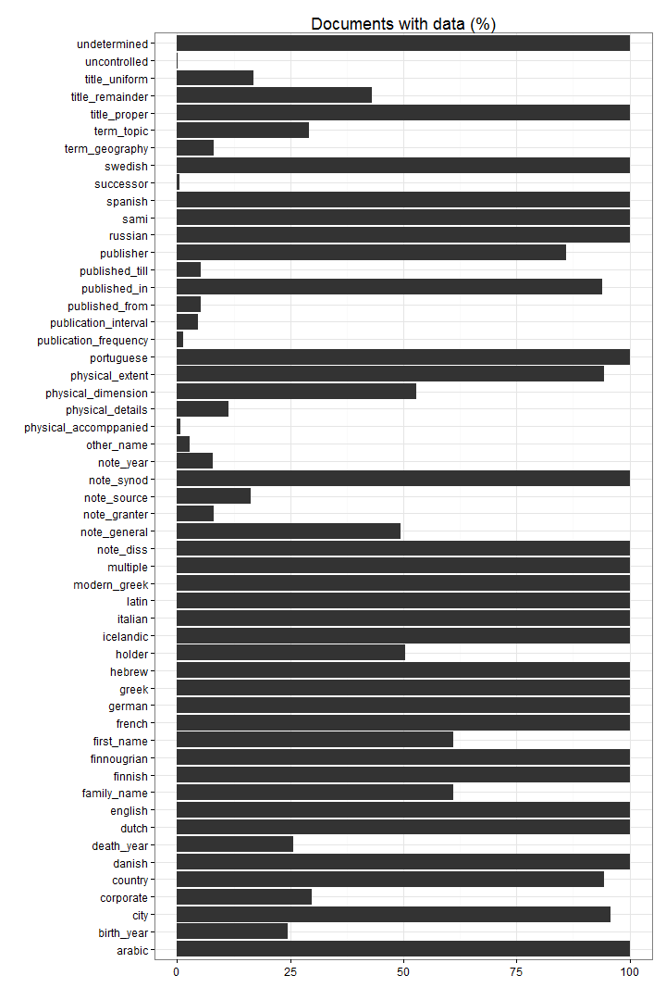

# Summary of the preprocessed Fennica data

## Annotated documents

Fraction of documents with entries for each annotation field.


```
## Error in order(df3$missing): object 'df3' not found
```

 

## Topics


```
## [1] "Complete subject topic counts in file: output.tables/subjecttopics.tab"
```

Top-50 topics and number of documents for each. In total, there are 3533 unique topics and 20889 documents assigned to one or more topics (29).

 


## Authors

Top-50 uniquely identified authors and number of documents for each (duplicate docs not checked yet).


```
## Error in plot.window(xlim, ylim, log = log, ...): need finite 'xlim' values
```

 


## Subject geographical places


Top-50 geographical places are shown together with the number of documents assigned to that region. Geography information is available for 5838 documents (8%). There are 650 unique geographical places.

 


```
## [1] "Complete counts in file: output.tables/geoplaces.csv"
```


## Publication 

### Publication places

Top-50 publication places are shown together with the number of documents. This info is available for 68832 documents (96%). There are 734 unique publication places.

 


```
## [1] "Complete counts in file: output.tables/publicationplaces.csv"
```

