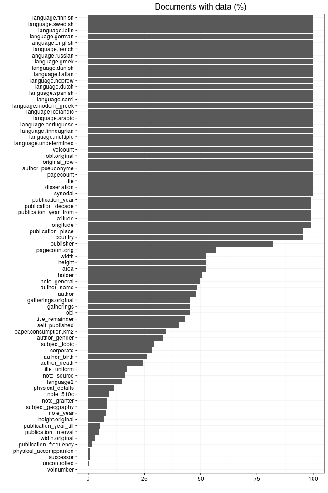
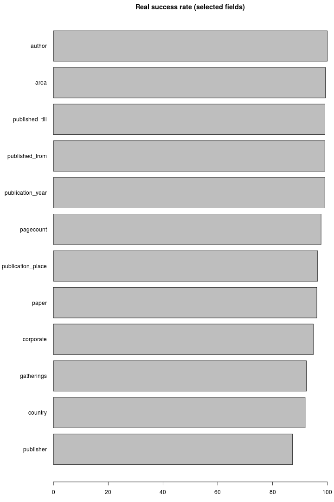
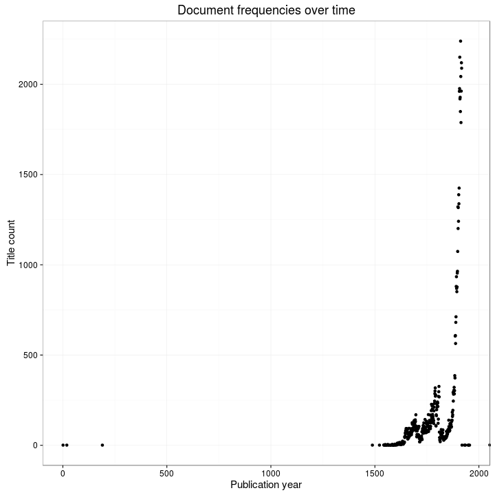
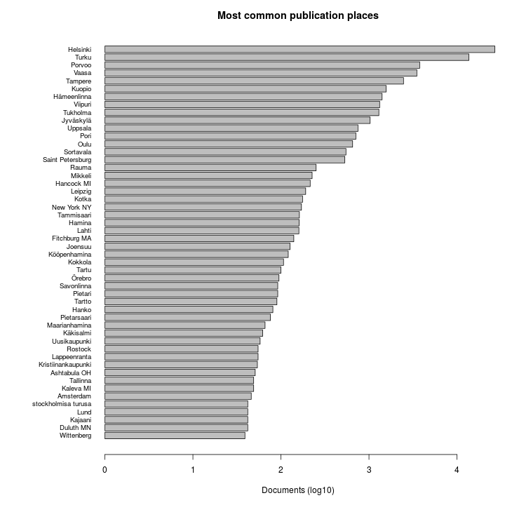
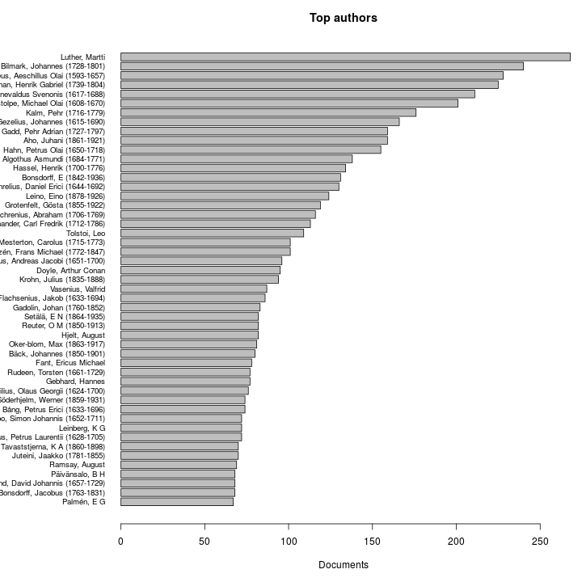
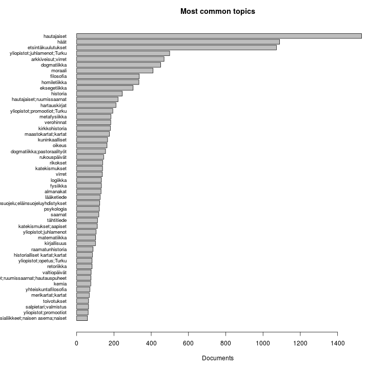
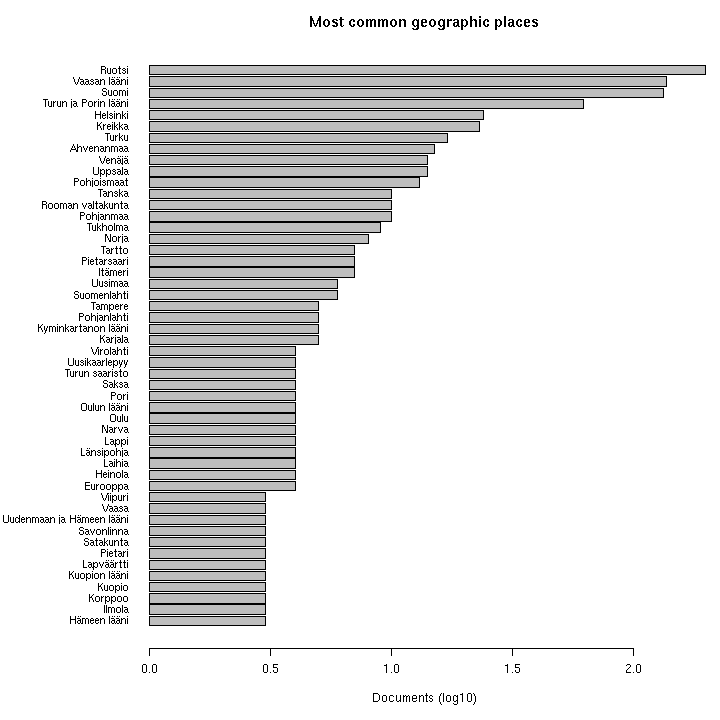

# Fennica summary

## Annotated documents

Fraction of documents with entries for each annotation field.

Percentage of non-NA entries among all documents in the preprocessed data (note that in some cases a significant fraction of this information is missing already in the raw data)

 

Fields of special interest: real success percentage (proportion of successful conversions compared to non-NA entries in the original data):

 

## Pagecounts

[Discarded page count data](https://github.com/rOpenGov/fennica/blob/master/inst/examples/output.tables/pagecount_discarded.csv)

[Successfully converted page counts](https://github.com/rOpenGov/fennica/blob/master/inst/examples/output.tables/pagecount_conversion.csv)

Compare gatherings and cm2 sizes as a quality check. This includes all data; the area has been estimated from the gatherings when dimension information was not available.

 

Compare gatherings and page counts. 

 

## Publication time

[Successfully converted publication times](output.tables/publication-time-accepted.csv)

[Discarded publication times](output.tables/publication-time-discarded.csv)

 

## Publication places

Top-20 publication places are shown together with the number of documents. This info is available for 68827 documents (96%). There are 680 unique publication places.

 

[Successfully converted publication places](https://github.com/rOpenGov/fennica/blob/master/inst/examples/output.tables/publication_place_accepted.csv)

[Discarded publication places](https://github.com/rOpenGov/fennica/blob/master/inst/examples/output.tables/publication_place_discarded.csv)

[Publication places missing country information](https://github.com/rOpenGov/fennica/blob/master/inst/examples/output.tables/publication_place_missingcountry.csv)

## Dimensions

[Successfully converted dimension info](https://github.com/rOpenGov/fennica/blob/master/inst/examples/output.tables/accepted_dimensions.csv)

[Discarded dimension info](https://github.com/rOpenGov/fennica/blob/master/inst/examples/output.tables/missing_dimensions.csv)

[Discarded gatherings info](https://github.com/rOpenGov/fennica/blob/master/inst/examples/output.tables/missing_gatherings.csv)

## Publisher 

[Discarded publisher info](https://github.com/rOpenGov/fennica/blob/master/inst/examples/output.tables/publisher_discarded.csv) (Check that ok to discard these)

[Converted publishers](https://github.com/rOpenGov/fennica/blob/master/inst/examples/output.tables/publisher_accepted.csv) (Check for formatting and synonymes)

We also have corporate info available ?

[Accepted corporate info](https://github.com/rOpenGov/fennica/blob/master/inst/examples/output.tables/corporate_accepted.tab)

## Authors

[Accepted author info](https://github.com/rOpenGov/fennica/blob/master/inst/examples/output.tables/author_accepted.csv)

[Discarded author info](https://github.com/rOpenGov/fennica/blob/master/inst/examples/output.tables/author_discarded.csv)

Top-50 uniquely identified authors and number of documents for each (duplicate docs not checked yet).

 

## Topics

[Complete subject topic counts](https://github.com/rOpenGov/fennica/blob/master/inst/examples/output.tables/subjecttopics.tab)

Top-50 topics and number of documents for each. In total, there are 3533 unique topics and 20889 documents assigned to one or more topics (29).

 

## Subject geographical places

Top-50 geographical places are shown together with the number of documents assigned to that region. Geography information is available for 5838 documents (8%). There are 645 unique geographical places.

 

[Complete geoplace listing](https://github.com/rOpenGov/fennica/blob/master/inst/examples/output.tables/geoplaces.csv)
