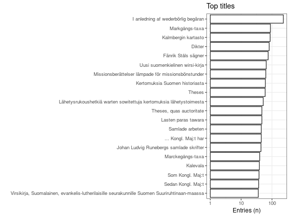
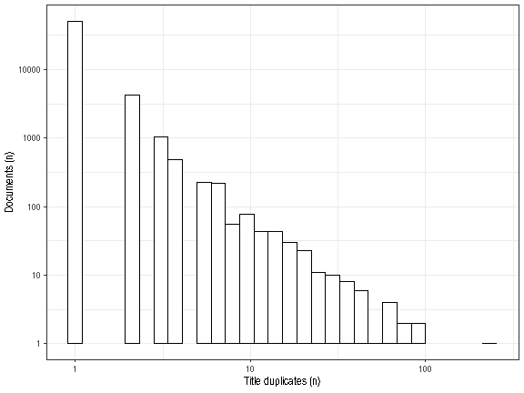

* [Unique accepted entries](output.tables/title_accepted.csv): 57062
* [Unique discarded entries in original data](output.tables/title_discarded.csv) (excluding NA cases): 0
* Original documents with non-NA titles: 71916 / 71919 (100%)
* Original documents with missing (NA) titles 3 / 71919 documents (0%)

Top-20 titles and their title counts.

Frequency of unique titles:

