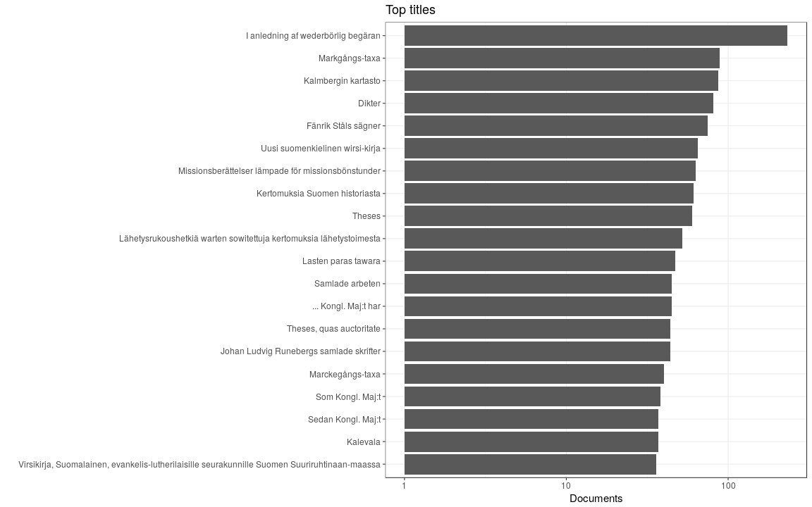

### Titles

 * 57062 [unique titles](output.tables/title_accepted.csv)
 * 71916 documents (100%) have a title
 * [Discarded titles](output.tables/title_discarded.csv)

Top-20 titles are shown together with the number of documents.

