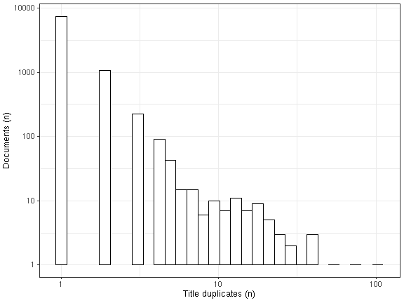

* [Unique accepted entries](output.tables/title_uniform_accepted.csv): 8887
* [Unique discarded entries in original data](output.tables/title_uniform_discarded.csv) (excluding NA cases): 0
* Original documents with non-NA titles: 12209 / 71919 (17%)
* Original documents with missing (NA) titles 59710 / 71919 documents (83%)

Top-20 titles and their title counts.

Frequency of unique titles:
  

